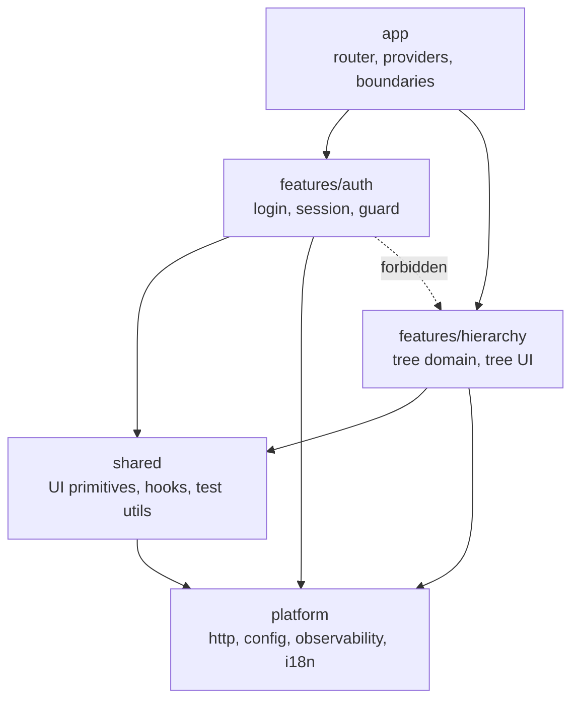
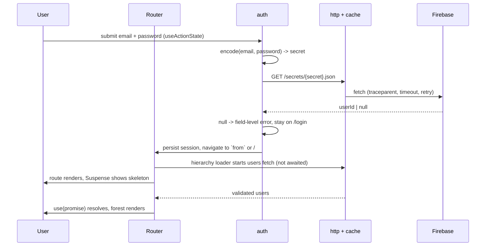

# Architecture

Technical decisions behind [GOAL.md](./GOAL.md). High level by design: it states what exists and why, not how each file is written. Implementation detail belongs to task decomposition.

## 1. Context and constraints

- The backend is fixed and cannot be changed: a public Firebase REST database with a flat `users` collection and a `secrets` map of secret to user id. There is no session endpoint, no pagination, no filtering.
- The dataset is small (33 users, ~9KB) and the payload is public, including plaintext passwords.
- Client-only static hosting. There is no server we own, so anything a backend would normally do is either mitigated in the client or documented as a gap.
- The app must stay small enough to read in one sitting while still carrying the concerns a production app carries: observability, i18n, accessibility, resilience, testing, budgets.

The guiding rule: **the brief bounds the features, not the engineering.** Nothing is built that GOAL.md does not ask for; the depth goes into how the requested behavior is built.

## 2. System overview

Three layers with one-directional imports. Features never reach into each other, and the platform never knows what a "user" is.

- `app` owns composition: the router, the provider stack, the root error boundary. It is the only place that knows the full feature set.
- `features/*` own a slice end to end - route module, data access, domain logic, components - and expose a single public entry. Everything else is internal.
- `shared` holds framework-level building blocks with no domain knowledge.
- `platform` holds adapters to the outside world: HTTP, configuration, logging/tracing/analytics, i18n. Swappable without touching features.

The rules are enforced, not documented: `eslint-plugin-boundaries` plus `no-restricted-imports` fail CI on a cross-feature or deep import.

Routing runs in React Router library mode (`createBrowserRouter`) so Vite stays the only build tool and the output remains static files. Route modules are lazily imported, which makes the route boundary the code-splitting boundary.

## 3. Runtime flow

Two properties matter here. The loader starts the request at navigation time, so there is no render-then-fetch waterfall. And the login lookup fetches only `/secrets/{secret}.json` - the app never downloads the password table to authenticate.

## 4. Cross-cutting concerns

### Data access and caching

A single `http` client owns every network call: base URL from config, `AbortController` timeout, one bounded exponential-backoff-with-jitter retry for idempotent GETs only (never on 4xx), trace header propagation, and timing telemetry. Its transport is injected, which is what makes component tests possible without a mock server.

Above it, a repository per resource maps raw JSON to domain types. Caching lives in one framework-agnostic module shared by loaders and components: in-flight request dedupe, TTL, and stale-while-revalidate. React Router's loader and the component's `use()` call read through the same cache, so there is exactly one place where freshness is defined.

No data-fetching library. React 19 primitives (`use`, Suspense, transitions, `useActionState`) plus the router's loader/action lifecycle cover what this app needs, and the cache module is small enough to own.

### Domain model

Tree construction is pure, framework-free, and the most heavily tested code in the repo:

- `buildForest(users)` - O(n) grouping by `managerId`. Users with no manager, a dangling `managerId`, or a cycle become roots; cycles are broken and reported to telemetry rather than hanging the render.
- `flattenVisible(forest, expandedIds)` - produces the visible row list with `depth`, `hasChildren`, `isExpanded`, `setSize`, `posInSet`. This shape serves the ARIA attributes, the render, and any future virtualizer.

The UI renders that row list with memoized rows keyed by user id. Nothing in the domain layer imports React.

### Validation and error taxonomy

Zod schemas validate at the API boundary. Parsing is tolerant per row: an invalid user is dropped and counted in telemetry instead of failing the page, because a shared public database can change under us. Ids and emails are branded types, so a raw number cannot be passed where a user id is expected.

Failures are a small typed union - `NetworkError`, `TimeoutError`, `HttpError(status)`, `ParseError` - mapped once in the http client. The UI has four states everywhere data is involved: skeleton, error with a retry that re-runs the loader, empty, and data.

### Accessibility

The tree implements the full WAI-ARIA tree pattern, not a nested list with buttons: `role=tree` / `treeitem` / `group`, roving tabindex so the whole tree is one tab stop, arrow keys to move and expand/collapse, Home/End, type-ahead, and `aria-expanded` / `aria-level` / `aria-setsize` / `aria-posinset` from the flattened row model. Expand/collapse changes are announced through a live region.

Beyond the widget: visible focus rings, `prefers-reduced-motion` respected, color contrast held to WCAG AA in both themes, avatars carrying meaningful alternatives and falling back to initials. `jsx-a11y` lints the markup, axe-core asserts on rendered components in unit tests, and `@axe-core/playwright` asserts on real pages in e2e - the a11y claim is enforced in CI rather than asserted in a README.

### Internationalization

i18next with a namespace per feature, lazy-loaded with the route. Every user-visible string lives in a catalogue; `eslint-plugin-i18next` fails the build on hardcoded literals. Dates, numbers, names and lists format through `Intl`, never string concatenation.

English ships alone, but the pipeline is exercised end to end so a second locale is a content change, not a refactor. Layout uses logical properties (`padding-inline-start` for tree indentation, `text-start`, `ms-*`/`ps-*` utilities) throughout, so an RTL locale needs a catalogue and a `dir` switch, nothing more.

### Observability

One facade in `platform/observability` exposing three narrow interfaces - logger, tracer, analytics - over swappable sinks: console in development, an in-memory ring buffer in production builds, no-op in tests unless asserted on. A vendor SDK is a one-line sink swap.

- Every request gets a W3C `traceparent`; the same correlation id appears on the request log, on any error the boundary reports, and on the analytics event for that interaction.
- Analytics events are a typed union with a documented catalogue, so event names are refactorable and cannot drift.
- Web Vitals (LCP, INP, CLS) are collected via `PerformanceObserver` - no dependency - and reported through the same facade.
- A redaction layer scrubs `password`, `secret` and `token` keys before anything reaches a sink.

E2E asserts against the buffer sink, which makes the telemetry contract a tested behavior rather than decoration.

### Performance and budgets

- Route-level code splitting; the login route never pays for the tree route.
- The forest is built once per payload and memoized; toggling a node recomputes only the visible row list.
- Rows are memoized components keyed by id. Virtualization is deliberately not shipped for 33 rows, but `flattenVisible` already produces exactly what a windowing layer consumes - the seam is named and the threshold documented (~500 visible rows).
- Avatars are lazily loaded with explicit dimensions to avoid layout shift, and fall back to initials on error.
- Budgets are numbers in the repo, checked by `size-limit` in CI: app entry and per-route chunk ceilings in gzipped kB. Field targets: LCP under 1.5s and INP under 200ms on a mid-tier device.

### Security posture

The constraint is that client-side auth is not authentication. What we control, we do:

- Only `/secrets/{secret}.json` is fetched at login; the users table with its plaintext passwords is never pulled for authentication.
- Secrets and passwords never enter URLs, logs, telemetry or storage. The session record holds a user id and a schema version, in `sessionStorage`, scoped to the tab.
- A CSP meta tag constrains sources; third-party avatar URLs load with `referrerpolicy="no-referrer"`.
- Route guards run in loaders (redirect with a `from` param), not in render, so an unauthenticated user never triggers a data fetch.

The gap is stated plainly in the code and in this document: a real deployment puts a BFF in front of this, which performs the lookup server-side and issues an httpOnly session cookie. The auth module isolates that seam so replacing it touches one file.

### UI and UX

Tailwind v4 with a CSS-first theme, so design tokens - color, spacing, type scale, radii, motion - are declared once and consumed as utilities. Dark mode via `prefers-color-scheme`, layout responsive from 320px up with container queries on tree rows so deep nesting stays usable on narrow screens.

Expand/collapse state lives in a URL search param: the view is shareable, the back button works, and a refresh preserves the shape of the tree. On first paint, roots and their first level are expanded so the org shape is immediately legible.

## 5. Quality pipeline

- **Types**: TypeScript strict, no `any`, no non-null assertions; type-aware ESLint rules (`recommendedTypeChecked`) so lint sees types.
- **Lint**: ESLint owns correctness and architecture - boundaries, `jsx-a11y`, `react-hooks`, `i18next` literals, testing-library and Playwright hygiene. Prettier owns formatting, with Tailwind class sorting; `eslint-config-prettier` keeps them from overlapping.
- **Unit and component**: Vitest with jsdom and Testing Library. The pure domain is held at ~100%; components are tested by behavior and keyboard contract, with axe assertions. Component tests inject a fake transport fed from the same fixtures the e2e mocks serve.
- **E2E**: Playwright with `route()` mocks by default - deterministic, offline-capable, and able to exercise failure paths (500, timeout, empty payload, malformed row, cycle) that a live API will not produce on demand. A separate script runs smoke tests against the real database to catch contract drift; it never gates the default suite.
- **CI**: one GitHub Actions workflow on PR and main - typecheck, lint and format check, unit tests with coverage thresholds, build, size budgets, e2e with report artifact. A manually triggered job runs the live smoke tests.
- **Deploy**: main deploys to GitHub Pages from the same workflow, so review starts with a URL rather than an install.
- **Config**: a single typed module reads `import.meta.env` once, validates at startup, and exposes environment-shaped defaults (API base URL, log level, sink, feature flags). No `import.meta.env` reads scattered through the code.

## 6. Decision log

Each entry: the choice, why, and what was rejected.

- **React Router library mode over framework mode** - keeps Vite the only build tool and the output static, which matches the hosting constraint. Framework mode brings routing machinery, typegen and a server story this app never uses.
- **Loader starts the fetch, `use()` suspends, over a blocking loader** - removes the render-then-fetch waterfall while keeping granular skeletons. A blocking loader is simpler but gives up streaming; pure Suspense without loaders reintroduces the waterfall.
- **Own cache module over TanStack Query** - the caching needs here are dedupe, TTL and revalidate, which React 19 primitives plus a small module cover. Rejected a data library as weight that hides the interesting design.
- **Zod at the boundary over hand-written guards** - the schemas are the parsing rules, the types, and the documentation in one place, and per-row `safeParse` gives tolerant parsing cheaply. Hand-written guards avoid a dependency but drift from the types they protect.
- **Feature-sliced with lint-enforced boundaries over layer-by-type** - a feature's code stays in one place, and the boundary is a CI failure rather than a convention. Rejected a workspaces monorepo as tooling cost out of proportion to the app.
- **Full ARIA tree widget over nested lists with disclosure buttons** - the brief describes a tree; the accessible tree has a defined keyboard contract, and claiming the role without the contract is worse than not claiming it. The list version is simpler but turns 33 users into 33 tab stops.
- **`sessionStorage` user id over in-memory or `localStorage`** - survives reload, dies with the tab, and stores nothing sensitive. In-memory reads as a bug on refresh; `localStorage` widens exposure of something standing in for a credential.
- **Playwright route mocks over a shared mock server** - one browser-level mocking mechanism, no extra dependency, and full control over failure injection. Live coverage is preserved through a separate, explicitly run smoke suite.
- **Tailwind v4 over CSS Modules with tokens** - the theme layer gives a real token system and the utility layer keeps styling decisions visible in the component, with class ordering enforced by Prettier.
- **English-only i18n with full infrastructure** - the pipeline is what is expensive to retrofit; a second catalogue is not. Shipping a token second locale would prove less than exercising the real one.

## 7. Deliberately not built

Named so the omissions read as decisions, with the seam that makes each cheap later:

- **Virtualized rendering** - unnecessary at 33 rows; `flattenVisible` already emits the row model a windowing layer needs.
- **Real auth** - impossible against this API from a static client; `features/auth` isolates the lookup so a BFF-issued cookie replaces one module.
- **Offline / service worker** - a 9KB public payload does not justify a cache lifecycle; the repository layer is where a persistent cache would attach.
- **Search, filtering, org editing** - outside GOAL.md. The tree domain is pure and already returns the row model a filter would narrow.
- **A second locale, SSR, a component library** - infrastructure supports each; none is needed to satisfy the goal.
- **Vendor telemetry** - the facade defines the contract; a real sink is a swap, not a rewrite.
