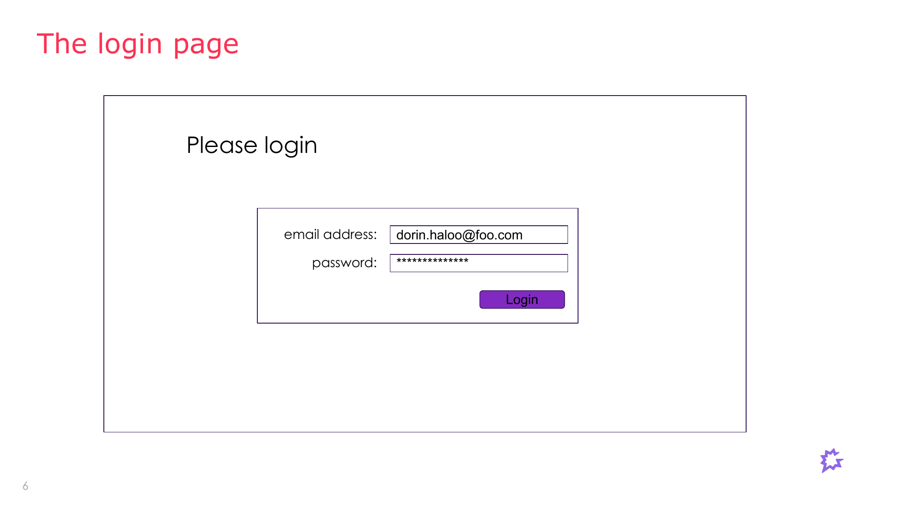
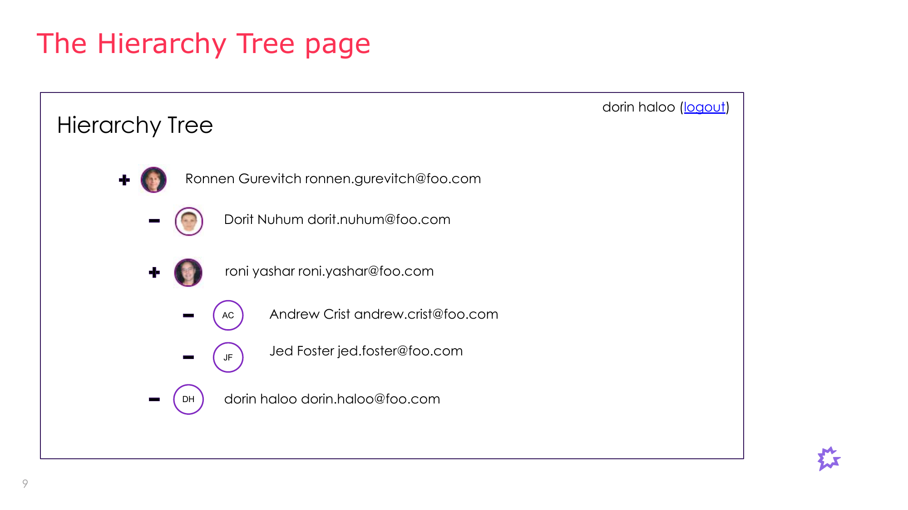

# Front End Exercise

## The exercise

- Write a web application:
  - On visiting your application it opens a login page.
  - After successfully logging in, the application redirects to a user hierarchy page.
  - The hierarchy page fetches a tree of users from a database and presents it on the screen.
- For writing the application, create a new project using Vite. The choice of framework is up to you.
- We've provided a Firebase database and an `encode` function to help you get started.
- Upload your completed exercise to a git repository and send a link to it back to us when you are done.
- When we review your work we assume that you are experienced with your chosen framework.
- In the next interview step we will review your work with you.
- The exercise should take between 3-4 hours to complete.

## The Application Database

- We provide a Firebase database available at `https://gongfetest.firebaseio.com/.json` containing all the data you should need to complete the exercise.
- Firebase represents its data as a JSON object and you read/write to it using REST requests.
- Element URLs must all end with the `.json` suffix. For instance a GET request to `https://gongfetest.firebaseio.com/.json` will retrieve the content of the whole database as one big JSON object. To access a specific element you should add to the root URL the names of all the objects from the root to the element you want to read separated by slash and add a `.json` suffix at the end.
- To access the first name of the second user, which in JS would be `users[1].firstName`, you can use the following URL: `https://gongfetest.firebaseio.com/users/1/firstName.json`
- Important: if for any reason you need to reset the database, you can use `https://9y9r481m5w.csb.app` to re-populate it with data, just make sure to select the correct database domain.

## The encode function

The below code snippet and `encode` function will return a secret which can then be used to lookup a user's ID in the database when given an email and password.

```js
const POISON_ARRAY = [
  156,33,64,174,120,204,69,242,177,98,16,244,75,5,21,7,145,39,156,119,246,63,43,201,91,164,171,244,198,100,252,91,92,193,95,70,131,18,69,131,88,40,241,203,190,210,154,138,4,5,212,34,25,151,150,253,135,
  59,144,152,202,190,196,29,23,165,234,254,6,245,142,18,234,49,63,31,33,152,73,6,212,119,245,182,248,40,167,206,230,204,245,48,200,169,186,110,124,105,22,7,128,56,85,12,48,130,207,114,168,216,104,20,28,
  183,78,194,131,33,245,47,203,214,109,27,8,214,195,249,152,240,51,142,123,250,208,160,51,207,6,67,63,111,75,198,63,50,181,137,163,43,160,141,19,188,37,50,105,20,252,93,134,39,130,234,109,223,161,74,175,
  44,35,62,201,159,3,170,224,28,113,184,243,116,166,132,77,93,130,101,198,173,143,8,131,180,130,61,242,43,39,105,44,239,157,181,86,150,180,100,172,134,53,76,220,18,210,150,99,234,57,252,242,40,205,185,
  53,162,160,211,134,91,44,65,160,30,9,28,192,239,255,92,108,226,242,67,0,201,158,39,128,97,215,65,221,197,22,231
];

function make32(inputString) {
  const targetLength = 32;
  let resultString = "";
  while (resultString.length < targetLength) {
    resultString += inputString;
  }
  resultString = resultString.substring(0, targetLength);
  return Array.from(resultString, (char) => char.charCodeAt(0));
}

function encode(email, password) {
  const emailChars = make32(email);
  const passwordChars = make32(password);
  let encodedResult = "";
  for (let i = 0; i < 32; ++i) {
    const index = (emailChars[i] ^ passwordChars[i]) & 0xff;
    const value = POISON_ARRAY[index];
    encodedResult += value.toString(16).padStart(2, "0").toUpperCase();
  }
  return encodedResult;
}
```

## The login page



- After submitting the login form the application should use the `encode` function included in this document to create a secret which can then be used to lookup the user in the database.
- The logged in user's name should be presented at the top right corner of the Hierarchy page along with a logout link that will sign the user out and redirect back to the login page.

## The Hierarchy Tree page

- The hierarchy tree of users is determined by the manager ID field of each user.
  - Users without a manager ID do not have a manager and should be considered managers themselves.
  - Users with a manager ID report to the user with the same ID.
  - The tree may have several roots, each user that does not have a manager is a root in the hierarchy.
  - A user can only report to a single manager, they do not have multiple managers.
- The page should show the complete hierarchy tree, regardless of the logged in user.
- Each user is presented with:
  - A badge showing the user's photo, if the user has a photo field, or the user's initials if a photo is not available.
  - User's full name.
  - User's email.
- Managers should have a "+" sign to the left of their image. A user is considered a manager if there is at least one user that names them as their manager.
- Clicking on the "+" sign should toggle between collapsing and expanding the branches beneath the manager.
- Non-managers should display a "-" sign on their left.


