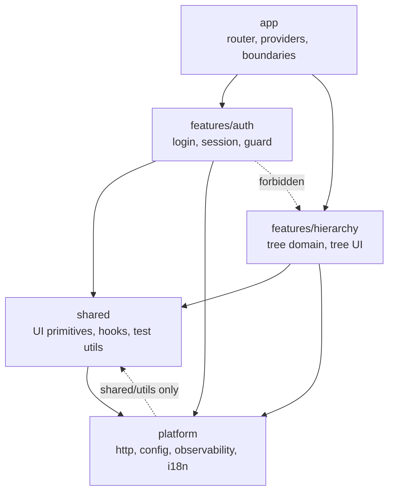
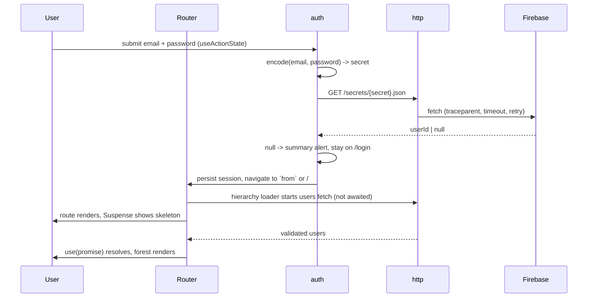

# Architecture

Technical decisions behind [GOAL.md](./GOAL.md). High level by design: it states what exists and why, not how each file is written. Implementation detail belongs to task decomposition.

## 1. Context and constraints

- The backend is fixed and cannot be changed: a public Firebase REST database with a flat `users` collection and a `secrets` map of secret to user id. There is no session endpoint, no pagination, no filtering.
- The dataset is small (33 users, ~9KB) and the payload is public, including plaintext passwords.
- Client-only static hosting. There is no server we own, so anything a backend would normally do is either mitigated in the client or documented as a gap.
- The app must stay small enough to read in one sitting while still carrying the concerns a production app carries: observability, i18n, accessibility, resilience, testing, budgets.

The guiding rule: **the brief bounds the features, not the engineering.** Nothing is built that GOAL.md does not ask for; the depth goes into how the requested behavior is built.

## 2. System overview

Four layers with one-directional imports. Features never reach into each other, and the platform never knows what a "user" is. One narrow, lint-scoped exception: `platform` may import `shared/utils` (not the rest of `shared`) - see the decision log.

- `app` owns composition: the router, the provider stack, the root error boundary. It is the only place that knows the full feature set.
- `features/*` own a slice end to end - route module, data access, domain logic, components - and expose a single public entry. Everything else is internal.
- `shared` holds framework-level building blocks with no domain knowledge. `shared/utils` is its own `eslint-plugin-boundaries` element (distinct from the rest of `shared`): zero-dependency helpers only, restricted to importing nothing but each other, which is what lets `platform` depend on it without reopening the `shared` -> `platform` edge into a cycle.
- `platform` holds adapters to the outside world: HTTP, configuration, logging/tracing/analytics, i18n. Swappable without touching features.

The rules are enforced, not documented: `eslint-plugin-boundaries` plus `no-restricted-imports` fail CI on a cross-feature or deep import.

Routing runs in React Router library mode (`createBrowserRouter`) so Vite stays the only build tool and the output remains static files. Route modules are lazily imported, which makes the route boundary the code-splitting boundary.

## 3. Runtime flow

Two properties matter here. The loader starts the request at navigation time, so there is no render-then-fetch waterfall. And the login lookup fetches only `/secrets/{secret}.json` - the app never downloads the password table to authenticate.

## 4. Cross-cutting concerns

### Data access

A single `http` client owns every network call: base URL from config, `AbortController` timeout, one bounded exponential-backoff-with-jitter retry for idempotent GETs only (never on 4xx), trace header propagation, and timing telemetry. Its transport is injected, which is what makes component tests possible without a mock server.

Above it, a repository per resource maps raw JSON to domain types. The router's loader starts the request at navigation time and the component reads the returned promise with `use()`, so a resource has exactly one fetch site.

There is no response cache in this roadmap. Request dedupe, TTL and stale-while-revalidate are **withdrawn, not deferred** - they are outside this roadmap entirely, and reinstating them is a new decision-log entry rather than scheduled work (see the decision log). Each navigation that needs the users payload fetches it, which at 33 users and ~9KB is a request the app can afford, and the repository is the seam a cache attaches to when one is worth its complexity.

No data-fetching library. React 19 primitives (`use`, Suspense, transitions, `useActionState`) plus the router's loader/action lifecycle cover what this app needs.

### Domain model

Tree construction is pure, framework-free, and the most heavily tested code in the repo:

- `buildForest(users)` - O(n) grouping by `managerId`. Users with no manager, a dangling `managerId`, or a cycle become roots; cycles are broken and reported to telemetry rather than hanging the render.
- `flattenVisible(forest, expandedIds)` - produces the visible row list with `depth`, `hasChildren`, `isExpanded`, `setSize`, `posInSet`. This shape serves the ARIA attributes, the render, and any future virtualizer.

The UI renders that row list with memoized rows keyed by user id. Nothing in the domain layer imports React.

### Validation and error taxonomy

Zod schemas validate at the API boundary. Parsing is tolerant per row: an invalid user is dropped and counted in telemetry instead of failing the page, because a shared public database can change under us. Ids and emails are branded types, so a raw number cannot be passed where a user id is expected.

Failures are a small typed union - `NetworkError`, `TimeoutError`, `HttpError(status)`, `ParseError` - mapped once in the http client. The UI has four states everywhere data is involved: skeleton, error with a retry that re-runs the loader, empty, and data.

### Accessibility

The tree implements the full WAI-ARIA tree pattern, not a nested list with buttons: `role=tree` / `treeitem` / `group`, roving tabindex so the whole tree is one tab stop, arrow keys to move and expand/collapse, Home/End, type-ahead, and `aria-expanded` / `aria-level` / `aria-setsize` / `aria-posinset` from the flattened row model. Expand/collapse changes are announced through a live region.

Beyond the widget: visible focus rings, `prefers-reduced-motion` respected, color contrast held to WCAG AA in both themes, avatars carrying meaningful alternatives and falling back to initials. `jsx-a11y` lints the markup, axe-core asserts on rendered components in unit tests, and `@axe-core/playwright` asserts on real pages in e2e - the a11y claim is enforced in CI rather than asserted in a README.

### Internationalization

i18next with a namespace per feature, lazy-loaded with the route. Every user-visible string lives in a catalogue; `eslint-plugin-i18next` fails the build on hardcoded literals. Dates, numbers, names and lists format through `Intl`, never string concatenation.

English ships alone, but the pipeline is exercised end to end so a second locale is a content change, not a refactor. Layout uses logical properties (`padding-inline-start` for tree indentation, `text-start`, `ms-*`/`ps-*` utilities) throughout, so an RTL locale needs a catalogue and a `dir` switch, nothing more.

### Observability

One facade in `platform/observability` exposing three narrow interfaces - logger, tracer, analytics - over swappable sinks: console in development, an in-memory ring buffer in production builds, no-op in tests unless asserted on. A vendor SDK is a one-line sink swap.

- Every request gets a W3C `traceparent`; the same correlation id appears on the request log, on any error the boundary reports, and on the analytics event for that interaction.
- Analytics events are a typed union with a documented catalogue, so event names are refactorable and cannot drift.
- Web Vitals (LCP, INP, CLS) are collected through the `web-vitals` package and reported through the same facade. This reverses an earlier "no dependency" position; see the decision log.
- A redaction layer scrubs `password`, `secret` and `token` keys before anything reaches a sink.

E2E asserts against the buffer sink, which makes the telemetry contract a tested behavior rather than decoration.

### Performance and budgets

- Route-level code splitting; the login route never pays for the tree route.
- The forest is built once per payload and memoized; toggling a node recomputes only the visible row list.
- Rows are memoized components keyed by id. Virtualization is deliberately not shipped for 33 rows, but `flattenVisible` already produces exactly what a windowing layer consumes - the seam is named and the threshold documented (~500 visible rows).
- Avatars are lazily loaded with explicit dimensions to avoid layout shift, and fall back to initials on error.
- Budgets are numbers in the repo, checked by `size-limit` in CI: app entry and per-route chunk ceilings in gzipped kB. Field targets: LCP under 1.5s and INP under 200ms on a mid-tier device.

### Security posture

The constraint is that client-side auth is not authentication. What we control, we do:

- Only `/secrets/{secret}.json` is fetched at login; the users table with its plaintext passwords is never pulled for authentication.
- Passwords never enter URLs, logs, telemetry or storage at all. The derived secret enters exactly one URL - the `GET /secrets/{secret}.json` the API's shape leaves no alternative to - and nothing else: not the app's own URL, not a log line, not a stored telemetry record, not storage. The session record holds a user id and a schema version, in `sessionStorage`, scoped to the tab. See the decision log for what this wording replaced and why.
- A CSP meta tag constrains sources; third-party avatar URLs load with `referrerpolicy="no-referrer"`. The meta tag carries no `frame-ancestors` directive, because browsers ignore it there. Framing protection needs a response header, and Cloudflare Pages sets one from a `_headers` file in the build output. See the decision log.
- Route guards run in loaders (redirect with a `from` param), not in render, so an unauthenticated user never triggers a data fetch.

The gap is stated plainly in the code and in this document: a real deployment puts a BFF in front of this, which performs the lookup server-side and issues an httpOnly session cookie. The auth module isolates that seam so replacing it touches one file.

### UI and UX

Tailwind v4 with a CSS-first theme, so design tokens - color, spacing, type scale, radii, motion - are declared once and consumed as utilities. Dark mode via `prefers-color-scheme`, layout responsive from 320px up with container queries on tree rows so deep nesting stays usable on narrow screens.

Expand/collapse state lives in a URL search param: the view is shareable, the back button works, and a refresh preserves the shape of the tree. On first paint, roots and their first level are expanded so the org shape is immediately legible.

## 5. Quality pipeline

- **Types**: TypeScript strict, no `any`, no non-null assertions; type-aware ESLint rules (`recommendedTypeChecked`) so lint sees types.
- **Lint**: ESLint owns correctness and architecture - boundaries, `jsx-a11y`, `react-hooks`, `i18next` literals, testing-library and Playwright hygiene. Prettier owns formatting, with Tailwind class sorting; `eslint-config-prettier` keeps them from overlapping.
- **Unit and component**: Vitest with jsdom and Testing Library. The pure domain is held at ~100%; components are tested by behavior and keyboard contract, with axe assertions. Component tests inject a fake transport fed from the same fixtures the e2e mocks serve.
- **E2E**: Playwright with `route()` mocks by default - deterministic, offline-capable, and able to exercise failure paths (500, timeout, empty payload, malformed row, cycle) that a live API will not produce on demand. A separate script runs smoke tests against the real database to catch contract drift; it never gates the default suite.
- **CI**: one GitHub Actions workflow on PR and main - typecheck, lint and format check, unit tests with coverage thresholds, build, size budgets, e2e with report artifact. A manually triggered job runs the live smoke tests.
- **Deploy**: main deploys to Cloudflare Pages from the same workflow, after every gate has passed, so review starts with a URL rather than an install.
- **Config**: a single typed module reads `import.meta.env` once, validates at startup, and exposes environment-shaped defaults (API base URL, log level, sink, feature flags). No `import.meta.env` reads scattered through the code.

## 6. Decision log

Each entry: the choice, why, and what was rejected.

- **React Router library mode over framework mode** - keeps Vite the only build tool and the output static, which matches the hosting constraint. Framework mode brings routing machinery, typegen and a server story this app never uses.
- **Loader starts the fetch, `use()` suspends, over a blocking loader** - removes the render-then-fetch waterfall while keeping granular skeletons. A blocking loader is simpler but gives up streaming; pure Suspense without loaders reintroduces the waterfall.
- **No response cache in this roadmap** (2026-08-13, phase 1) - the earlier position was an own cache module over TanStack Query, on the grounds that dedupe, TTL and stale-while-revalidate are small enough to own. Specifying it proved otherwise: the state machine, per-key generations, revalidation cooldowns and their tests were the largest single piece of the phase 1 spec, and it exists to save one 9KB request on a dataset of 33 users. The cache is withdrawn from the roadmap, not designed and deferred - phases 1 to 3 ship without it and the repository per resource is the seam it attaches to afterwards. Rejected: TanStack Query, which is the same weight bought rather than written; and keeping the module in phase 3, which would land a cache and the tree domain in one loop. The withdrawn design is kept whole in [CACHE.md](./CACHE.md), including the ten review findings it absorbed, so reinstating it is a decision rather than a rewrite.
- **Zod at the boundary over hand-written guards** - the schemas are the parsing rules, the types, and the documentation in one place, and per-row `safeParse` gives tolerant parsing cheaply. Hand-written guards avoid a dependency but drift from the types they protect.
- **Feature-sliced with lint-enforced boundaries over layer-by-type** - a feature's code stays in one place, and the boundary is a CI failure rather than a convention. Rejected a workspaces monorepo as tooling cost out of proportion to the app.
- **Full ARIA tree widget over nested lists with disclosure buttons** - the brief describes a tree; the accessible tree has a defined keyboard contract, and claiming the role without the contract is worse than not claiming it. The list version is simpler but turns 33 users into 33 tab stops.
- **`sessionStorage` user id over in-memory or `localStorage`** - survives reload, dies with the tab, and stores nothing sensitive. In-memory reads as a bug on refresh; `localStorage` widens exposure of something standing in for a credential.
- **Playwright route mocks over a shared mock server** - one browser-level mocking mechanism, no extra dependency, and full control over failure injection. Live coverage is preserved through a separate, explicitly run smoke suite.
- **Tailwind v4 over CSS Modules with tokens** - the theme layer gives a real token system and the utility layer keeps styling decisions visible in the component, with class ordering enforced by Prettier.
- **English-only i18n with full infrastructure** - the pipeline is what is expensive to retrofit; a second catalogue is not. Shipping a token second locale would prove less than exercising the real one.
- **`web-vitals` as a dependency over hand-rolled `PerformanceObserver` collection** (2026-08-13, phase 1) - INP is a high percentile of interaction latencies under a specific windowing rule, and CLS is a session-window maximum. `PerformanceObserver` cheaply yields a maximum interaction latency and a running shift sum, which are different numbers. Reporting those under the labels `INP` and `CLS` would make the telemetry lie about what it measures, and the facade's whole point is that the contract is tested rather than asserted. Rejected: shipping the approximations under honest alternative names, which keeps the dependency count at zero but leaves the app with no comparable field metric; and dropping INP and CLS entirely, which gives up the interaction budget the performance section commits to. The cost is one small runtime dependency inside the entry budget.
- **No `frame-ancestors` in the CSP meta tag; the response header instead** (2026-08-13, phase 1) - browsers ignore `frame-ancestors` when it arrives in a meta tag and log a warning saying so, so including it would buy no protection while producing a permanent console warning, forcing an allow-list entry into the e2e console assertion that otherwise stays empty. Rejected: keeping the directive in the meta tag as a statement of intent. Framing protection therefore ships as a response header, which Cloudflare Pages sets from a `_headers` file in the build output - the one thing the previous hosting choice could not do. Everything else stays in the meta tag, so there is one policy to read rather than two half-policies.
- **Cloudflare Pages over GitHub Pages** (2026-08-13, phase 1) - the repository is private, and GitHub Pages does not serve a site from a private repository on this account's plan, so the hosting decision had to be remade rather than debated. Cloudflare Pages serves the site at the root (no project sub-path, so the Vite `base` stays `/`), gives SPA deep links through a `_redirects` rule instead of a `404.html` copy, and sets response headers from `_headers`, which is what makes framing protection possible at all. Deployment stays inside the same GitHub Actions workflow, running `wrangler pages deploy` after every gate has passed, so the rule that a deploy follows a green pipeline is unchanged. Rejected: Cloudflare's own Git integration, which builds and deploys on push without waiting for the workflow's gates, giving up exactly that property; and making the repository public to keep Pages, which is not a hosting decision.
- **App entry budget of 100 kB gzipped** (2026-08-13, phase 1) - set against an estimate of 85-90 kB for the fixed dependency set (react-dom, react-router, zod, i18next, react-i18next, web-vitals), leaving roughly 10-15% headroom. Rejected: 75 kB, which the dependency set alone would likely bust, turning the budget into noise the first time it ran; and deferring the number until measured, which leaves CI with no size gate while the skeleton is built. Per-route chunks stay at 30 kB.
- **App entry budget revised to 150 kB gzipped** (2026-08-13, phase 1) - wiring the real router in M5 step 31 measured the entry at 112.77 kB, busting the 100 kB budget by 12.77 kB. An isolated esbuild probe (`createBrowserRouter` + `RouterProvider` alone, tree-shaken, react/react-dom externalized) put react-router's own weight at ~31 kB gzipped - the original 85-90 kB estimate undercounted react-router specifically, this was not a tree-shaking regression or a code defect. Per this section's own rule, a wrong estimate is revisited with the user rather than silently raised; the user set the corrected number at 150 kB, leaving headroom over the measured 112.77 kB rather than pinning the limit to the exact current build. Rejected: a code-splitting mitigation to defer router construction, which was not pursued because the router must exist to render the very first route - there is no idle window before it that deferral could exploit.
- **Two design tokens darkened past their mockup literals: `border-field` and `ink-faint`** (2026-08-13, phase 1) - `docs/reference.md`'s pulled values (`#E2DDEE` field border, `#8E8AA0` faint ink) hold 1.33:1 and 3.34:1/4.31:1 (light/dark) against the surfaces they sit on, both short of invariant 72's AA floor (3:1 for UI boundaries, 4.5:1 for body text - the correlation id `ErrorState` renders in `ink-faint`, per invariant 92, is body text). `theme.css` re-declares both tokens (`border-field` `#8F89A3`, `ink-faint` `#726E85` light / `#847F95` dark) with `contrastPairs.test.ts` entries proving the new values clear AA in both themes. Rejected: keeping the mockup literals and accepting the AA failure, which invariant 70's mockup-fidelity goal does not outrank invariant 72's binding accessibility floor; and reusing an existing darker token (`ink-muted`) for the correlation id instead of darkening `ink-faint`, which would collapse two intentionally distinct text weights into one.
- **`eslint-plugin-jsx-a11y`'s peer dependency is overridden to accept eslint 10** (2026-08-14, phase 1) - `npm ci` failed in CI (though not locally, since local `node_modules` had been installed incrementally and never re-validated from a clean state) with an ERESOLVE conflict: `eslint-plugin-jsx-a11y@6.10.2`'s `peerDependencies` cap `eslint` at `^9`, while this project pins `eslint@^10.8.0`. Confirmed against the npm registry that 6.10.2 is jsx-a11y's latest release and has no eslint-10-compatible version. `package.json` now carries a narrow `overrides` entry (`eslint-plugin-jsx-a11y.eslint -> $eslint`) that relaxes only this one peer edge, verified against a genuinely clean `rm -rf node_modules && npm ci` (both in an isolated worktree and on the real repo) followed by a full `npm run verify` and `npm run e2e` pass, including the `jsx-a11y` rules themselves still firing correctly under eslint 10. Rejected: downgrading `eslint` to `^9`, which would give up the newer major this project deliberately adopted for no defect of eslint's own; and `--legacy-peer-deps`, which would silence strict peer-conflict detection for every dependency in the tree, not just this one known-safe pairing.
- **A key-echoing `test` locale ships in the same build that deploys to production** (2026-08-14, i18n-test-locale loop) - the entry above holds that a token second *product* locale would prove less than exercising the real one; this does not reopen that trade-off, because `test` is not a product locale at all. Unit and e2e assertions previously hardcoded a copy of the real English strings, which could drift silently whenever the catalogue's prose changed and the test's copy did not. `Locale.Test` (tag `'zxx'` - not `'test'` itself, which is not valid BCP-47 syntax and fails `Intl.getCanonicalLocales`) is a generated i18next resource bundle - one function walks each real English catalogue's key shape and replaces every leaf with its own dot-path, so `t('notFound.title')` resolves to the literal string `'notFound.title'` under it - which turns every such assertion into a structural check against the real catalogue instead of a hand-maintained copy of its prose. It is the default `buildTestRuntime` (`src/app/testing/renderRoute.tsx`) builds and the locale Playwright's `chromium` project requests via its context `locale` option; it is reachable only through those two paths, never through a real browser's language preference or an in-app control - `detectLocale` (`src/platform/internationalization/detectLocale.ts`) matches a visitor's `navigator.languages` against `Locale`'s members and falls back to `Locale.English` when nothing matches, which is what happens for every real visitor today, since `'zxx'` (ISO 639-2 for "no linguistic content; not applicable") does not correspond to a spoken language and no real browser reports it. Rejected: keeping hand-authored English assertions, the status quo this entry replaces and the drift risk that motivated the change; and leaning on i18next's own missing-key fallback to echo keys, which `vitest.setup.ts`'s empty-`missingKeyReports` assertion forecloses - a real fallback reports every key as missing rather than echoing it silently. The chosen tag went through two corrections during review before landing on `'zxx'`: `'test'` fails `Intl`'s BCP-47 grammar check outright, and its first replacement, `'pseudo'`, passes that grammar check but is not a registered IANA subtag and fails axe-core's registry-based `html-lang-valid` rule - verified directly by running real axe-core against both, not by syntax inspection alone.
- **`platform` may import `shared/utils` only, via its own `eslint-plugin-boundaries` element type** (2026-08-14, phase 1) - `bytesToHex` was duplicated verbatim in `createCorrelationId.ts` (platform/observability) and `createTraceparent.ts` (platform/http), a single-source-of-truth violation typescript-coding's const-object-enum guidance calls out for status literals and applies equally to duplicated pure helpers. The natural home is `shared` (no domain knowledge, used by more than one module), but the base boundaries policy only allows `shared -> platform` (needed by `shared/testing`'s fakes: `createFakeRandomness`, `createFakeClock`, `createFakeTransport`, which type against platform's `Randomness`/`Clock`/`Transport`) - a blanket `platform -> shared` addition would reopen that same edge in reverse and create a `shared` <-> `platform` cycle, contradicting this section's "one-directional imports" claim even though no single file pair would cycle today. `shared/utils` is carved out as its own boundaries element (`src/shared/utils/**`, matched before the general `shared` pattern) with an intentionally strict `from` policy - it may import only itself, never `platform` or the rest of `shared` - so it is structurally incapable of ever being the far end of a real cycle, whichever direction is added to it. `platform`'s policy then allows `shared-utils` alongside `platform`. Rejected: allowing `platform -> shared` broadly (reopens the cycle risk documented above); leaving `bytesToHex` duplicated (fails the single-source-of-truth goal that motivated moving it); relocating it inside `platform` instead, e.g. `platform/runtime` (keeps the fix inside the existing rules with a one-line policy, but was rejected by the user in favor of `shared/utils`, matching where a zero-dependency, domain-free helper conceptually belongs).
- **The deploy job's post-deploy assertion is dropped; it never verified anything a deployment could fail** (2026-08-14, phase 1) - invariant 123 originally had the deploy job compare Wrangler's `deployment-url` output against `deployment.json`'s recorded production hostname, on the theory that a misconfigured Pages project (invariant 126) would report a preview URL there instead. Reality, confirmed against the real project after merge: `wrangler pages deploy` always reports the deployment's own permanent per-deployment URL (`https://<hash>.hierarchy-tree.pages.dev`), never the production alias hostname, regardless of whether Cloudflare has correctly flagged that deployment `Production` internally - `wrangler pages deployment list` showed `Environment: Production, Branch: main` for the exact deployment the assertion rejected. The comparison was therefore unsatisfiable by construction; it would fail identically for a correctly configured project and a misconfigured one, so it verified nothing. The step now only records both URLs to the job summary for visibility. Invariant 126a's post-merge `e2e:deployed` run remains the actual verification that the production hostname serves the deployed build - it fetches that real URL directly, which is the one check in this pipeline that can actually distinguish success from failure here. Rejected: querying the Cloudflare API for the deployment's `environment` field, or fetching the production hostname and diffing it against the build's own asset hashes, both of which would restore an early, wrangler-output-only signal - not pursued because `e2e:deployed` already performs the more direct version of the second option immediately afterward, and a second implementation of the same check was judged not worth the added API surface for a signal the next step gives for free.

- **A failed sign-in shows one summary alert, not the field-level error this document's runtime flow used to promise** (2026-08-14, phase 2) - section 3's sequence diagram said `null -> field-level error`, and mockup 1d draws a red password field under an "Incorrect password" line. Both are wrong about what the app can know: the derivation collapses the email and the password into a single secret, so a `null` lookup is evidence that the *pair* does not match and evidence of nothing else. Attributing the failure to the password sends a user to change a credential that may have been right all along, and attributing it to the email leaks which addresses exist. The login card therefore renders 1d's alert block verbatim, marks both fields invalid, and renders no field-level message under either. The diagram is amended to `null -> summary alert`. Rejected: mockup fidelity, which invariant 52 of `specs/phase-2-login/PRODUCT.md` records as a deliberate deviation rather than an oversight; and a neutral field-level line under both fields, which keeps 1d's shape while still implying the app examined the fields separately.
- **"Secrets and passwords never enter URLs" was false as written, and is replaced by what is actually guaranteed** (2026-08-14, phase 2) - the security posture stated flatly that secrets never enter URLs, while the only authentication mechanism this backend offers is `GET /secrets/{secret}.json`. The claim was contradicted by construction the moment phase 2 existed, and a binding document that says something the implementation must violate teaches a reader to discount it. The wording now separates the two: passwords enter nothing at all, and the derived secret enters exactly one URL - the request the API's shape leaves no alternative to - and no other surface, which is the part the client actually controls and can assert. Rejected: keeping the sentence as a statement of intent, which would have left phase 2 shipping a knowing violation of its own architecture; and hashing or otherwise obscuring the secret before the request, which does not work, because the value in the URL *is* the lookup key the database indexes.
- **The credential derivation is ported byte-exact, including a Unicode defect in the original** (2026-08-14, phase 2) - the brief's `make32` ends `Array.from(resultString, (char) => char.charCodeAt(0))`, which iterates by code POINT, so a non-BMP character contributes only its high surrogate and the returned array is shorter than 32; the derivation loop then reads `undefined` at the tail, and `undefined ^ x` evaluates to `x`. Two independent spec reviewers found this, and the first spec draft had confidently described the opposite behaviour. The port reproduces the original exactly, defect included, because the secrets in the live database were generated by that code and any "corrected" implementation derives a different secret for an affected credential - silently, since a wrong-but-plausible secret simply fails to match. The user took this call explicitly. Rejected: iterating by code unit for defensible Unicode handling, which would lock out any account whose password contains an astral character while passing every unit test and the live proof, since real credentials are ASCII.
- **The email is trimmed before derivation; the password is not touched** (2026-08-14, phase 2) - the brief passes the email straight into `make32`, so trimming is a deviation, and it is recorded as one rather than absorbed silently. A leading or trailing space arriving from a password manager or a copy-paste produces an unexplainable failed login, and the trim costs nothing for any address that does not have one. It happens outside the ported algorithm, so the algorithm itself stays byte-exact per the entry above. Rejected: lowercasing as well, which would break any stored address containing an uppercase letter, exactly the silent lockout the byte-exact decision exists to avoid; and trimming nothing, the literal reading, which the user weighed and declined.
- **A user id is restricted to a conservative charset at the parse boundary, in addition to being percent-encoded into the path** (2026-08-14, phase 2) - the secrets lookup returns a user id that is then interpolated into `/users/{id}.json` for the header's name request and written into the session record. Codex's spec review found that an id of `../secrets` resolves that path to `/secrets.json`, and that `/`, `?`, `#` and a backslash each address a different resource than intended. Ids are therefore validated against `A-Za-z0-9_-` where the response is parsed - before the value is used for anything or stored - and percent-encoded again where they are placed into a path. A value failing the check is a malformed response, which the service-problem state already handles, and a stored record failing it is treated as no session. Rejected: encoding alone, which closes the URL but still lets a hostile value into storage and telemetry; and trusting the backend's shape, which is a public database this project does not control.
- **The header shows three presentations, not the four states this document requires of a data surface** (2026-08-14, phase 2) - section 4 requires skeleton, error-with-retry, empty and data everywhere data is involved. The header's name is fetched, so the rule binds, and it is met with skeleton, name, and a neutral signed-in presentation when the name cannot be resolved - no error state and no empty state. The reason is that the name is decorative: the session, the guard, the page beneath and the logout control are all fully operable without it, so an error state would interrupt a user for something that did not stop them, and a retry affordance would offer to re-run a request whose failure they have no stake in. The fetch failure is reported through observability at warning level instead. Rejected: an error state with a retry, which turns a cosmetic gap into a blocking one; and blocking the authenticated view on the name, which would make a decorative fetch a dependency of the whole page.
- **`withSessionGuard` is built in phase 2 although its only caller arrives in phase 3** (2026-08-14, phase 2) - phase 2's own rule (invariant 146 of `specs/phase-2-login/PRODUCT.md`) forbids abstractions whose caller does not exist yet, and this is its one named exception. React Router runs the loaders of all matched routes in PARALLEL, so a guard on a parent route does not stop a child's loader from starting: phase 2 satisfies "the redirect happens before any data fetch" only because the hierarchy route has no loader yet, and phase 3's users fetch would start before the parent's redirect landed. Discovering that in phase 3 means discovering it as a security-shaped bug in a route that already fetches. The wrapper plus a structural test that every guarded route uses it is the seam; the user approved building it now. Rejected: leaving it to phase 3, which trades a small unused abstraction for a fetch that fires for unauthenticated visitors.
- **Three additive changes to the shared UI kit, raised rather than slipped in** (2026-08-14, phase 2) - phase 2's invariant 141 freezes phase 1's surfaces, so a change to one is a finding to raise. Three are needed and all three were approved: `Input` gains `readOnly` (the submitting state renders both fields non-editable while keeping their values in the accessibility tree) and `placeholder` (mockup 1a's `you@foo.com`), and `Button` gains busy-spinner support (mockup 1c's spinner and pressed fill, which the current component cannot express - it renders only its children, and its pressed colour is bound to `:hover`). All three are additive and optional, and none carries a domain type, so the kit stays domain-free. Rejected: a feature-owned spinner rendered into the button's children, which puts a second spinner implementation in the codebase for the one state that needs it; and dropping the spinner from the busy state, which was declined as a real loss to the mockup's clarity.
- **The redaction layer gains a path-segment rule, and three phase-1 guards are narrowed rather than removed** (2026-08-14, phase 2) - `redact` scrubs object keys and URL search parameters, neither of which covers a secret that sits in a path SEGMENT, so the http client's timing record would carry `/secrets/<SECRET>.json` verbatim into the telemetry buffer on every sign-in. A path-segment rule in `redact` is the fix, and it engages invariant 141 like the kit changes above. Separately, three guards written in phase 1 specifically to stop phase 2's work from starting early must now move: the `sessionStorage` ban, the `redirect`/`redirectDocument` import ban (which lives in TWO ESLint blocks, the later one governing feature files), and the `/secrets` string-literal ban. Each is narrowed to a named file or directory, never removed, each keeps its guard-script assertion updated in the same change, and each gets a demonstrable-negative capture proving the rule still fires everywhere else - because a wholesale removal passes CI and loses the guarantee silently. The mechanics land with the milestone that needs them; `specs/phase-2-login/TECH.md` records which.
- **The header's name fetch reads the whole `/users.json` collection and matches a record's own `id` field, not `GET /users/{id}.json`** (2026-08-15, phase 2, M4 live smoke) - the entry above (2026-08-14, "a user id is restricted to a conservative charset") assumed the secrets lookup's resolved id addresses `/users/{id}.json` directly, matching `docs/reference.md`'s "GET /secrets/{secret}.json to obtain a user id" and `docs/task.md`'s `users[1].firstName` example. The M4 live-smoke suite (invariant 97e) proved that assumption wrong against the real database: `/users.json` is Firebase's own array, stored under positional keys `0`-`32` (confirmed via `?shallow=true`), while `/secrets.json`'s values are each record's own internal `id` field - a large, unrelated synthetic number (e.g. array index `0`'s record carries `id: 2217873750`). `GET /users/2217873750.json` therefore always returns empty; every gating test passed feeding a mocked single-record response, so nothing caught it before the live suite ran. There is also no Firebase index on `id` (`?orderBy="id"&equalTo=...` returns `Index not defined`), so a server-side filtered query is not available. The fix: `fetchSignedInUser` fetches `/users.json` once, and `parseSignedInUsers` keeps every element that parses against `signedInUserSchema` (now including `id`) while dropping the rest (this section's own "tolerate bad rows" rule), then the caller finds the record whose `id` matches. `userResourcePath.ts` (the direct-path builder) is deleted; nothing else referenced it. The user id charset restriction from the entry above still applies to `id`'s stored/compared value, just no longer to a URL path segment it is interpolated into. Rejected: leaving the direct-path fetch in place and recording this as an accepted gap, which was rejected because it is not a marginal edge case - it is a 100% failure rate for every real signed-in user, exactly the silent failure invariants 5, 6 and 97e exist to prevent one layer down; and requesting a Firebase `.indexOn` rule change, which is not available on a shared read-only exercise database this project does not control.

## 7. Deliberately not built

Named so the omissions read as decisions, with the seam that makes each cheap later:

- **Virtualized rendering** - unnecessary at 33 rows; `flattenVisible` already emits the row model a windowing layer needs.
- **Real auth** - impossible against this API from a static client; `features/auth` isolates the lookup so a BFF-issued cookie replaces one module.
- **Offline / service worker** - a 9KB public payload does not justify a cache lifecycle; the repository layer is where a persistent cache would attach.
- **Response caching** - dedupe, TTL and stale-while-revalidate, withdrawn from the roadmap by the decision log entry above; the design is preserved in [CACHE.md](./CACHE.md). The repository per resource is the seam: caching attaches behind it without a caller changing.
- **Search, filtering, org editing** - outside GOAL.md. The tree domain is pure and already returns the row model a filter would narrow.
- **A second *product* locale, SSR, a component library** - infrastructure supports each; none is needed to satisfy the goal. (A test-only locale for unit/e2e assertions ships separately - see the decision log.)
- **Vendor telemetry** - the facade defines the contract; a real sink is a swap, not a rewrite.
