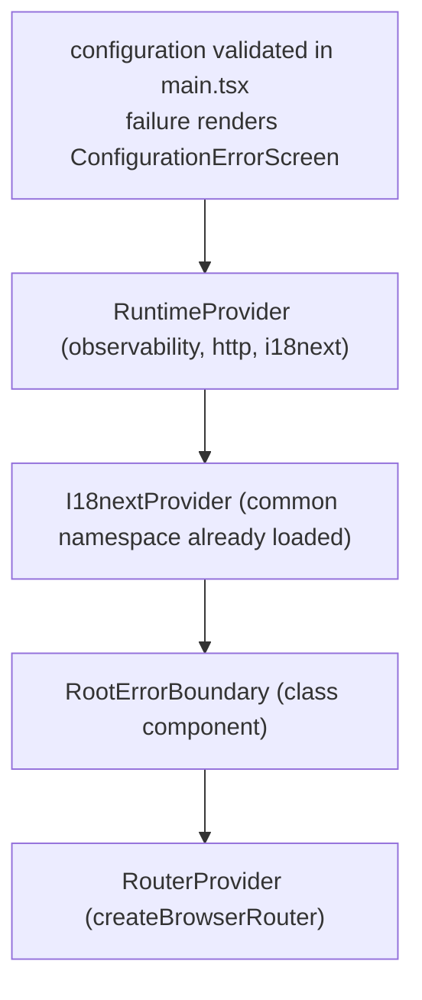

# Tech spec: phase-1-setup - layers, platform adapters, UI kit, app shell, pipeline, deploy

## Context

### What the repository is today

A stock Vite React TypeScript template with three commits and no product code.

- `package.json` - scripts are `dev`, `build` (`tsc -b && vite build`), `lint` (`eslint .`), `preview`. Runtime dependencies are `react` and `react-dom` only. Dev dependencies are `@eslint/js`, `@types/node`, `@types/react`, `@types/react-dom`, `@vitejs/plugin-react`, `eslint`, `eslint-plugin-react-hooks`, `eslint-plugin-react-refresh`, `globals`, `typescript` (`~6.0.2`), `typescript-eslint`, `vite`. There is no test runner, no Playwright, no Tailwind, no Prettier, no `size-limit`, no i18n, no Zod, no router.
- `tsconfig.json` - a solution file referencing `tsconfig.app.json` (includes `src`) and `tsconfig.node.json` (includes `vite.config.ts`). This phase adds a third, `tsconfig.tools.json`, for everything outside both (section 2.5).
- `tsconfig.app.json` - has `target: es2023`, `moduleResolution: bundler`, `verbatimModuleSyntax`, `erasableSyntaxOnly`, `noUnusedLocals`, `noUnusedParameters`, `noFallthroughCasesInSwitch`, `noEmit`, `jsx: react-jsx`. It has **no `strict` flag**, so the whole of `src` currently compiles with implicit `any`. ARCHITECTURE.md section 5 requires strict, no `any`, no non-null assertions; invariant 104 names this gap explicitly.
- `vite.config.ts` - `defineConfig({ plugins: [react()] })`. No `base`, which is what the deployment needs: Cloudflare Pages serves this site from the root of its own hostname, so the default `base: '/'` is correct and stays untouched (invariant 122).
- `eslint.config.js` - `js.configs.recommended`, `tseslint.configs.recommended` (not type-checked), `react-hooks`, `react-refresh`. No boundaries, no `jsx-a11y`, no `i18next`, no restricted imports, no Prettier interop.
- `index.html` - `lang="en"`, viewport meta, title `hierarchy-tree`, favicon `/favicon.svg`, script `/src/main.tsx`. No CSP meta tag.
- `.gitignore` - carries a blanket `*.log` rule inherited from the template. Any evidence log committed under `specs/` with a `.log` extension would be silently dropped from the commit.
- `src/` - `main.tsx` (renders `App`, and uses a non-null assertion on `getElementById('root')`), `App.tsx` (the Vite landing page, ~120 lines, links to vite.dev and react.dev), `App.css`, `index.css` (template theme variables), `assets/{hero.png,react.svg,vite.svg}`.
- `public/` - `favicon.svg` (9.5 kB) and `icons.svg` (5 kB), both template assets referenced only by `App.tsx` and `index.html`.
- `specs/phase-1-setup/` - `PRODUCT.md` (135 invariants: 1 through 136 with 36-44 withdrawn, plus the suffixed 45a, 47a, 86a, 86b, 96a, 99a, 116a and 116b), `loop.json`, and an `evidence/` directory holding the two G1 reviews. There is no `VERIFICATION.md` anywhere in the repository, so the loop has no verification profile to run against.
- `src/vite-env.d.ts` does not exist yet, although the layout below and the `boundaries/ignore` list both reference it. Milestone 1 creates it.

### Environment and targets

- Node `v24.15.0`, npm `11.12.1` locally. Nothing pins that version in the repository yet.
- Remote is `git@github.com:sergeykhomyuk/hierarchy-tree.git` and the repository is **private**, which is what rules GitHub Pages out and settles the hosting question (ARCHITECTURE.md decision log, 2026-08-13).
- The site is deployed to a Cloudflare Pages project by direct upload from the CI workflow, after every gate has passed. It serves from the root of `https://<project>.pages.dev`, so the Vite `base` stays `/` and every URL in the build output is root-relative (invariant 122). The repository owner performs the one-time setup: create the Pages project, mint an API token scoped to Cloudflare Pages edit, and store `CLOUDFLARE_API_TOKEN` and `CLOUDFLARE_ACCOUNT_ID` as repository secrets (invariant 126). The production hostname the project is given is recorded in `deployment.json` at the repository root - `{ "projectName": "hierarchy-tree", "productionHostname": "https://<project>.pages.dev" }` - which is the single machine-readable source invariant 123 requires. The deploy job reads it with `jq`, the `deployed` Playwright project takes it as `DEPLOYED_BASE_URL`, and `VERIFICATION.md` and `.env.example` cite it on a line carrying the literal marker `<!-- production-hostname -->` / `# production-hostname:` respectively, and a unit test asserts each marker is PRESENT and that the value on it equals `deployment.json`'s. Requiring presence is the half that matters: a test phrased only as "the cited hostname matches" passes vacuously against a document that cites nothing, which would reinstate the documentation drift `deployment.json` was introduced to close. M6 makes both edits, in the same change that creates `deployment.json` - M1 ships `VERIFICATION.md` without the marker because the Pages project does not exist yet, and M6 adds it. Recording it only in prose would have forced a second, uncheckable copy into `ci.yml`.
- Cloudflare Pages serves `_redirects` and `_headers` files found at the root of the uploaded directory. Vite copies `public/` into `dist/` verbatim, so both files live in `public/` and need no plugin. This is what replaces the `404.html` copy the previous hosting needed, and what makes the `frame-ancestors` response header of invariant 99a possible at all.
- API base URL for later phases: `https://gongfetest.firebaseio.com` (docs/reference.md). Phase 1 makes no request to it except from the manually triggered live smoke job.

### Versions this spec builds on

Verified against the npm registry on 2026-08-13 (recorded in `loop.json`): react 19.2.8, react-dom 19.2.8, react-router 8.3.0, zod 4.4.3, i18next 26.3.6, react-i18next 17.0.11, web-vitals 6.1.0, tailwindcss 4.3.3, @tailwindcss/vite 4.3.3, vitest 4.1.10, jsdom 30.0.1, @testing-library/react 16.3.2, @testing-library/user-event 14.6.4, @testing-library/jest-dom 7.0.1, @vitest/coverage-v8 4.1.10, axe-core 4.13.0, @playwright/test 1.62.1, @axe-core/playwright 4.13.0, eslint 10.8.1, eslint-plugin-boundaries 7.2.0, eslint-plugin-jsx-a11y 6.10.2, eslint-plugin-i18next 6.1.5, eslint-plugin-testing-library 7.16.2, eslint-plugin-playwright 2.11.0, prettier 3.9.6, prettier-plugin-tailwindcss 0.8.1, eslint-config-prettier 10.1.8, size-limit 13.0.3, @size-limit/preset-app 13.0.3, vite 8.2.1, @vitejs/plugin-react 6.0.5, typescript-eslint 8.67.0.

Deployment adds no npm dependency: the deploy job runs `cloudflare/wrangler-action@v4`, which supplies Wrangler itself (v4 by default; npm's current `wrangler` is 4.122.0, verified 2026-08-13). Nothing in `package.json` changes for it, so the runtime allow-list of invariant 134 is untouched and `npm ci` stays the same on a contributor's machine.

TypeScript stays on the pinned `~6.0.2`. The latest published release is 7.0.2, but `package.json` is the truth source and typescript-eslint 8.x states no TypeScript 7 support; upgrading TypeScript and the lint toolchain together is a change of its own, not a side effect of phase 1. `erasableSyntaxOnly` is already on, which means no enums and no parameter properties - const objects with `as const` are the only enum shape available, which matches the repository's TypeScript conventions.

### Where this spec deviates from nothing

Every technical decision in ARCHITECTURE.md is taken as binding, and where this loop moved one, ARCHITECTURE.md moved with it in the same change. Two decisions were remade on 2026-08-13 and are recorded in its decision log rather than only here: response caching is withdrawn from the roadmap, and the deployment target is Cloudflare Pages rather than GitHub Pages. Three further places where an invariant and a platform limitation collided are resolved by the user's decisions below and by the matching PRODUCT.md amendments to invariants 52, 99, 99a, 112 and 134: the `frame-ancestors` directive in a `<meta>` CSP, the gzipped entry budget against the fixed runtime dependency set, and the INP definition without the `web-vitals` package. What remains under "Risks and mitigations" is what each decision costs, not an open question.

One editorial defect in the binding document was found and fixed in the same change: section 2 opened with "Three layers with one-directional imports" and then named and diagrammed four (`app`, `features`, `shared`, `platform`). The four-element diagram is what PRODUCT.md invariant 1 encodes and what section 2 of this spec configures. The sentence was a stale count, not a design position, so correcting it needed no decision - ARCHITECTURE.md now reads "Four layers". (An earlier version of this paragraph said the fix had been made AND that it belonged to a separate edit by the document's owner, which left a reader unable to tell whether anything was outstanding. Nothing is.)

### Decisions taken during specification

- **Entry budget set at 100 kB gzipped, not measured first.** The M1 measurement spike is dropped as a spike, but the measurement itself moves to M1: `.size-limit.json` ships in the first milestone with real globs, so `npm run verify` is the full chain from M1 onward and the first number arrives before five milestones of code are written on top of it. 100 kB is set against ARCHITECTURE.md's 85-90 kB estimate for the fixed dependency set alone; the initial-payload entry measures that set plus this repository's own code, so the 10-15 kB difference is the app's budget rather than headroom. The per-route budget is unchanged at 30 kB gzipped, the stylesheet gets its own 15 kB entry and each lazily loaded catalogue chunk its own 5 kB entry. Encoded in PRODUCT.md invariant 112.
- **`webServer` commands pin `--host 127.0.0.1`, confirmed at M5.** Running the M5 e2e suite for the first time, `vite preview`/`vite dev` without an explicit `--host` bound to `localhost`, which this machine resolved to the IPv6 loopback (`::1`) - a real address the server was listening on, but not the IPv4 `127.0.0.1` every `webServer.url`, `baseURL` and route-mock origin in this config targets, so Playwright's readiness probe timed out against a server that was actually up. `--host 127.0.0.1` on both the `preview` and `dev` commands pins the bind address to the one this config already assumed, which is more portable than relying on `localhost` resolving to IPv4 first in every environment (a known source of exactly this kind of environment-dependent flake). Corrects section 6.2's `webServer` command strings to the same effect.
- **Entry budget revised to 150 kB gzipped at M5.** Wiring the real router (step 31) measured the entry at 112.77 kB, busting the 100 kB figure by 12.77 kB. An isolated tree-shaken probe of `createBrowserRouter`/`RouterProvider` alone put react-router's own weight at roughly 31 kB gzipped, so the M1 estimate had undercounted react-router specifically - not a build regression or a tree-shaking failure. Per the same invariant's rule, the number was revisited with the user rather than silently raised; the user set the corrected figure at 150 kB. Every literal `100 kB` figure elsewhere in this document describes the M1-era config as it stood at that milestone and is left as written history; the live number is 150 kB, per PRODUCT.md invariant 112 and `.size-limit.json`.
- **A development-only kit route.** Five of the eight kit components appear on no product surface in this phase, so invariant 86 was unprovable and invariant 87's "both themes" was proving nothing in jsdom. A `/__kit` route, mounted only behind a build-time flag and dropped from the production bundle, renders every documented state from one shared inventory; Playwright exercises it at 320px with axe in real light and real dark. A shipped gallery page remains a non-goal. Encoded in PRODUCT.md invariants 86, 86a, 86b and 87 and in the amended non-goals list.
- **Cancellation is an outcome, not a failure.** The client's result type has three arms - success, failure and cancelled - so invariant 33's four-member failure union stays exactly as it was and stays exhaustive. Encoded in PRODUCT.md invariants 25 and 33.
- **The request deadline is per logical request.** It covers the first attempt, the backoff wait and the retry together, so a caller passing 8000 ms waits at most 8000 ms rather than 16 s plus backoff. Encoded in PRODUCT.md invariant 23.
- **Caching is withdrawn from the phase and from the roadmap.** The cache was the largest single design in this spec - a six-state entry machine, per-key generations, a revalidation cooldown and nine invariants with their tests - and what it buys is avoiding a repeat of one 9KB request over 33 users. The earlier decision that TTL binds to the key rather than to the call is moot with it. Invariants 36-44 are retired, their numbers are not reused, and ARCHITECTURE.md's decision log carries the withdrawal so a later phase does not quietly reintroduce it. The repository per resource stays the seam a cache attaches behind.
- **Deployment moves to Cloudflare Pages.** The repository is private, so GitHub Pages is not available to it. Cloudflare Pages serves from the root of its own hostname, which removes the `/hierarchy-tree/` base path and everything that hung off it, replaces the `404.html` copy with a `_redirects` rule, and adds response headers through `_headers`. The deploy stays inside the GitHub Actions workflow, after the gates, by direct upload of the `dist` that was just verified. Encoded in PRODUCT.md invariants 120-126.
- **`frame-ancestors` moves from the meta tag to a response header.** The directive is ignored inside a meta tag and browsers warn about it, so it is dropped from the meta policy - which keeps the e2e console allow-list empty rather than spending its first entry on a warning about a no-op. It is then set for real in `_headers`, which the new hosting can serve and the old one could not. Encoded in PRODUCT.md invariants 99 and 99a.
- **`web-vitals` is added to the runtime dependency allow-list.** `PerformanceObserver` alone cannot compute INP's percentile-with-windowing rule or CLS's session-window maximum, and reporting an approximation under the label `INP` would make the telemetry lie. The package's standard ESM build is 8,963 bytes raw and about 3.3 kB gzipped whole, which the entry budget absorbs. Encoded in PRODUCT.md invariants 52 and 134.

## Proposed changes

### 1. Directory layout

**Naming and module conventions.** These are the repository's TypeScript and React conventions (CLAUDE.md's `/typescript-coding` and `/react-coding`), applied to every path and snippet in this document rather than restated per section.

**Their status, stated up front because it changes what a reviewer does with them: these conventions are implementation GUIDANCE, not acceptance criteria.** No invariant encodes them, no lint rule enforces them, and the testing map has no row for them - a kebab-case module, a default-exported route or an unmemoized component would pass the whole specified pipeline. That is deliberate rather than an oversight: PRODUCT.md's preamble promises that every rule *it* states has a check behind it, and adding a filename linter would mean a new dev dependency and a new invariant to carry style. Style is carried by review here. The one place a name is load-bearing rather than stylistic is the route modules, because `size-limit` globs and the chunk assertions are written against the emitted chunk names (section 5.3) - and that is pinned as a build-output assertion, which does not depend on anyone honouring a convention. Where the guidance below and a binding invariant disagree, the invariant wins; the exceptions list says where that already happens.

- One public symbol per module, and the filename is that symbol. A React component is `PascalCase.tsx` (`Button.tsx` exports `Button`); a function, factory, constant or type module is `lowerCamelCase.ts` matching the symbol (`createHttpClient.ts`, `localeDirection.ts`, `httpFailure.ts` for `type HttpFailure`); a hook is `useThing.ts`. Helpers used only by their owner stay in that file; a helper anything else imports or tests gets its own file, which is why `deriveInitials.ts` sits beside `Avatar.tsx` rather than inside it.
- A const object plus the type derived from it (`SkeletonSize` and `type SkeletonSize`) counts as one symbol and lives in one file. `erasableSyntaxOnly` is already on, so that pattern is the only enum shape available anyway.
- A multi-file folder that is a *public surface* has an `index.ts` re-exporting it and containing nothing else - no side effects, no top-level code. This is not universal, and the two exclusions matter. A folder whose modules are deliberately unreachable from outside gets NO barrel: `platform/observability/sinks/` must not have one, because a `sinks/index.ts` is importable as `@platform/observability/sinks`, which the restricted-import pattern of section 2.3 - requiring a segment after `sinks` - does not match, so the barrel would open a lint-legal path to construct a sink outside the facade and quietly defeat invariant 45. A folder of route modules (`app/routing/routes/`) gets none either, because each is reached only through its own dynamic `import()` and a barrel would defeat the per-route code splitting of invariant 89 by pulling every route into one chunk. `shared/theme/` holds CSS and a token module rather than a public API surface, and gets none. Barrels therefore exist in this phase for the feature entries, `app/composition/`, and the kit - and the layout below is the authority on which folders have one.
- Consumers import a folder rather than an internal path where a barrel exists. Note what enforces this and what does not: `no-restricted-imports` (section 2.3) bans deep paths into `@features/*` and into the observability sinks, and nothing else. For `shared` and `platform` generally, folder-only importing is convention, not a rule - the earlier claim that this "is the same rule `no-restricted-imports` enforces" was simply false, and a reviewer relying on it would have assumed coverage that does not exist.
- Named exports only, including route modules. React Router's `lazy` wants a `Component` key, so `routeDefinitions.ts` adapts at the registration site - `lazy: async () => ({ Component: (await import('./routes/HomeRoute')).HomeRoute })` - rather than every route file exporting a symbol whose name says nothing about it.
- Components are wrapped in `memo` with a named inner function, props are destructured in the signature, and a `FooProps` type is declared directly above the component. Section 4.3 lists each kit component's props in that shape.
- Directories stay kebab-case (`error-boundary/`, `kit-route/`), as do files that are not TypeScript modules: configs, `.mjs` scripts, CSS, JSON catalogues, Playwright specs (`kit-route.spec.ts`) and the build-output assertions (`spa-fallback.test.ts`), which are named after what they assert rather than after a symbol. A unit test is named for its subject and sits beside it: `Button.test.tsx` next to `Button.tsx`.
- Names are spelled out - `configuration`, not `config`; `retryDelayMilliseconds`, not `delay`. Every module inside a feature that is not the public entry is internal.

**Exceptions, enumerated.** An earlier draft claimed "two documented exceptions" while the layout named several files under neither the conventions nor the exceptions - which invites an implementer to "fix" a filename that a later section's path reference then no longer matches. The complete list:

- `platform/configuration/environment.ts` exports both `readEnvironment` and `isDevelopmentBuild`. Invariant 13 requires exactly one module to read `import.meta.env`, and it is backed by a lint rule with a single file override; splitting the module into two files would mean two overrides and would make the invariant's own check weaker. The binding invariant wins over the file convention, and the module is one concept - the environment as this app reads it.
- Non-module files stay kebab-case: configs, `.mjs` scripts, CSS, JSON catalogues, Playwright specs (`kit-route.spec.ts`) and the build-output assertions (`spa-fallback.test.ts`), which are named after what they assert rather than after a symbol. `scripts/live-smoke/live-smoke.test.ts` is in this category - a test file named for its subject, not a module exporting a symbol.
- `src/app/main.tsx` is the Vite entry point. Its name is fixed by `index.html`'s `<script src>`, it exports nothing, and it is the one file whose name is not ours to choose.
- `src/vite-env.d.ts` is an ambient declaration file with no exports, named by Vite's convention.
- `RootErrorBoundary.tsx` exports a **class** component and is therefore not wrapped in `memo` with a named inner function. React error boundaries require `componentDidCatch`/`getDerivedStateFromError`, which have no hook equivalent, so a class is the only available shape - the `memo` guidance simply does not apply to it. `RouteErrorBoundary` is a function component and follows the guidance normally.
- **React context modules** are lowerCamelCase files exporting a PascalCase context object: `shared/ui/fieldContext.ts` exports `FieldContext`, and `app/composition/runtimeContext.ts` exports `RuntimeContext`. Context objects are PascalCase by React convention while the module itself is a plain module; both spellings are defensible and this one is chosen for consistency with the surrounding non-component modules. Stated as a category rather than per file, because an earlier draft listed `fieldContext.ts` alone and left its identical twin `runtimeContext.ts` looking like a slip - which is how a "complete" exception list stops being complete.
- **Test helpers that render JSX** are `.tsx` files named for what they do rather than for an exported symbol: `renderRoute.tsx`, `renderComponent.tsx`, `kitStates.tsx`. They are test infrastructure, in the same spirit as the kebab-case spec files, and they take the extension because they contain JSX.
- `platform/observability/analyticsEvents.ts` exports `AnalyticsPayloads` and `AnalyticsEventName` - a type map and the union derived from it. This is the const-object-plus-derived-type case the one-symbol rule already permits, generalised to a type map plus its derived key union: one concept, two exported names, one file.

```
.
  .github/workflows/ci.yml
  .nvmrc                          24.15.0
  .prettierrc.json
  .prettierignore
  .size-limit.json
  deployment.json                 project name + production hostname, the single source (invariant 123)
  VERIFICATION.md                 the repository's verification profile (milestone 1)
  eslint.config.js
  index.html                      script src -> /src/app/main.tsx, CSP meta injected by a Vite plugin
  playwright.config.ts
  vite.config.ts
  vitest.config.ts
  vitest.build-output.config.ts   the `verify:build` project only (7.1)
  vitest.live.config.ts           the manually run live smoke project only
  e2e/
    placeholder-routes.spec.ts
    not-found.spec.ts
    error-boundary.spec.ts
    telemetry-buffer.spec.ts
    accessibility.spec.ts
    kit-route.spec.ts             all eight components at 320px, axe in light and dark
    right-to-left.spec.ts         runs only in the `right-to-left` project
    development-console.spec.ts   runs only in the `development` project
    deployed-smoke.spec.ts        runs only in the `deployed` project
    support/
      consoleRecorder.ts
      axeBuilder.ts
      routeMocks.ts
      forceDirection.ts           the init script of 6.2
  build-output/                   node tests that read `dist`, run after the build only
    expected-build-output.json    the one declaration table (7.1)
    declaration-table.test.ts     fail-closed guard: the table is complete at phase 'complete' (7.1)
    base-path.test.ts
    bundle-secrets.test.ts        runs assert-no-secrets.mjs --bundle-only (invariants 20, 133)
    route-chunks.test.ts
    catalogue-chunks.test.ts
    kit-route-absent.test.ts
    spa-fallback.test.ts          `_redirects` and `_headers` in `dist` (invariants 99a, 124)
    size-limit-entries.test.ts
  scripts/
    assert-no-physical-properties.mjs
    assert-no-secrets.mjs         --source-only in lint, --bundle-only after the build
    live-smoke/
      live-smoke.test.ts          outside `src`, outside every default Vitest project
  public/
    favicon.svg                   replaced with an app favicon (invariant 101)
    _redirects                    `/* /index.html 200` - SPA deep links (invariant 124)
    _headers                      `frame-ancestors 'none'` (invariant 99a)
  src/
    app/
      main.tsx                    the Vite entry: reads the environment, calls bootstrap
      bootstrap.ts                bootstrap(container, rawEnvironment) - the testable startup path
      ApplicationRoot.tsx         provider composition, one place (invariant 90)
      ConfigurationErrorScreen.tsx   rendered when configuration validation fails
      composition/
        createRuntime.ts          builds configuration, observability, http, i18next once
        runtimeContext.ts         React context carrying the runtime object
        useRuntime.ts
        index.ts
      routing/
        createApplicationRouter.ts   createBrowserRouter(routeDefinitions)
        routeDefinitions.ts       lazy() route objects
        createInteractionTracker.ts  router subscription: owns startInteraction and app.route_viewed
        index.ts
        routes/
          HomeRoute.tsx           -> features/hierarchy public entry
          LoginRoute.tsx          -> features/auth public entry
          NotFoundRoute.tsx
      kit-route/
        KitRoute.tsx              development-only, behind environment.ts's isDevelopmentBuild
      layout/
        ApplicationLayout.tsx     <main> landmark, skip link, single h1 per page
      error-boundary/
        RootErrorBoundary.tsx     class boundary above the router
        RouteErrorBoundary.tsx    the root route's ErrorBoundary element
        ErrorSurface.tsx          takes its recovery as a prop; calls no router hook
        reportRootError.ts        single-report guarantee, object and primitive paths
        index.ts
      locales/
        en/common.json            shell + UI-kit strings (invariant 61)
      testing/
        renderRoute.tsx           renders a route through the real provider stack
        kitStates.tsx             the one state inventory: kit route + unit tests read it
        index.ts
    features/
      auth/
        index.ts                  the single public entry
        AuthPlaceholderPage.tsx
        loadTranslations.ts
        locales/en/auth.json
      hierarchy/
        index.ts                  the single public entry
        HierarchyPlaceholderPage.tsx
        loadTranslations.ts
        locales/en/hierarchy.json
    shared/
      ui/
        Button.tsx Field.tsx Input.tsx Card.tsx Avatar.tsx
        Skeleton.tsx ErrorState.tsx EmptyState.tsx
        fieldContext.ts           what Field publishes and Input consumes (4.3)
        deriveInitials.ts         pure, exported, separately tested
        skeletonSize.ts           the closed size union and its const object
        sizeClass.ts              SkeletonSize -> complete Tailwind class names
        index.ts
      theme/
        theme.css                 @import "tailwindcss" + @theme tokens + dark overrides
        contrastPairs.ts          the pairs the contrast test walks
      hooks/
        useDocumentTitle.ts
      testing/
        createFakeTransport.ts
        createFakeClock.ts        manual timer queue: schedule, advance, cancel
        createFakeRandomness.ts
        toHaveNoAxeViolations.ts  the axe-core matcher
        renderComponent.tsx       kit-level render helper (no providers)
        index.ts
      index.ts
    platform/
      configuration/
        environment.ts            THE ONLY import.meta.env read: readEnvironment + isDevelopmentBuild
        configuration.ts          type Configuration
        configurationSchema.ts    Zod schema + defaults
        createConfiguration.ts    pure: raw record -> ConfigurationResult
        index.ts
      http/
        createHttpClient.ts
        createFetchTransport.ts   THE ONLY fetch call
        transport.ts              type Transport
        httpRequest.ts            type HttpRequest
        httpResult.ts             type HttpResult - success | failure | cancelled
        httpFailure.ts            type HttpFailure - the four-member union
        resourcePath.ts           type ResourcePath - the `/${string}` template type
        createTraceparent.ts
        shouldRetry.ts
        retryDelayMilliseconds.ts
        index.ts
      observability/
        createObservability.ts    the facade factory, the only constructor of sinks
        observabilityFacade.ts    type ObservabilityFacade
        telemetryRecord.ts        type TelemetryRecord (the buffer's element)
        timingRecord.ts           type TimingRecord
        redact.ts
        analyticsEvents.ts        AnalyticsPayloads and the name union derived from it
        createCorrelationId.ts    16 random bytes as 32 hex characters
        reportWebVitals.ts
        sinks/
          createConsoleSink.ts createRingBufferSink.ts createNoOpSink.ts
        index.ts
      internationalization/
        createInternationalization.ts
        reportMissingKey.ts       the missingKeyHandler notification (invariant 63)
        formatMissingKey.ts       the parseMissingKeyHandler marker - what renders
        localeDirection.ts        the explicit locale -> 'ltr' | 'rtl' map
        index.ts
      runtime/
        clock.ts                  type Clock - now, setTimer (cancellable), wait
        createSystemClock.ts      the only setTimeout
        randomness.ts             type Randomness
        createSystemRandomness.ts the only getRandomValues
        index.ts
      index.ts
    vite-env.d.ts
```

Removed in milestone 1 (invariant 131): `src/App.tsx`, `src/App.css`, `src/index.css`, `src/assets/` (all three files), `public/icons.svg`, and `src/main.tsx` in its current location. `public/favicon.svg` is replaced by an app favicon rather than deleted.

Two corrections to the earlier layout, so the difference is not read as drift: the live smoke test is at `scripts/live-smoke/live-smoke.test.ts`, which is where section 6.1 and `tsconfig.tools.json` already placed it - the previous tree showed a `smoke/` directory that nothing else referenced. And `vitest.build-output.config.ts` now appears, because section 7.1's `verify:build` script runs it.

Path aliases, declared once in `tsconfig.app.json` `paths` and mirrored in `vite.config.ts` `resolve.alias` and in `vitest.config.ts`:

- `@app/*` -> `src/app/*`
- `@features/*` -> `src/features/*`
- `@shared/*` -> `src/shared/*`
- `@platform/*` -> `src/platform/*`

Cross-layer imports use aliases; imports inside a module use relative paths. That split is what makes the deep-import ban expressible as a small set of source-string patterns (section 2).

Catalogue placement follows the layer rules rather than convenience. `platform/internationalization` is a domain-free i18next factory that takes resources as an argument; it never imports a catalogue. `app` owns `common`, each feature owns its own namespace. That keeps `platform` importing nothing (invariant 5) while satisfying "one namespace per feature plus a common namespace" (invariant 61).

### 2. Boundary enforcement mechanics

#### 2.1 Element declaration

`eslint.config.js` gains a `settings` block. Order matters: `eslint-plugin-boundaries` matches elements in declaration order, so the feature pattern must precede any broader pattern.

```js
settings: {
  'boundaries/include': ['src/**/*.{ts,tsx}'],
  'boundaries/ignore': ['src/vite-env.d.ts'],
  'boundaries/elements': [
    { type: 'testing-harness', pattern: 'src/app/testing', mode: 'folder' },
    { type: 'app',      pattern: 'src/app',        mode: 'folder' },
    { type: 'feature',  pattern: 'src/features/*', mode: 'folder', capture: ['featureName'] },
    { type: 'shared',   pattern: 'src/shared',     mode: 'folder' },
    { type: 'platform', pattern: 'src/platform',   mode: 'folder' },
  ],
},
```

`mode: 'folder'` means every file below the folder belongs to that element, so intra-element relative imports never trip a rule. The `capture` on `feature` yields `featureName`, which is what makes the same-feature allowance expressible.

`testing-harness` is declared **first** because the plugin matches in declaration order and `src/app/testing` also matches `src/app`. It carries `renderRoute.tsx` (the real provider stack) and `kitStates.tsx` (the documented-state inventory of invariant 87), which a feature test and a kit test both need. Without a separate element there is no legal way to satisfy invariant 90's "rendering a route in a test goes through the real stack": duplicating the stack inside a feature breaks 90, putting it in `shared` breaks the `shared` row, and blanket-exempting test files from `boundaries` weakens invariants 1 and 12 silently. See 2.2 for the one override that lets test files reach it.

#### 2.2 Allowed edges

```js
'boundaries/element-types': ['error', {
  default: 'disallow',
  message: '${file.type} may not import ${dependency.type} (${dependency.source})',
  rules: [
    { from: ['testing-harness'], allow: ['app', 'feature', 'shared', 'platform', 'testing-harness'] },
    { from: ['app'],      allow: ['app', 'feature', 'shared', 'platform', 'testing-harness'] },
    { from: ['feature'],  allow: ['shared', 'platform', ['feature', { featureName: '${from.featureName}' }]] },
    { from: ['shared'],   allow: ['shared', 'platform'] },
    { from: ['platform'], allow: ['platform'] },
  ],
}],
'boundaries/no-unknown': 'error',
'boundaries/no-unknown-files': 'error',
```

One override block, scoped to `src/**/*.test.{ts,tsx}` and nothing else, re-declares `boundaries/element-types` at the same `'error'` severity with `'testing-harness'` appended to the `feature` and `shared` rows. Production files in those layers still cannot import it, and the config-severity test of 2.4 asserts three things about the override: its `files` glob is exactly the test-file pattern, its severity is `'error'`, and the only difference from the base rule is the added `testing-harness` entry. A widened override therefore fails the unit suite rather than quietly opening the layer.

- Invariant 2 is the `app` row. ARCHITECTURE.md's diagram draws only `app -> features`; the provider stack needs `app -> platform` and the layout needs `app -> shared`, and both are downward edges. PRODUCT.md invariant 2 already records that reading, so no decision-log change is needed.
- Invariant 6 falls out of the captured `featureName` equality: `features/auth` importing `@features/hierarchy` resolves to element `feature` with `featureName: 'hierarchy'`, which does not equal `'auth'`, so the rule denies it and the message names both elements.
- Invariant 5 is the `platform` row allowing only `platform`.
- Invariant 1 is `boundaries/no-unknown-files` (a file under `src` matching no element) plus `boundaries/no-unknown` (an import of a file matching no element).

#### 2.3 Deep imports past a public entry (invariant 7)

`boundaries/entry-point` is deliberately not used: it also inspects intra-element imports in some configurations, and ARCHITECTURE.md section 2 already names `no-restricted-imports` as the mechanism. The rule reads:

```js
'no-restricted-imports': ['error', {
  patterns: [
    { group: ['@features/*/*', '@features/*/**'],
      message: 'Import a feature only through its public entry: @features/<name>.' },
    { group: ['**/features/**', '../features/*', '../../features/*'],
      message: 'Import features through the @features/<name> alias, never a relative path.' },
    { group: ['@platform/observability/sinks/*', '**/observability/sinks/*'],
      message: 'Sinks are constructed only by platform/observability/createObservability.ts.' },
  ],
}],
```

The second group bans relative traversal into `features` from anywhere outside a feature, which closes the hole that pattern globbing alone leaves (a relative deep path has an unpredictable number of leading segments). The third group is invariant 45's "no module outside the facade constructs a sink". `createObservability.ts` carries a file-scoped override switching the rule off, with a one-line justification comment.

An override block turns the first two groups off for files under `src/features/*` so a feature's own files can use relative imports freely.

#### 2.4 Single-reader rules

Invariant 13, environment access:

```js
'no-restricted-syntax': ['error', {
  selector: 'MemberExpression[object.type="MetaProperty"][object.meta.name="import"]' +
            '[object.property.name="meta"][property.name="env"]',
  message: 'Read the environment only in src/platform/configuration/environment.ts.',
}],
```

with an override for `src/platform/configuration/environment.ts`. `vite.config.ts` is outside `src` and outside the rule's file scope, so the build-time CSP plugin reading `loadEnv` is unaffected.

Invariant 21, network access:

```js
'no-restricted-globals': ['error',
  { name: 'fetch', message: 'Use the http client. Only platform/http/createFetchTransport.ts calls fetch.' },
  { name: 'XMLHttpRequest', message: '...' },
],
'no-restricted-properties': ['error',
  { object: 'window', property: 'fetch', message: '...' },
  { object: 'navigator', property: 'sendBeacon', message: '...' },
],
```

plus `no-restricted-globals` entries for `WebSocket` and `EventSource`, and a `no-restricted-syntax` selector `MemberExpression[property.name="sendBeacon"]` to catch an aliased `navigator`. That identifier set is the whole of what lint can decide, which is why invariant 21 now enumerates it instead of saying "or an equivalent"; a transport assembled from a computed member access is review-carried and listed as such. Overrides: `src/platform/http/createFetchTransport.ts` only. `e2e/**` is outside `src` and is linted by a separate config block that does not carry these rules.

Two more single-reader rules follow the same shape:

- Wall-clock and randomness (invariant 115): `no-restricted-globals` for `setTimeout`, `setInterval` and `requestAnimationFrame`, plus `no-restricted-properties` for `Date.now`, `Math.random`, `performance.now` and `crypto.getRandomValues`, plus a `no-restricted-syntax` selector for `NewExpression[callee.name="Date"][arguments.length=0]`. Overridden only in `src/platform/runtime/createSystemClock.ts` and `src/platform/runtime/createSystemRandomness.ts`. Every other module receives time and randomness by injection, so "no test depends on wall-clock timing" has a rule behind it rather than a habit. The residue - a test that awaits a real promise chain - is named in the review-dependent list.
- Storage (invariant 128): banned in both forms the invariant names, because either alone leaves half of it unenforced. `no-restricted-globals` entries for `localStorage`, `sessionStorage`, `indexedDB` and `caches`, plus `no-restricted-properties` entries for those four and `serviceWorker` on the `window`, `globalThis` and `navigator` objects - `no-restricted-globals` matches only bare identifier references, so `window.localStorage.setItem(...)` and `globalThis.sessionStorage` slip past it entirely. No override anywhere in `src`. Two of these were missing when the rule was rehomed from the withdrawn cache set (section 3.3) and the gap was real rather than theoretical: `caches` is the `CacheStorage` global that invariant 128's "service worker cache" clause names, so `await caches.open('app')` satisfied the invariant's prose while passing its only check. This is the same identifier-plus-member pairing the network ban of invariant 21 already uses, for the same reason. The e2e half also carries over from the withdrawn set rather than being dropped with it: `telemetry-buffer.spec.ts` asserts `localStorage.length === 0` and `sessionStorage.length === 0` after visiting both routes, which catches a write made through a computed member access that no lint rule can see. Nothing in this phase persists anything, and these checks are what make that a failure rather than a habit; phase 2 removes the `sessionStorage` entries with a decision-log line when the session record needs it.
- The telemetry global (invariant 45a): a `no-restricted-syntax` selector matching any member expression whose property is `__hierarchyTreeTelemetry`, overridden only in `src/app/composition/createRuntime.ts`. That is what makes "exactly one module attaches the handle" a lint failure rather than a convention, and it keeps the write in `app` where invariant 45a puts it.

Invariant 105:

```js
'@typescript-eslint/no-explicit-any': 'error',
'@typescript-eslint/no-non-null-assertion': 'error',
'@typescript-eslint/no-unsafe-argument': 'error',   // type-aware
'@typescript-eslint/no-unsafe-assignment': 'error', // type-aware
```

The "suppression needs an adjacent justification" half of 105 is not covered by any package in the approved dependency set (`@eslint-community/eslint-plugin-eslint-comments` is not on the list, and invariant 134 discourages adding one). It is enforced instead by `linterOptions.reportUnusedDisableDirectives: 'error'` plus `scripts/assert-no-secrets.mjs`'s sibling check: a small grep step in the same script asserting that no `eslint-disable` mentioning `boundaries/`, `no-restricted-`, `no-explicit-any` or `no-non-null-assertion` appears under `src/`. Zero suppressions for those rules ship, so the check is an equality assertion rather than a comment parser.

Invariant 12 (rules are errors, not warnings) is asserted by a unit test that imports `eslint.config.js`, finds the config object carrying the boundaries rules, and asserts each severity is `'error'`. Downgrading a rule then fails the unit suite, which is the mechanical half of "must be argued in the decision log".

#### 2.5 Type-aware linting and its cost

```js
languageOptions: {
  parserOptions: { projectService: true, tsconfigRootDir: import.meta.dirname },
},
extends: [tseslint.configs.recommendedTypeChecked],
```

- Scope: type-checked config applies to `src/**/*.{ts,tsx}` and `e2e/**/*.ts` only. `tseslint.configs.disableTypeChecked` is applied to `**/*.js` (which is `eslint.config.js` itself) and to `scripts/**/*.mjs`.
- Every type-checked file must belong to a TypeScript project, or `projectService: true` reports it as outside one and `npm run lint` errors on the first e2e spec. The solution file therefore references a third project, `tsconfig.tools.json`, whose `include` is `e2e`, `build-output`, `scripts/live-smoke`, `vitest.setup.ts`, `vitest*.config.ts` and `playwright.config.ts`. This also closes a gap in invariant 104: with only `tsconfig.app.json` and `tsconfig.node.json`, `tsc -b` type-checked `src` and `vite.config.ts` and nothing else, so "the code is type-sound" excluded every test outside `src` - including the e2e suite and the build-output assertions that several invariants depend on.
- Cost: type-aware linting builds a TypeScript program, so `npm run lint` goes from roughly a second to the same order as `tsc -b` plus rule evaluation. On a project this size (expected 60-90 source files) that is a few seconds, not a minute. It is measured once during milestone 2 and the number recorded in VERIFICATION.md so a later regression is visible. If it exceeds ~30 s locally, the fallback is `projectService` with `allowDefaultProject` narrowed, not dropping type-aware rules - invariant 104 requires them.
- CI runs `npm run typecheck` and `npm run lint` as separate steps (invariant 103 order), so the program is built twice. That is accepted: separate steps mean the failure reason is unambiguous, which invariant 106 asks for.

#### 2.6 The demonstrable negatives (invariants 10 and 11)

Two throwaway edits, each captured to `specs/phase-1-setup/evidence/` and reverted inside the same milestone:

- `boundaries-cross-feature.txt` - add `import { HierarchyPlaceholderPage } from '@features/hierarchy';` to `src/features/auth/AuthPlaceholderPage.tsx`, run `npm run lint`, capture stdout showing `boundaries/element-types` and both element names, revert.
- `boundaries-deep-import.txt` - add `import { HierarchyPlaceholderPage } from '@features/hierarchy/HierarchyPlaceholderPage';` to `src/app/routing/routes/HomeRoute.tsx`, run `npm run lint`, capture stdout showing `no-restricted-imports` and the pattern message, revert.

Evidence files use the `.txt` extension because `.gitignore` carries a blanket `*.log` rule. Milestone 1 additionally appends `!specs/**/evidence/**` to `.gitignore` as a safety net (the negation works here because no parent directory is excluded, only the `*.log` file pattern). VERIFICATION.md states the `.txt` convention so the next loop does not rediscover it.

### 3. The platform modules

#### 3.1 Configuration

- `environment.ts` exports `readEnvironment(): RawEnvironment` where `RawEnvironment = Readonly<Record<string, string | undefined>>`. Its body is the single `import.meta.env` read in the repository, plus `BASE_URL`, `MODE`, `DEV` and `PROD` copied into the record as strings. Everything downstream is a pure function of that record, which is what makes invariant 19 (injectable in tests, no global mutation) true by construction.
- `configurationSchema.ts` is a Zod object with a `.default()` on every key (invariant 18), so a checkout with no `.env` file validates:
  - `VITE_API_BASE_URL` - `z.url()` narrowed to absolute `https:`; default `https://gongfetest.firebaseio.com`.
  - `VITE_LOG_LEVEL` - `z.enum(['debug','info','warn','error','silent'])`; default `debug` in development, `warn` in production.
  - `VITE_OBSERVABILITY_SINK` - `z.enum(['console','buffer','none'])`; default `console` in development, `buffer` in production, `none` under test.
  - `VITE_REQUEST_TIMEOUT_MILLISECONDS` - coerced integer, bounded; default 8000.
  - `VITE_FEATURE_TELEMETRY_BUFFER_HANDLE` - boolean flag gating the e2e-readable buffer handle (section 3.4); default true in non-production, true in production for this phase.
  - `VITE_DEVELOPMENT_ROUTES` - boolean flag gating the development-only kit route (section 4.4), exposed as `configuration.developmentRoutes`; default true in development, false in production.
  - `BASE_URL` - passed through as `basePath`, which is what the router's `basename` uses (invariant 88) and what the root error boundary reloads to (section 5.4). It is `/` in every mode, because Cloudflare Pages serves the site from the root of its own hostname and the Vite `base` is therefore the default. The passthrough is kept rather than inlined as `'/'`: it is the reason no module besides `environment.ts` reads `import.meta.env`, and a future move to a sub-path deployment changes one Vite option instead of hunting for hardcoded prefixes.
  - `environment.ts` additionally exports `isDevelopmentBuild = import.meta.env.DEV` as a build-time constant. It is the only module permitted to read `import.meta.env` (invariant 13), and re-exporting the already-substituted literal is what lets the bundler fold the kit-route guard while keeping the single-reader rule intact.
- `createConfiguration.ts` exports `createConfiguration(raw: RawEnvironment): ConfigurationResult` where `ConfigurationResult = { ok: true; configuration: Configuration } | { ok: false; invalidKeys: readonly string[] }`. On failure it returns the offending key names and never the values (invariant 17). `Configuration` is `Readonly<...>` at the type level and `Object.freeze`d at runtime (invariant 14: mutation is a compile error, and a runtime write throws in strict-mode modules).
- Startup (invariant 15, 16): `src/app/main.tsx` calls `readEnvironment()` then `createConfiguration()` **before** `createRoot(...).render(...)`. On `ok: false` it renders `ConfigurationErrorScreen` (which uses the kit's `ErrorState` and the statically bundled `common` catalogue), lists the failing key names, and reports through a minimal console-backed observability instance constructed with safe defaults. No router, no feature code and no partially configured UI is mounted.
- Nothing in configuration is secret (invariants 20, 133). `.env.example` documents the keys with their public defaults and is committed; no `.env*` file with real values is ever committed, and `scripts/assert-no-secrets.mjs` asserts that.

#### 3.2 HTTP client

Signature, with every ambient capability injected:

```ts
type CancelTimer = () => void;

type Clock = {
  now(): number;
  setTimer(delayMilliseconds: number, callback: () => void): CancelTimer;
  wait(delayMilliseconds: number, signal?: AbortSignal): Promise<void>;
};

type HttpClientDependencies = {
  transport: Transport;                 // (request: Request) => Promise<Response>
  clock: Clock;
  randomness: Randomness;               // { nextUnitInterval(): number; nextBytes(n): Uint8Array }
  observability: ObservabilityFacade;
  configuration: Pick<Configuration, 'apiBaseUrl' | 'requestTimeoutMilliseconds'>;
};

type ResourcePath = `/${string}`;       // an absolute URL cannot satisfy this (invariant 22)

type HttpRequest<Value> = {
  method: 'GET' | 'POST' | 'PUT' | 'PATCH' | 'DELETE';
  resourcePath: ResourcePath;
  searchParameters?: Readonly<Record<string, string>>;
  body?: unknown;
  signal?: AbortSignal;
  timeoutMilliseconds?: number;
  parse: (payload: unknown) => Value;   // phase 3 passes a Zod parser here
};

type HttpResult<Value> =
  | { outcome: 'success'; value: Value; status: number }
  | { outcome: 'failure'; failure: HttpFailure }
  | { outcome: 'cancelled' };

type HttpFailure =
  | { kind: 'network' }
  | { kind: 'timeout'; timeoutMilliseconds: number }
  | { kind: 'http'; status: number; statusDescription: string }
  | { kind: 'parse' };
```

That block is the contract read in one place, not one file: each type lives in the module named for it - `clock.ts`, `transport.ts`, `httpRequest.ts`, `httpResult.ts`, `httpFailure.ts`, `resourcePath.ts` - and `createHttpClient.ts` declares its own `HttpClientDependencies` beside the factory that takes them, the way a component declares its `Props`.

- A result union rather than thrown errors: invariant 33 asks for a union that a `switch` exhausts without a default branch, and a thrown value in TypeScript is `unknown`, which cannot give that. Repositories in phase 3 decide whether to convert a failure into a thrown router error. The alternative - throwing tagged error classes and narrowing with `instanceof` - is also defensible and would suit React Router's `errorElement` more directly; it is rejected here because it puts the exhaustiveness burden on every caller.
- Absolute URLs (invariant 22): the template literal type rejects `https://...` at compile time because it does not start with `/`. A protocol-relative `//evil.example` does satisfy the type, so `createHttpClient.ts` additionally rejects a path starting with `//` at runtime, returning `{ kind: 'network' }` and logging. A `@ts-expect-error` test asserts the compile-time half.
- Timeout (invariant 23): ONE deadline per logical request, not one per attempt. `createHttpClient.ts` arms a single `AbortController` and a single `clock.setTimer(timeoutMilliseconds)` when the call begins, and that one signal is composed into every attempt and into the backoff wait. A caller passing 8000 ms therefore waits at most 8000 ms in total, covering the first attempt, the backoff and the retry - which is what invariant 23 now requires and what the per-attempt design contradicted. The deadline timer is cleared through its cancel handle when the call settles, so a completed request leaves no pending timer. The abort reason distinguishes a deadline abort from a caller abort, which is how the client returns `{ kind: 'timeout' }` rather than a `cancelled` outcome.
- Signal composition (invariant 24): `AbortSignal.any([callerSignal, deadlineController.signal])` when the caller supplies one. `AbortSignal.any` is Baseline in all target browsers and in Node 24, so no polyfill is added (invariant 134).
- Caller abort (invariant 25): if `callerSignal.aborted` after a failure, the client returns without retrying and emits no error-level record - one debug-level record noting the cancellation.
- Retry (invariants 26-29): `shouldRetry.ts` exports a pure `shouldRetry(attempt, method, failure): boolean` and `retryDelayMilliseconds.ts` a pure `retryDelayMilliseconds(attempt, randomUnitInterval): number`. At most one retry (`attempt < 1`), GET only, only for `network`, `timeout` and `status >= 500`. Delay is `Math.min(maximumDelay, baseDelay * 2 ** attempt) * (0.5 + 0.5 * randomUnitInterval)` with `baseDelay = 200`, `maximumDelay = 2000`, computed from injected randomness so a test asserts the exact number, and awaited through the injected clock so no test sleeps.
- Trace propagation (invariant 30): `createTraceparent.ts` exports `createTraceparent(traceId, randomness)` producing `00-<32 hex>-<16 hex>-01`. The trace id is the interaction tracker's `currentCorrelationId()`, which is a value `createCorrelationId.ts` produced from 16 random bytes rendered as 32 hex characters, so the correlation id and the trace id are literally the same string (invariant 47). A fresh 8-byte span id is generated per attempt.
- Telemetry (invariant 31): one timing record per attempt via `observability.tracer`, carrying `method`, `resourcePath`, `outcome`, `status` when present, `durationMilliseconds`, `correlationId`, `attempt` and `requestId` (a per-logical-request id shared by both attempts), which is how two attempts are recognisable as one request.
- Mapping (invariants 34, 35): every non-`Response` throw from the transport becomes `{ kind: 'network' }`; a non-2xx becomes `{ kind: 'http', status, statusDescription }` where the description is a fixed lookup keyed by status class, never `response.statusText` and never any body content; a `parse` throw becomes `{ kind: 'parse' }` with no payload attached.
- Transport injection (invariant 32): `createFetchTransport.ts` is the only module calling `fetch`. Tests pass `createFakeTransport(routes)` from `shared/testing`, keyed by `method + resourcePath`, returning queued `Response` objects or throwing.

#### 3.3 Caching - withdrawn

There is no cache module, in this phase or in any later one. The design this section used to carry is preserved whole in `specs/CACHE.md`, so nothing has to be reconstructed from a diff if it is ever reinstated. ARCHITECTURE.md's decision log records the withdrawal on 2026-08-13: the design was a six-state entry machine with per-key generations, a cache-wide epoch and a revalidation cooldown, and what it bought was avoiding a repeat of one 9KB request over 33 users. Invariants 36-44 are retired with it.

What this removes from the phase: `platform/cache` entirely, the resource registry, the cache key builder, the `read`/`invalidate`/`clear` surface, the nine cache invariants and their unit suites, and the cache from `createRuntime.ts`'s construction order (section 5.1). Callers - which in phase 3 means a repository behind a router loader - call the http client directly.

Two things the cache carried are kept, because they earn their place on their own:

- The storage ban, which now sits under invariant 128 rather than 43. Its contents are specified once, in section 2.4, and are not restated here - the rehoming originally copied a narrower three-item list into this bullet, which then disagreed with the rule the lint configuration actually installs. In short: all five storage globals (`localStorage`, `sessionStorage`, `indexedDB`, `caches`, `navigator.serviceWorker`), banned in both bare-identifier and member forms, plus the e2e emptiness assertion. Phase 2 removes the `sessionStorage` entries with a decision-log line, because the session record is what first needs it.
- The injected clock. `platform/runtime/createSystemClock.ts` and the fake clock of section 6.1 exist for the http client's deadline and backoff, which is where they were always load-bearing.

#### 3.4 Observability

- `createObservability.ts` returns `{ facade, bufferHandle }`, where `facade` is `{ logger, tracer, analytics }` and nothing else. Invariant 45 is about the FACADE's surface - the object features and the app hold and call - not about the factory's return. Separating the two is what makes the buffer handle reachable without either adding a fourth key to the facade or importing a sink module outside `platform/observability`, both of which the earlier design required and both of which its own checks forbade. `bufferHandle` is `{ read(): readonly TelemetryRecord[] } | null` - non-null only when the buffer sink is selected. The three facade interfaces:
  - `logger`: `debug|info|warn|error(event: string, attributes?: Attributes)`.
  - `tracer`: `recordTiming(record: TimingRecord)` and `startInteraction(): CorrelationId`.
  - `analytics`: `track<Name extends AnalyticsEventName>(name: Name, payload: AnalyticsPayloads[Name])`.
- Typed event union (invariants 50, 51): `analyticsEvents.ts` declares `type AnalyticsPayloads = { 'app.route_viewed': { routeId: string }; 'app.error_boundary_shown': { correlationId: string }; 'app.web_vital': { metric: 'LCP'|'INP'|'CLS'; value: number } }` and `type AnalyticsEventName = keyof AnalyticsPayloads`. An unknown name or a wrong payload is a compile error; renaming a key is a compiler-guided refactor. The catalogue is the module, with a comment per event.
- Sink selection (invariant 46): decided once in `createObservability.ts` from `configuration.observabilitySink`. `console` in development, `buffer` in production, `none` under test unless the test passes `{ sink: 'buffer' }`. Sink modules are not re-exported from `platform/observability/index.ts`, and the `no-restricted-imports` group in section 2.3 makes importing them elsewhere a lint failure.
- Ring buffer (invariants 48, 49): a fixed-capacity array (256 records) with a write cursor; past capacity the oldest record is overwritten, so memory is constant. `read()` returns the records in chronological order, oldest first, after the cursor has wrapped as well as before - the wrap is an implementation detail the handle does not leak.
- The buffer handle's ownership (invariants 45, 49): `createObservability.ts` constructs the sink, so it is the only module that holds the buffer, and it returns the handle alongside the facade. `createRuntime.ts` - in `app`, the composition layer - is what attaches the frozen handle at `globalThis.__hierarchyTreeTelemetry` when `configuration.telemetryBufferHandle` is true, typed via a `declare global` in `vite-env.d.ts`. That keeps the `globalThis` write in the layer whose job is composition, keeps `platform` free of global side effects, and needs no import of a sink module outside the facade, so the `no-restricted-imports` group in section 2.3 stays intact. That is the handle Playwright reads with `page.evaluate`. It exposes only redacted records, because redaction runs before anything reaches the buffer, so the handle cannot leak what redaction removed.
- Redaction (invariants 54, 55, 56): `redact.ts` exports `redact(value: unknown): unknown`, applied inside the single private `dispatch(record)` function that every one of the three interfaces funnels through. There is no code path from a public method to a sink that skips `dispatch`, which is what "cannot be bypassed" means concretely. It walks objects and arrays to any depth, matches keys case-insensitively against `/password|secret|token/`, replaces the value with `'[redacted]'` while keeping the key, and for any string that parses as a URL rewrites matching search parameters the same way. Cycles are handled with a `WeakSet`.
- Log level (invariant 57): the level check is the FIRST thing inside `dispatch`, not a guard in front of it. A below-threshold call still performs no redaction and produces no sink call - it returns immediately - but it does so inside the `try/catch`, which is what invariant 59 requires of the whole call. Placing the check before `dispatch`, as an earlier draft did, would have left it as the one unguarded step. Asserted with a spy sink, plus a case where the level comparison itself is fed a malformed level and asserted not to throw.
- Web Vitals (invariants 52, 53): `reportWebVitals.ts` imports `onLCP`, `onINP` and `onCLS` from the `web-vitals` package (6.1.0, the standard build, not the `attribution` one) and registers each with a callback that forwards through `analytics.track('app.web_vital', { metric, value })`. The library owns the reporting moment - it already flushes on `visibilitychange` to `hidden` and on `pagehide` - so no lifecycle listener is written here, and the values are the real metrics: INP's percentile-with-windowing rule and CLS's session-window maximum. The three registrations sit inside one `try/catch`, and each callback is registered only when `typeof PerformanceObserver === 'function'`; on an unsupported engine web-vitals simply never invokes the callback, so an unsupported environment produces no throw and no console output (invariant 53). The module imports the three named functions only, so the unused metrics tree-shake out of the entry.
- No transmission (invariant 58): no sink performs I/O. The console sink writes to `console`, the buffer sink writes to memory, the no-op sink does nothing. There is no fetch in this layer, which the lint rule in section 2.4 enforces.
- Never throws (invariant 59): the `try/catch` wraps the WHOLE of `dispatch` - the level check, the redaction traversal and the sink call - not the sink call alone. Redaction walks caller-supplied data of arbitrary shape, so a throwing getter, a revoked `Proxy`, a `URL` parse edge case or a structure deep enough to overflow the traversal stack can throw before any sink is touched; with the guard around the sink only, that throw lands in a component render or a request path, which is exactly the failure invariant 59 exists to prevent. Two tests, not one: a sink that always throws, and a payload whose property getter throws. Both assert the caller returns normally and a render completes.

**What an interaction is (invariants 47, 31).** The specs previously named `startInteraction()` without saying who calls it or when, which left the e2e assertions on `app.route_viewed` unimplementable. It is defined here:

- An interaction begins when the router starts a navigation, INCLUDING the initial page load. `createInteractionTracker.ts` owns the lifecycle - one module, as invariant 47a requires. `createRuntime.ts` cannot: it builds configuration, observability, the http client and i18next, and it has no router reference, because the router is created afterwards in `createApplicationRouter.ts`. So `createRuntime.ts` constructs the tracker and `createApplicationRouter.ts` hands it the router via `tracker.attach(router)`, which is where `router.subscribe` is called. The tracker calls `tracer.startInteraction()` when a navigation enters a non-idle state. The current id lives on the TRACKER INSTANCE, not in a module-level slot, and `currentCorrelationId()` reads through the instance the runtime holds - a module-level slot would be shared by two runtimes in one Vitest file, letting invariant 47's test pass on a leaked id from a previous test.
- It ends when the navigation settles, either by rendering the route or by erroring. The correlation id stays readable until the next navigation begins, so an error reported after the render still carries the id of the interaction that produced it.
- `app.route_viewed` is emitted once per SUCCESSFUL navigation, after the route module resolves and renders, carrying the matched route id. A navigation that fails to resolve emits no `route_viewed` - it emits `app.error_boundary_shown` instead. The initial page load emits one, because it is a navigation. This is what lets `telemetry-buffer.spec.ts` assert "one `route_viewed` per navigation" and `error-boundary.spec.ts` assert "no `route_viewed`, exactly one `error_boundary_shown`" without the two contradicting.
- Invariant 47's "the same id on the request record, the boundary report and the analytics event" has no request record to correlate against in phase 1, because nothing fetches. The unit test proves the three-way equality by driving `tracer.recordTiming` directly with the http client's fake transport; the e2e proves the two-way equality that a fetch-free app can actually exhibit. This is stated rather than glossed, so phase 2 knows the third leg is first exercised by a real request there.

#### 3.5 Internationalization

- `createInternationalization.ts` exports `createInternationalization({ resources, language, observability })` returning an initialized i18next instance. It takes resources as an argument and imports no catalogue, which keeps `platform` domain-free (invariant 8).
- Init options: `lng: 'en'`, `fallbackLng: false`, `defaultNS: 'common'`, `ns: ['common']`, `interpolation: { escapeValue: false }`, `returnNull: false`, `saveMissing: true` with a `missingKeyHandler`. `react-i18next` is initialized with `useSuspense: false` so a missing namespace surfaces as a reported failure rather than an indefinite suspension.
- The `common` namespace is imported statically from `src/app/locales/en/common.json` and passed into `createInternationalization`, so it is present before the first render. That is what lets the root error boundary translate its own strings (section 5.3).
- Lazy namespaces (invariant 62): each feature exports `loadTranslations()` which does `const catalogue = await import('./locales/en/auth.json'); instance.addResourceBundle('en', 'auth', catalogue.default);`. The route's `lazy()` function awaits it before resolving the component. `loadTranslations` is idempotent and dedupes concurrent calls behind a module-level promise, so two navigations to the same route register the bundle once; a failed dynamic import rejects the route's `lazy()`, which is what drives the error boundary rather than leaving a route with missing strings.
- What the bundler actually does with that import, and what invariant 62's check therefore has to be: a dynamic `import()` is a chunk boundary, so the catalogue is emitted as its OWN chunk (`assets/auth-<hash>.js`), not inlined into `assets/LoginRoute-<hash>.js`. The earlier claim that it bundles the catalogue "into that route's chunk" was wrong, and the check built on it - grep the login route chunk for a hierarchy-only key and assert absence - was vacuous, because the login chunk contains no catalogue keys at all and the grep passes against a correct and a broken build alike. The real check reads Vite's build manifest (`build.manifest: true`) and asserts on the CHUNK GRAPH: the login route chunk's transitive imports include the `auth` catalogue chunk and do NOT include the `hierarchy` catalogue chunk, and vice versa. That fails against a build where the namespaces were statically imported into the entry, which is the failure mode invariant 62 is about. The emitted catalogue chunks are named deterministically and given their own `.size-limit.json` entries, so they are not outside every budget the way they previously were.
- Missing keys (invariant 63): two DIFFERENT i18next hooks do the two halves of this, and conflating them was a validation finding. `missingKeyHandler` is a void notification callback - i18next ignores whatever it returns - so it does the reporting: `observability.logger.error('i18n.missing_key', { namespace, key })`, plus, under test, a push to a module-level array that `vitest.setup.ts` clears in `beforeEach` and asserts empty in `afterEach`, so any rendered surface requesting a nonexistent key fails the suite. `parseMissingKeyHandler` is the hook whose RETURN VALUE is rendered, so it produces the visibly wrong marker. The two live in their own modules - `reportMissingKey.ts` and `formatMissingKey.ts` - and `createInternationalization.ts` registers both, which keeps the notification and the rendered marker separately testable.
- Missing keys in production (invariant 63): the invariant covers development and tests, and production was left unstated. It is settled here: production renders the same `⟦key⟧` marker and reports through the facade at `warn`. Rendering the bare key - i18next's behavior with `fallbackLng: false` and `returnNull: false` - is precisely the silent fallback the invariant opens by rejecting, and it is the failure mode most likely to ship unnoticed, because a key like `login.submit` reads as plausible copy. The marker cannot.
- `Intl` only (invariant 64): a `no-restricted-syntax` selector bans `toLocaleDateString`, `toLocaleTimeString` and `toLocaleString` in `src`, pushing formatting through explicit `Intl.DateTimeFormat` / `NumberFormat` / `ListFormat` / `Collator` instances. Phase 1 has no formatted values yet, so this is a rule installed ahead of its first caller - permitted because it is a lint rule, not an abstraction (invariant 136 targets code, not configuration).
- Locale plumbing (invariants 65, 66, 68): `ApplicationRoot.tsx` sets `document.documentElement.lang` from the active i18next language and `dir` from `localeDirection(language)`, a two-line exported function in `platform/internationalization/localeDirection.ts` backed by an explicit map of right-to-left language subtags with `'ltr'` as the default. It does NOT use `new Intl.Locale(language).getTextInfo()`: the Codex validation pass compiled that expression against this repository's `tsconfig.app.json` and got `Property 'getTextInfo' does not exist on type 'Locale'`, because the lib list is `ES2023` and `DOM` while TypeScript 6.0.3 declares `getTextInfo` only in `lib.esnext.intl.d.ts`. Widening the lib to `esnext` to reach one stage-3 method would loosen the type surface of the whole app for no gain, since English is the only shipped locale and the map is smaller than the guard the optional call needed. The map is the single locale-specific branch in the codebase and it lives in the module whose job that is, so invariant 65 holds.
- Logical properties (invariant 67): `scripts/assert-no-physical-properties.mjs` greps `src/**/*.{tsx,css}` for `margin-left`, `margin-right`, `padding-left`, `padding-right`, `text-align:\s*(left|right)`, and the Tailwind utility forms `ml-`, `mr-`, `pl-`, `pr-`, `text-left`, `text-right`, `left-`, `right-`, `border-l`, `border-r`. Exit non-zero on a hit. It runs as part of `npm run lint` (`"lint": "eslint . && node scripts/assert-no-physical-properties.mjs"`) so it fails the same CI step.

### 4. The UI kit

#### 4.1 Tokens (invariants 70, 71, 73)

`src/shared/theme/theme.css` is the single stylesheet, imported once by `src/app/main.tsx`:

```css
@import "tailwindcss";

@theme {
  --color-primary: #7b2bf0;
  --color-primary-pressed: #6a22d6;
  --color-primary-deep: #5b15c4;
  --color-primary-tint: #ede4ff;
  --color-primary-tint-hover: #f1eafe;
  --color-canvas-login: #f3eeff;
  --color-canvas-app: #f6f7f9;
  --color-surface: #ffffff;
  --color-surface-hover: #f7f5fd;
  --color-surface-selected: #f7f3fe;
  --color-ink: #1b1230;
  --color-ink-muted: #55506b;
  --color-ink-muted-soft: #6a6a85;
  --color-ink-faint: #8e8aa0;
  --color-ink-placeholder: #a9a5b8;
  --color-border-hairline: rgb(36 11 78 / 0.08);
  --color-border-field: #e2ddee;
  --color-border-control: #dcd7ea;
  --color-danger: #c81e4a;
  --color-danger-surface: #fde9ee;
  --color-focus-ring: #5b15c4;
  --radius-control: 0.625rem;   /* 10px */
  --radius-card: 0.875rem;      /* 14px */
  --radius-toggle: 0.375rem;    /* 6px */
  --text-*: ...                 /* the type scale, spelled out */
  --ease-standard / --duration-fast / --duration-normal
}

@media (prefers-color-scheme: dark) {
  :root {
    --color-surface: #17131f;
    /* every color token re-declared over the same name; no new names appear */
  }
}
```

Light values are the mockup values recorded in `docs/reference.md`. Dark values are derived over the same names, so no component ever branches on theme (invariant 71) and no component references a raw color (checked by the same grep script, extended with a `#[0-9a-f]{3,8}` pattern over `src/shared/ui/**` and `src/app/**`). Dark activates from `prefers-color-scheme` only; there is no switcher (invariant 73).

Tailwind v4 generates its utilities from `@theme` at build time and emits `var(--color-*)` references, so re-declaring a variable inside a media query changes the resolved color at runtime without duplicating a utility set. Fonts: Plus Jakarta Sans is referenced through a `--font-sans` token with a system fallback stack; no remote font is loaded, because CSP `default-src 'self'` forbids it and invariant 134 forbids the dependency. If the family is not installed locally the fallback renders - a visual difference from the mockup, recorded here rather than discovered in phase 2.

#### 4.2 The contrast assertion (invariant 72)

Implemented as a Vitest test in `src/shared/theme/contrastPairs.test.ts`, with no browser involved:

- The token values are read from `theme.css` with `node:fs` and a regex over `--color-<name>: <value>;`, once for the `@theme` block (light) and once for the `prefers-color-scheme: dark` block (dark, layered over light so an unspecified token inherits). Parsing the shipped stylesheet rather than a parallel TypeScript constants file is deliberate: a second source of truth would drift, and the CSS is what actually ships.
- `contrastPairs.ts` exports the explicit list of pairs the components use, each with a required ratio and a role: for example `{ foreground: 'ink', background: 'surface', minimumRatio: 4.5 }`, `{ foreground: 'ink-muted', background: 'canvas-app', minimumRatio: 4.5 }`, `{ foreground: 'surface', background: 'primary', minimumRatio: 4.5 }` (button label on primary), `{ foreground: 'focus-ring', background: 'surface', minimumRatio: 3 }`, `{ foreground: 'border-field', background: 'surface', minimumRatio: 3 }`, `{ foreground: 'danger', background: 'danger-surface', minimumRatio: 4.5 }`. Large-text pairs carry `minimumRatio: 3`.
- The test parses `#rrggbb` and `rgb(r g b / a)` values, composites any translucent color over its stated background before measuring, computes relative luminance per WCAG 2.1 and asserts the ratio for every pair, in both themes. A pair whose token is missing from either theme fails rather than being skipped.
- Adding a component that uses an unlisted pair is caught by review, not by the test - stated plainly as the limit of this check.

#### 4.3 Component APIs (invariants 69, 74-87)

All props are primitives, `ReactNode` or kit-local unions; no domain type appears (invariant 84); no component contains a user-visible literal (invariant 85).

Every one of the eight follows the same shape, which section 1's conventions require and which is written out once here rather than repeated per component:

```tsx
type ButtonProps = {
  variant: 'primary' | 'secondary';
  type?: 'button' | 'submit';
  disabled?: boolean;
  busy?: boolean;
  onClick?: (event: React.MouseEvent<HTMLButtonElement>) => void;
  children: React.ReactNode;
};

export const Button = memo(function Button({ variant, type = 'button', disabled, busy, onClick, children }: ButtonProps) {
  ...
});
```

One file per component, named for it; a co-located `FooProps` directly above; props destructured in the signature; a named export wrapped in `memo` with a named inner function so DevTools and stack traces read as `Button` rather than as an anonymous render. A component taking only children declares `React.PropsWithChildren` instead of hand-writing `children`. Handlers passed down are `useCallback`-stable and derived values are `useMemo`-computed, with dependency arrays complete - a kit this small has few of either, which is the reason to get them right rather than a reason to skip them.

The prop lists below are the contracts; the shape above is how each is written.

- `Button` - `{ variant: 'primary' | 'secondary'; type?: 'button' | 'submit'; disabled?: boolean; busy?: boolean; onClick?; children: ReactNode }`. Busy sets `aria-busy="true"`, keeps the visible label as the accessible name (a spinner is `aria-hidden`), and blocks a second activation without disabling (which would move focus and drop the name). Blocking means BOTH halves: the component skips `onClick`, and its internal handler calls `event.preventDefault()`. The second half is not redundant - a `type="submit"` button submits its form on pointer or keyboard activation through the native default action, which never passes through `onClick`, so ignoring the handler alone would leave a busy submit button still able to submit. Phase 2's login form is the first real caller, and this is the shape it needs.
- `Field` - `{ id: string; label: string; hint?: string; error?: string; required?: boolean; children: ReactNode }`. It renders `<label htmlFor={id}>`, renders hint and error text with generated ids, and publishes `describedBy`, `invalid` and `required` through a small `FieldContext` (`shared/ui/fieldContext.ts`) that `Input` consumes. It clones nothing and takes no render prop. The earlier text offered two incompatible shapes in one paragraph and then selected the one its own body did not describe; the context variant is chosen because it is what `Input`'s prop list already assumes, and because it keeps `Field` usable around any control, not only the kit's own. No placeholder is ever used as a label.
- `Input` - `{ id; name; type: 'text'|'email'|'password'; value; onChange; autoComplete? }`. It reads `FieldContext` for `aria-describedby`, `aria-invalid` and `required`. The context has a default value, so `Input` renders standalone outside a `Field` without throwing - the property the render-prop variant was reaching for, obtained without the render prop.
- `Card` - `{ padding?: 'compact'|'comfortable'; children }`, a surface with `--radius-card` and the hairline border.
- `Avatar` - `{ imageSource?: string; displayName: string; size: 'small'|'medium'; decorative: boolean }`. Renders `` (invariant 77); on missing source or `onError`, falls back to initials derived from `displayName` by `deriveInitials(displayName)` from `shared/ui/deriveInitials.ts` - its own module because the tests and, later, other callers reach for it (invariant 78 - the component knows nothing about a user record). `decorative` decides between `alt=""`/`aria-hidden` and an accessible name built from `displayName` (invariant 79).
- `Skeleton` - `{ shape: 'text'|'circle'|'block'; width: SkeletonSize; height: SkeletonSize }`, where `SkeletonSize` is a union of named steps on the spacing and sizing scale (`'line'`, `'avatar'`, `'row'`, `'card'`, and the numeric scale steps), declared as a const object with its derived type in `shared/ui/skeletonSize.ts`, alongside `shared/ui/sizeClass.ts`'s `sizeClass: Record<SkeletonSize, string>` - a literal lookup object whose values are COMPLETE class names (`{ avatar: 'h-[34px] w-[34px]', ... }`), never assembled by template. Tailwind v4 emits only classes it finds as literals in source, so `` className={`w-${width}`} `` produces no CSS and the skeleton collapses to zero width; the lookup object is what makes the closed union actually resolve to emitted classes. `sizeClass` is exported rather than kept private precisely so non-skeleton content can be given the same named size, which is what invariant 76's swap test measures against. Dimensions stay required props, so it still reserves the space of what it replaces (invariant 76), but they resolve to STATIC UTILITY CLASSES from the token scale rather than to a `style` attribute. That is load-bearing, not stylistic: the production CSP sets `style-src 'self'` with no `'unsafe-inline'`, so an inline `style` attribute is blocked by the browser and emits a CSP violation - which would fail invariant 100's zero-console-error assertion while also silently removing the reserved space invariant 76 promises. A free-form `width: string` prop cannot be expressed as a Tailwind class ahead of time (Tailwind generates classes by scanning source, so a runtime string produces nothing), which is why the prop becomes a closed union of scale steps. The shimmer is a CSS animation disabled under `prefers-reduced-motion: reduce` by a global rule in `theme.css` that zeroes `animation-duration` and `transition-duration` for every element (invariant 75).
- `ErrorState` - `{ title: string; message: string; correlationId?: string; action?: { label: string; onActivate: () => void } }`. The action renders as a real `<button>` with an accessible name (invariant 82).
- `EmptyState` - `{ title: string; message: string; action?: { label: string; onActivate: () => void } }` (invariant 83).
- Focus (invariant 74): a single `:focus-visible` rule in `theme.css` applies a 2px `--color-focus-ring` outline with a 2px offset. No component sets `outline: none`.
- Responsive (invariant 86): the kit uses logical properties and intrinsic sizing only; the 320px assertion is an e2e check (jsdom has no layout), and it runs against the development-only kit route described in 4.4, which is the surface that makes all eight components observable in a browser.

#### 4.4 The development-only kit route (invariants 86, 86a, 86b, 87)

Five of the eight components - `Input`, `Field`, `Avatar`, `Skeleton`, `EmptyState` - appear on no product surface in this phase, so every browser-level claim about them was unprovable and every jsdom-level claim about their layout was meaningless. A narrow development-only route fixes that without shipping a gallery.

- `src/app/kit-route/KitRoute.tsx` renders every documented state of all eight components, each in a labelled region with a stable `data-kit-state` attribute the e2e selects on. That is the one path for this module; the layout in section 1 uses the same one.
- `configuration.developmentRoutes` is a real key in the configuration schema (section 3.1), sourced from `VITE_DEVELOPMENT_ROUTES`, defaulting to true in development and false in production. It was referenced by the e2e and by section 6.2 before it existed in the schema, which would have been a typecheck error.
- `routeDefinitions.ts` registers `{ path: '__kit', lazy: async () => ({ Component: (await import('../kit-route/KitRoute')).KitRoute }) }` BEFORE the `{ path: '*' }` not-found entry. Order matters: the wildcard matches `/__kit` and would render not-found instead, so the route that invariants 86, 86a, 86b and the dark half of 87 all rest on would silently never resolve.
- It is registered only when the build-time constant `isDevelopmentBuild` is true, and the runtime flag `configuration.developmentRoutes` gates it as well - the constant is what lets the bundler drop the module, the flag is what the e2e and the configuration schema express. That constant is exported from `src/platform/configuration/environment.ts` - the single module permitted to read `import.meta.env` (invariant 13) - as `export const isDevelopmentBuild = import.meta.env.DEV`. The route table does `if (isDevelopmentBuild) { routes.push(kitRoute) }` with a dynamic `import()` inside. Putting a raw `import.meta.env.DEV` guard in the kit route module itself, as an earlier draft did, would have violated invariant 13 outright; re-exporting the already-substituted literal from the one sanctioned reader keeps the single-reader rule intact while leaving the bundler a statically foldable constant, because Vite substitutes `import.meta.env.DEV` with a literal before rolldown runs.
- Invariant 86b is the guarantee that this stays true: a build-output check asserts no `dist` file contains the kit route path, the kit chunk, or any state-inventory marker. If constant folding across the module boundary ever fails to eliminate the route, this check fails the pipeline rather than letting a test surface ship, and the fallback is a Vite `define` constant, which folds unconditionally. The route is a test surface that must not become a shipped surface, and the check is what keeps that honest rather than assumed.
- The e2e visits it at a 320x640 viewport and asserts no horizontal overflow (invariant 86), and runs axe over it twice, once per Playwright `colorScheme` (invariant 87). This is real dark-theme coverage in a real browser with the real stylesheet applied - which the previously specified jsdom dual-theme run could not provide, because jsdom applies no stylesheet and axe's contrast rule does not run there.
- This narrows the "no component gallery" non-goal deliberately, and PRODUCT.md's non-goals say so: a development-only route excluded from the production build is in scope; a shipped, documented gallery page is still not.

### 5. The app shell

#### 5.1 Runtime construction

`createRuntime.ts` builds, in order: configuration (already validated in `main.tsx`), observability, http client (with the real `createFetchTransport`, the real `createSystemClock` and the real `createSystemRandomness`), and the i18next instance. It returns a frozen `Runtime` object placed on a React context. Tests build a runtime with fakes and pass it to `renderRoute.tsx`, which is how "rendering a route in a test goes through the real stack" (invariant 90) stays true without the test touching the network.

#### 5.2 Provider order (invariant 90)



The order is forced by three dependencies: observability needs configuration to pick a sink and a level; the error boundary needs observability to report and i18n to render translated text; the router must sit inside the boundary so a provider-level throw is still caught. i18n above the boundary is safe because the `common` namespace is statically bundled and `init` is synchronous - only feature namespaces load lazily, and a lazy-namespace failure is a route error the boundary handles with `common` strings it already has.

#### 5.3 Router, routes and chunks (invariants 88, 89, 94, 97, 98)

```ts
createBrowserRouter(routeDefinitions, { basename: configuration.basePath })
```

`basePath` is `/` in every mode, sourced from the configuration module's `BASE_URL` passthrough, so no module besides `environment.ts` reads `import.meta.env`. Cloudflare Pages serves from the root of its own hostname, so there is no sub-path to carry and no development/production split: the dev server, `vite preview` and the deployed site all serve the app at `/`.

`routeDefinitions.ts`, with the `lazy` adapter section 1 describes - each route file exports a named component, and the registration site is what produces React Router's `Component` key:

```ts
{ path: '/', element: <ApplicationLayout />, ErrorBoundary: RouteErrorBoundary, children: [
  { index: true,   lazy: async () => ({ Component: (await import('./routes/HomeRoute')).HomeRoute }) },
  { path: 'login', lazy: async () => ({ Component: (await import('./routes/LoginRoute')).LoginRoute }) },
  { path: '*',     lazy: async () => ({ Component: (await import('./routes/NotFoundRoute')).NotFoundRoute }) },
] }
```

Each `lazy()` function awaits its feature's `loadTranslations()` before resolving, so a route never renders before its namespace is registered. No loader, no guard, no redirect exists in this phase (invariant 97).

One chunk per route (invariant 89) comes from the bundler's default behavior for dynamic imports, made deterministic and measurable by naming the route files `HomeRoute.tsx`, `LoginRoute.tsx`, `NotFoundRoute.tsx` and pinning the output names in `vite.config.ts`.

**The bundler is rolldown, not Rollup, and the option names follow from that.** `vite@8.2.1` depends on `rolldown@~1.2.1` (1.2.4 installed) and ships no Rollup at all - verified against `node_modules`, not assumed from Vite's history. Two consequences the earlier draft got wrong by writing this block from Rollup habit:

- Vite's own types mark `build.rollupOptions` `@deprecated Use rolldownOptions instead` (`vite/dist/node/index.d.ts`). Both still work and both are typed as `RolldownOptions`; this spec uses `rolldownOptions`, because building the phase's measurement apparatus on an alias the tool already deprecates is the kind of thing that is free now and expensive at the next major.
- rolldown marks BOTH older manual-chunking options deprecated in favour of `output.codeSplitting`, and each is ignored when `codeSplitting` is also set: `manualChunks` (deprecated, "if `manualChunks` and `codeSplitting` are both specified, `manualChunks` will be ignored") and `advancedChunks` (also deprecated, same precedence rule, and it logs `` `advancedChunks` option is deprecated, please use `codeSplitting` instead. `` on every build). `codeSplitting` takes the same `{ groups: [...] }` shape `advancedChunks` did - `AdvancedChunksOptions` is now literally a deprecated alias of `CodeSplittingOptions` - so the migration is the key name and nothing else. A vendor chunk configured either older way beside anything that sets `codeSplitting` silently does not exist, and `size-limit`'s `vendor-*.js` glob then matches nothing.

```ts
build: {
  rolldownOptions: {
    output: {
      entryFileNames: 'assets/entry-[hash].js',
      chunkFileNames: 'assets/[name]-[hash].js',
      codeSplitting: {
        groups: [{ name: 'vendor', test: /node_modules/ }],
      },
    },
  },
},
```

`[name]` is the chunk's own name - for a dynamic-import chunk, the module's file name without its extension, verbatim and with no case transformation (rolldown's `chunkFileNames` documentation: "`[name]`: The name of the corresponding chunk"). So `HomeRoute.tsx` emits `assets/HomeRoute-<hash>.js`, **not** `assets/home-route-*.js`. The earlier draft asserted the kebab-case form, which no bundler produces from a PascalCase module and which the file-naming conventions of section 1 made unreachable; every `size-limit` route glob written against it would have matched nothing, and section 7.3's own rule - a glob matching no file makes size-limit fail - would have turned M5 red for a reason no error message explains.

That yields `assets/entry-*.js`, `assets/vendor-*.js`, `assets/HomeRoute-*.js`, `assets/LoginRoute-*.js`, `assets/NotFoundRoute-*.js`, which is what the `size-limit` globs of section 7.3 are written against and what makes invariant 89 a build-output assertion rather than an assumption. The exact emitted names, the `codeSplitting` option shape and the `rolldownOptions` spelling are all confirmed against the installed `vite` and `rolldown` in M1 - the milestone that first runs a build - and the globs are corrected there if the installed version disagrees. This is the one place in the phase where a file name is load-bearing rather than stylistic, which is why it is pinned here and re-checked empirically rather than trusted.

#### 5.4 Error boundary (invariants 91, 92, 93)

- `RouteErrorBoundary` is the root route's `ErrorBoundary`, catching route render throws and loader rejections. `RootErrorBoundary` is a class component above `RouterProvider`, catching everything else. Both render the same `ErrorSurface` component.
- `ErrorSurface` renders the kit's `ErrorState` with `common` catalogue strings, the correlation id, and a recovery action. It calls NO router hook. Recovery arrives as a prop - `{ onRecover: () => void }` - and each boundary supplies the recovery appropriate to where it sits. This is not a style preference: `RootErrorBoundary` renders above `RouterProvider`, and `useNavigate()` called outside a `<Router>` throws "useNavigate() may be used only in the context of a <Router> component". A surface that called it would throw again while rendering the recovery UI, producing exactly the blank page invariants 91 and 93 exist to prevent, in the one path with the least coverage.
  - `RouteErrorBoundary` passes `() => navigate(0)` - it is inside the router, so the hook is legal there, and re-running the current route is the useful recovery.
  - `RootErrorBoundary` passes `() => window.location.assign(configuration.basePath)` - a full document load back to the app root. It reads `configuration`, not `import.meta.env.BASE_URL`: the boundary renders below `RuntimeProvider`, so the configuration is in reach, and invariant 13's lint rule permits `import.meta.env` in `environment.ts` alone. The router is, by construction, not available to it; a hard reload is the honest recovery from an error that escaped the router entirely.
  - Either way it is a real focusable button, so keyboard recovery works (invariant 93); an e2e flow tabs to it and presses Enter.
- Reported exactly once (invariant 92): `reportRootError.ts` exports `reportRootError(error, { observability, interactionTracker })`, returning the correlation id. Both boundaries and `createRoot`'s error handlers call it with the runtime's tracker, which they already hold. The two-argument signature an earlier draft gave it could not reach the interaction-scoped primitive `Set` described below, which would have forced either hidden module-level global state - the thing instance ownership was introduced to remove - or silently dropping primitive deduplication. Object identity is tracked in a module-level `WeakSet<object>`, which needs no instance because identity is global and the set self-empties. The `WeakSet` is what survives React StrictMode's double-invoked effects in development - a plain `useRef` guard does not, because the component is mounted twice.
- Non-object throws: `throw 'boom'`, `throw null` and a promise rejected with a primitive are all reachable, from third-party code and from React Router's own thrown responses, and `WeakSet.add` raises `TypeError: Invalid value used in weak set` on any of them - inside the reporter the boundary is calling to obtain the correlation id it must display. `reportRootError` therefore tests `typeof error === 'object' && error !== null` before touching the `WeakSet`. Primitives are deduplicated too, by a different mechanism: a `Set<string>` of `${typeof value}:${String(value)}` held on the interaction tracker and cleared when a new interaction begins. Leaving primitives un-deduplicated - an earlier draft's position - contradicted invariant 92's "exactly once" outright, and the contradiction was reachable: both the boundary and `createRoot`'s `onCaughtError` call `reportRootError` for the same error, so a primitive throw would have been recorded twice on every occurrence, not only under StrictMode. Scoping the set to the interaction keeps it bounded, and a genuinely repeated primitive throw in a LATER interaction is reported again, which is correct - it is a new occurrence.
- Console cleanliness on the error path (invariant 100): React 19 logs every boundary-caught error through `console.error` by default, so the forced-error e2e flow would fail its own console assertion. `createRoot` accepts `onCaughtError` and `onUncaughtError` - VERIFIED against the installed `react-dom` 19.2.8, which declares both in `node_modules/@types/react-dom/client.d.ts` and implements them in `react-dom-client.development.js`. `main.tsx` supplies both, routing the error to `reportRootError` and returning without calling `console.error`. The error is therefore recorded in the buffer, where the e2e asserts on it, rather than on the console, where the e2e forbids it. The console allow-list stays empty, and invariant 100 keeps applying to every spec rather than being scoped down to the ones that happen to pass.
- The correlation id is the tracker's `currentCorrelationId()` when an interaction is active (one is opened by the router subscription on every navigation), otherwise a fresh `createCorrelationId()`. The same id goes to the log record, to `analytics.track('app.error_boundary_shown', ...)` and to the rendered `ErrorState`, so a screenshot ties to a buffer entry.
- The forced-error path for e2e: `not-found-route` is not it. A dedicated query parameter is rejected as feature-shaped code (invariant 136). Instead the e2e mocks the lazy route chunk request with `page.route(...)` to abort, which makes React Router's lazy import reject and drives the real boundary with no production code added.

#### 5.5 Placeholder pages (invariants 95, 96, 96a, 132)

Each feature's placeholder page - `AuthPlaceholderPage.tsx` and `HierarchyPlaceholderPage.tsx` - renders a `Card` containing one `h1`, one paragraph of catalogue text saying the feature is not built yet, and nothing else. It calls `useDocumentTitle(t('login.documentTitle'))`. There is no form, no lorem ipsum, no inert control, no nav rail, no centered login card and no brand mark - mockup screen `1a` is built whole in phase 2. `ApplicationLayout` provides the `<main>` landmark and a skip link; the pages provide the `h1`.

#### 5.6 index.html, CSP, and the deep-link and header files

- `index.html` keeps `lang="en"`, the viewport meta and a title, and gets an app favicon replacing the Vite one (invariant 101). Its script src becomes `/src/app/main.tsx`.
- CSP (invariant 99): Vite serves `index.html` itself, so the meta tag is injected by a `transformIndexHtml` plugin declared inline in `vite.config.ts`, which builds the policy string from one place and emits a different policy for `serve` and `build`:
  - production: `default-src 'self'; object-src 'none'; base-uri 'self'; img-src 'self' data:; style-src 'self'; font-src 'self'; script-src 'self'; connect-src 'self' <apiBaseUrl>`. There is no `frame-ancestors`: a meta-tag CSP ignores it and the browser warns, so the builder never emits it (invariant 99). It ships as a response header instead, from `public/_headers` (invariant 99a) - which is what the previous hosting could not do.
  - development additionally allows `'unsafe-inline'` and `'unsafe-eval'` in `script-src`, `'unsafe-inline'` in `style-src`, and `ws:` in `connect-src`, because Vite's HMR client and React Refresh inject inline scripts and styles. Without this, invariant 100 ("no CSP violation in the development server") is unsatisfiable.
  - The API base URL comes from `loadEnv` in `vite.config.ts`. This is a build-time read of the environment, not `import.meta.env`, and it is outside `src`, so invariant 13 is untouched.
- Deep links (invariant 124): `public/_redirects` carries one rule, `/* /index.html 200`. Cloudflare Pages applies it to any path that matches no uploaded asset, rewriting rather than redirecting and answering with a 200, so `location.pathname` is preserved, the browser sees an ordinary successful navigation, and React Router resolves `/login` on a direct load and on a refresh. This replaces the `404.html` copy the previous hosting needed, and it is simpler in the way that matters: no build plugin, no byte-identity check between two files, one line whose content a build-output test asserts.
- Framing header (invariant 99a): `public/_headers` carries

  ```
  /*
    Content-Security-Policy: frame-ancestors 'none'
  ```

  Cloudflare Pages serves that as a real response header. It is the only directive in the file: the meta tag stays the one place the rest of the policy is read, and two policies that can drift apart is the failure this split is arranged to avoid.
- Both files are plain assets under `public/`, which Vite copies into `dist/` verbatim, so neither needs a plugin and both are inspectable by `verify:build` (`build-output/spa-fallback.test.ts`) before any deploy exists. Neither takes effect under `vite preview`, which has its own SPA fallback and sets no headers - so the local e2e suite passes whether or not they are correct. That gap is real, it is why the build-output test asserts their content, and it is why `deployed-smoke.spec.ts` asserts the live header and the live deep link (Risks).
- `vite.config.ts` keeps the default `base: '/'` (invariant 122) and gains the `@tailwindcss/vite` plugin.

### 6. Test strategy

#### 6.1 Vitest

`vitest.config.ts` declares two projects so the pure platform code does not pay for jsdom:

- `platform` - `environment: 'node'`, `include: ['src/platform/**/*.test.ts', 'src/shared/theme/*.test.ts']`, `setupFiles: ['./vitest.setup.ts']`.
- `ui` - `environment: 'jsdom'`, `include: ['src/{app,features,shared}/**/*.test.{ts,tsx}']`, `setupFiles: ['./vitest.setup.ts']`.

Both projects load the setup file. The earlier configuration loaded it only in `ui`, which left the http client's own suite - the one module in the codebase permitted to call `fetch` - running without the network stub, so an accidental real request from it would have succeeded silently while invariant 32's stated check claimed otherwise. The setup file is written to be environment-agnostic for that reason: the `jest-dom` matcher import is guarded to the jsdom project, the `fetch` stub and the missing-key collector are not.

Neither project collects the live smoke. It lives at `scripts/live-smoke/live-smoke.test.ts`, OUTSIDE `src` entirely, and is run only by `vitest.live.config.ts` via `npm run smoke:live`. Both project `include` patterns are rooted at `src/`, so no default run, and therefore no gating CI step, can pick it up - which is what invariants 116 and 115 require, and what a file placed under `src/platform/http/` would have quietly broken.

`vitest.setup.ts` imports `@testing-library/jest-dom/vitest`, installs the missing-key collector assertions (section 3.5), and installs a `fetch` stub that throws `new Error('network access is not allowed in unit tests')` so invariant 115's "a test attempting real network access fails" is mechanical rather than aspirational.

Coverage (`@vitest/coverage-v8`): `provider: 'v8'`, `include: ['src/**/*.{ts,tsx}']`, `exclude: ['src/**/*.test.*', 'src/**/testing/**', 'src/app/main.tsx', 'src/**/locales/**', 'src/vite-env.d.ts']`, `reporter: ['text','html','json']`, and:

```ts
thresholds: {
  lines: 85, branches: 85, functions: 85,
  'src/features/*/domain/**': { lines: 100, branches: 100, functions: 100, statements: 100 },
},
```

The glob key satisfies invariant 110 today (no such directory exists, so it matches nothing and cannot fail) and binds phase 3 the moment the directory appears. See Risks for the fallback if Vitest 4 treats a non-matching glob as an error.

Fixtures and fakes live in `src/shared/testing`: `createFakeTransport` (a `Map` of `method + path` to queued responses or throws), `createFakeClock`, `createFakeRandomness` (a fixed sequence). The same JSON fixtures back the Playwright `route()` mocks, so the two suites cannot disagree about a payload.

`createFakeClock` is a manually-advanced timer queue, not an instantly-resolving `sleep`. It implements the production `Clock` interface exactly - `now()`, `setTimer(delay, callback)` returning a cancel handle, and `wait(delay, signal?)` - and adds one test-only method, `advance(milliseconds)`. Matching the injected interface including `wait`'s optional `AbortSignal` is what makes it a substitute rather than an approximation; a fake declaring `sleep(delay)` would not satisfy the type the client is written against, and an abort arriving during the backoff wait is a real path the deadline exercises, where `advance` moves `now` forward and fires every timer whose deadline has passed, in deadline order, awaiting the microtask queue between each. Nothing fires until a test says so. The earlier design - an instantly-resolving `sleep` - could not serve both jobs the http client needs from a clock: the deadline is armed through the same clock as the backoff, so a `sleep(timeout).then(abort)` would resolve on the next microtask and abort every request before its fake transport could respond. Which of the two won would depend on microtask ordering inside the fake, making the entire `src/platform/http` suite non-deterministic while appearing to pass. `setTimer` returning a cancel handle is also what lets the client clear the deadline on a successful response instead of leaking a pending timer per request.

Accessibility in unit tests (invariant 87): `src/shared/testing/toHaveNoAxeViolations.ts` wraps `axe-core` directly - `import { run } from 'axe-core'` against the rendered container, with an `expect.extend` matcher `toHaveNoAxeViolations`. No wrapper package is added; `docs/reference.md` records that the popular ones are unmaintained. Each kit component's test renders every documented state and asserts zero violations ONCE. The dual light/dark run in jsdom is deliberately not done: jsdom applies neither Tailwind's generated utilities nor `theme.css`'s `@media (prefers-color-scheme: dark)` block, and a `matchMedia` stub changes no computed style, so the second run would assert on a byte-identical DOM - doubling the cost of every kit test while proving nothing about the dark theme. Real dual-theme accessibility coverage is the Playwright pass over the development-only kit route (section 4.4), where the stylesheet is applied and axe's colour-contrast rule actually runs.

#### 6.2 Playwright

`playwright.config.ts`:

- `webServer: { command: 'npm run preview -- --port 4173', url: 'http://127.0.0.1:4173/', reuseExistingServer: !process.env.CI }` - the suite runs against the production build (invariant 113), not the dev server. It **serves the existing `dist` and does not rebuild it**. An earlier draft ran `npm run build && npm run preview`, which in CI (where `reuseExistingServer` is false) rebuilt `dist` during the e2e step - after `verify:build` and `size` had inspected the previous one and before the `site` artifact was uploaded from it. The bytes that shipped would then be bytes no gate had ever inspected, contradicting invariant 120's central claim, and the workflow-parse check named to discriminate ("the deploy step consumes the artifact rather than building its own") passes against that arrangement, so nothing would have caught it. Locally the build is the developer's own `npm run build`; in CI it is the workflow's build step, three steps earlier. `vite preview` fails loudly on a missing `dist`, so the ordering error surfaces as an error rather than as a stale pass.

  **Both servers and the whole project list are built conditionally**, because `webServer` and `projects` are config-level in Playwright - there is no per-project `webServer`, and every configured project runs unless a `--project` filter excludes it. The config is therefore:

  ```ts
  const isDeployedRun = Boolean(process.env.DEPLOYED_BASE_URL)
  export default defineConfig({
    webServer: isDeployedRun ? [] : [previewServer, developmentServer],
    projects: isDeployedRun ? [deployedProject] : [chromiumProject, developmentProject],
  })
  ```

  Two separate problems make this necessary, and neither is solved by the other. `npm run e2e:deployed` runs after a merge against a live URL: it must start NO local server, and a single-object ternary would still have left the development server (below) starting, which is the same failure in a different place. And `npm run e2e` must not run `deployed-smoke.spec.ts`, whose `baseURL` would be `undefined` - "excluded from the default run" is not something Playwright expresses by itself, so the projects array has to express it. Since that post-merge run is what invariant 126a makes the phase's completion condition, it is the one Playwright invocation that must not depend on local build state at all.
- `use: { baseURL: 'http://127.0.0.1:4173/', trace: 'on-first-retry' }`, one project on Chromium. `reporter: [['html', { outputFolder: 'playwright-report' }], ['list']]`.
- A second project `deployed`, present in the projects array ONLY when `DEPLOYED_BASE_URL` is set (see the conditional config above) and selected by `npm run e2e:deployed`, whose `baseURL` comes from `process.env.DEPLOYED_BASE_URL` and which runs only `deployed-smoke.spec.ts`. `e2e:deployed` sets that variable from `deployment.json` rather than from a hand-typed value - `DEPLOYED_BASE_URL=$(jq -r .productionHostname deployment.json) playwright test --project=deployed` - so the post-merge completion run cannot be pointed at a stale hostname while passing. That is how invariants 123 and 124 are proven against the real URL with the same assertions.
- A third project `development`, whose dev server is the second entry in the config-level `webServer` ARRAY (`npm run dev -- --port 4174`, url `http://127.0.0.1:4174/`) - Playwright accepts an array of server definitions, which is how two servers coexist without a per-project entry that does not exist - and with its own `baseURL`, running only `development-console.spec.ts`. Invariant 100 covers both the development server and the production build, and the previous configuration named a development-server spec while defining exactly one `webServer` and one project, so that half of the invariant had nothing to run on. This project is where Vite's HMR websocket lives, so `routeMocks.ts` allows `ws://127.0.0.1:4174` explicitly for it; that is a development-transport allowance, not a console allow-list entry. It runs in CI as part of `npm run e2e` and costs one extra dev-server start.
- The kit route (invariants 86, 87): `kit-route.spec.ts` runs in the `development` project, because the route exists only when `configuration.developmentRoutes` is on. It visits the route at 320x640 asserting no horizontal overflow, and runs `AxeBuilder` twice under Playwright's `colorScheme: 'light'` and `colorScheme: 'dark'`.
- Network hygiene: a global `page.route('**/*', ...)` in `e2e/support/routeMocks.ts` allows same-origin requests and fulfils or aborts everything else, so an accidental live request fails the test (invariant 115).
- Console assertions (invariant 100): `consoleRecorder.ts` attaches to `page.on('console')` and `page.on('pageerror')`, collects errors and warnings, and every spec asserts the collection is empty at the end - with ONE spec excepted, on stated terms. The forced-error spec aborts a lazy route chunk, and an aborted subresource makes the browser itself log a network error that no application code can suppress; the `onCaughtError` handler does not help, because a rejected `lazy()` import is a router data error rather than a React boundary catch. That spec therefore asserts an EXACT EXPECTED SET - the one aborted-request entry, matched by URL - and fails on anything else, including any React or React Router logging. An exact expected set is not an open-ended allow-list: it fails on a new entry the way an empty assertion does, which is the property invariant 100 depends on. Whether React Router additionally logs the route error through its own `console.error` is FROM TRAINING and unverified - `react-router` is not installed yet - so M5 checks it against the installed package and adds it to the expected set with a comment, or does not. Its allow-list is empty, and stays empty: adding an entry requires the same argument as downgrading a lint rule. Two decisions are what make an empty allow-list survivable rather than aspirational: dropping `frame-ancestors` from the meta tag removes the warning that would otherwise have been its first entry, and supplying `onCaughtError`/`onUncaughtError` to `createRoot` (section 5.4) keeps React 19's default `console.error` for boundary-caught errors off the console while still recording them in the buffer where the spec asserts on them.
- Telemetry (invariant 49): `telemetry-buffer.spec.ts` navigates, then `await page.evaluate(() => window.__hierarchyTreeTelemetry.read())` and asserts the expected records - a `app.route_viewed` per navigation, an `app.error_boundary_shown` with a correlation id in the error flow, and that no record contains a redacted-key value.
- Accessibility (invariant 113): `@axe-core/playwright`'s `AxeBuilder` on each rendered route, asserting zero violations.

### 7. Tooling, scripts and CI

#### 7.1 npm scripts (invariants 102, 118)

- `typecheck` - `tsc -b`
- `lint` - `eslint . && node scripts/assert-no-physical-properties.mjs && node scripts/assert-no-secrets.mjs --source-only`
- `format` / `format:check` - `prettier --write .` / `prettier --check .`
- `test` - `vitest run`
- `test:coverage` - `vitest run --coverage`
- `build` - `tsc -b && vite build` (invariant 111 - the build runs the typecheck)
- `size` - `size-limit`
- `verify:build` - `vitest run --config vitest.build-output.config.ts` (invariant 103's build-output step). The assertions live in `build-output/*.test.ts` as real Vitest files under their own config, NOT as a hand-rolled node script and NOT under `src/**` where the default projects would collect them and run them before any build exists. An earlier draft specified both shapes at once, which would have left the `.test.ts` files uncollected and five invariants' checks (62, 86b, 89, 122, 124) silently never executing. It runs every assertion that can only inspect `dist`, one test file each: the bundle secrets scan (`assert-no-secrets.mjs --bundle-only`, invariants 20 and 133), the base-path scan (invariant 122), the kit-route absence check (invariant 86b), the SPA fallback and header files check (`dist/_redirects` and `dist/_headers`, invariants 124 and 99a), the `.size-limit.json` entry guard (invariant 112), and the route and catalogue chunk-graph assertions read from the build manifest (invariants 62, 89). The step fails, rather than skips, when `dist` is absent.

**The declaration table, `expected-build-output.json`.** Two rules govern it, and the earlier draft stated the first while contradicting it and omitted the second entirely.

*Rule one - every assertion family has a key, including the always-on ones.* The table has **five top-level keys**: `alwaysOn`, `routeChunks`, `catalogueChunks`, `spaFallback` and `kitRouteAbsent`. Seven assertion families sit under them, because `alwaysOn` is an object holding the three unconditional ones - `basePath` (a boolean), `bundleSecrets` (a boolean) and `sizeLimitEntries` (see below) - while the other four keys are one family each. (An earlier draft of this paragraph said "six keys, one per family" and then listed five covering seven families, which is the same self-contradicting count the restructure was made to fix; the numbers above are the ones to build against.) The draft before that listed four keys and still claimed "EVERY assertion in this step is driven by one declaration table", which left the base-path scan, the bundle secrets scan and the size-limit guard with no stated activation - so under the uniform rule invariant 122's check was never active, and an M1 implementer could not decide whether to write it. Three families are unconditional because what they assert exists from the first build: a `dist` always has URLs to scan and bytes to scan for secrets, and `.size-limit.json` always has entries to guard.

`alwaysOn.sizeLimitEntries` is **not** a boolean, and this is the one place the table carries data rather than a flag. It is the expected `.size-limit.json` contents - an array of `{ name, limit }` pairs - which `size-limit-entries.test.ts` compares against the real `.size-limit.json`. A boolean would have been useless here: the guard exists so that a busted budget cannot be quietly fixed by editing the budget, and a check that reads its expectation out of the file it is checking is circular and asserts nothing. The array grows with the config and the growth is declared, not inferred - the entry/vendor pair in M1, plus the stylesheet in M4, plus the three routes and two catalogues in M5 - so at every milestone there is exactly one correct content for the test, which is what the earlier "still carries those names and numbers" wording could not say.

*Rule two - the table is fail-CLOSED once the artifacts exist.* "An absent key asserts nothing and passes" is correct while an artifact does not exist yet, and it is a hole once it does: forget `kitRouteAbsent` at M5 and invariant 86b - the only thing standing between the development-only `/__kit` route and the production bundle - silently never runs, with `verify:build` green and no other check to catch it. So the table carries a `phase` key (`'building'` in M1 to M4, `'complete'` from M5), and `build-output/declaration-table.test.ts` makes two assertions:

- When `phase` is `'complete'`, every one of the four conditional families is present and non-empty, both `alwaysOn` booleans are `true`, and `alwaysOn.sizeLimitEntries` is non-empty. That last clause matters on its own: the array is data rather than a flag, so an empty or truncated one would leave the budget guard asserting nothing while every other check passed. The comparison it drives is an EQUALITY over the `{ name, limit }` projection in both directions - an entry in `.size-limit.json` that the table does not declare fails just as a declared entry missing from the file does - because a one-way containment check would let a silently added budget escape the guard.
- **The flip itself is not taken on trust.** The test derives, from `dist` alone, whether the phase is finished - a `dist` containing route chunks (`assets/*Route-*.js`) is a build that has routes, catalogues, a `_redirects` file and a kit route to exclude - and FAILS when that is so while `phase` is still `'building'`. Without this half, an M5 implementer who skips the table edit wholesale (omitting both `kitRouteAbsent` and the flip) reproduces exactly the silent pass the `phase` key was introduced to prevent, and "M5's boundary cannot go green without it" would have been true only if someone remembered to arm it. Arming it from the build output rather than from a milestone checklist is what makes the guard self-enforcing.

  Two limits of that arming condition, stated rather than left to be discovered. It reads `assets/*Route-*.js`, so it rests on the same emitted-chunk-name assumption the size-limit globs do - which means M1's empirical confirmation (section 7.3) corrects THIS glob too, not only the budget ones, and the M1 milestone says so explicitly. And if M5's routes failed to code-split at all, `dist` would contain no route chunks, the guard would stay quiet and `phase` would stay `'building'` with several invariants unasserted - so M5's boundary verification asserts `phase === 'complete'` directly as part of its note, which is the backstop for the case where the build output itself is wrong.

An absent key is then a declaration that the artifact does not exist yet, checked against the build that says whether it does - not a silent no-op. This is the same shape as the ESLint config-severity test of section 2.4: a check that fails when a check is removed.

Populated conditional keys behave as before: the assertion fails if what the key declares is missing, or if a declared exclusion is present. The milestone that creates an artifact is the milestone that declares it - M5 for all four conditional families, which is also where `phase` flips to `'complete'`.
- `e2e` - `playwright test`
- `e2e:deployed` - `playwright test --project=deployed`
- `smoke:live` - `vitest run --config vitest.live.config.ts`
- `verify` - the gating scripts chained with `&&` in invariant 103's order, for local use

The secrets scan is split across two scripts on purpose. Its source half belongs in `lint`, which runs early; its bundle half cannot, because on a clean CI checkout `dist/` does not exist when lint runs - three steps before the build. Scanning a directory that is not there is not a check, and the earlier single-script design claimed the bundle was scanned while it never was. The bundle half moves into `verify:build`, which runs immediately after `build` and fails rather than skips on a missing `dist`, so no check can silently pass by being run at the wrong time. Several other assertions had the same shape - base paths, chunk graph, kit-route absence, the `_redirects` and `_headers` files - so they share that one step rather than each inventing a place to live.

CI runs the individual scripts, not `verify`, so each check is a separate step with its own name. A unit test parses `.github/workflows/ci.yml`, asserts the order matches invariant 103, and asserts no step carries `continue-on-error` (invariants 102, 135). Its rule about commands is: every GATING `run:` line is `npm run <script>` with `<script>` present in `package.json`, while a short explicit allow-list of infrastructure commands - `npm ci` and `npx playwright install --with-deps chromium` - is exempt. Without that allow-list the test would fail against the workflow this very section specifies. Invariant 102 says the same thing in behavior terms: what must not exist is a CHECK that lives only in the workflow file; environment setup is not a check.

#### 7.2 Prettier

`.prettierrc.json`: `{ "singleQuote": true, "plugins": ["prettier-plugin-tailwindcss"], "tailwindStylesheet": "./src/shared/theme/theme.css" }`. The v4 stylesheet option name is taken from prettier-plugin-tailwindcss 0.8; it is confirmed against the installed package's README during milestone 1 rather than assumed. `eslint-config-prettier` is applied last in the ESLint config so no formatting rule is owned by both tools.

#### 7.3 Size budgets (invariant 112)

`.size-limit.json`:

`.size-limit.json` lands in **M1**, not M6, so `npm run verify` is the same full chain from the first milestone onward and every milestone boundary means the same thing. Route and catalogue entries are appended by the milestone that creates those chunks (M5), which is an addition to a working config rather than the config's first appearance.

For that to be true rather than merely asserted, M1 has to land two things the globs depend on, and both are named here because they are specified in sections that describe later milestones:

- **The `build.rolldownOptions.output` block of section 5.3 ships in M1**, not M5. `dist/assets/entry-*.js` exists only because `entryFileNames` renames it (Vite's default is `index-[hash].js`), and `dist/assets/vendor-*.js` exists only because the `codeSplitting` group creates it. Without the block in the first milestone, both M1 globs match nothing and `npm run size` fails - the same borrowed-harness error the milestone list corrects elsewhere. The block is inert with respect to route chunks until M5 creates routes, so landing it early costs nothing.
- **The stylesheet entry is added in M4, with the theme.** M1 deletes the template's `index.css` and `theme.css` arrives in M4, so between them a `dist/assets/*.css` glob matches no file and would fail the build by section 7.3's own rule. The stylesheet entry therefore ships in M4 alongside the stylesheet it measures. This is the same principle the route and catalogue entries already follow - the milestone that creates the artifact is the milestone that declares it - applied to the one M1 entry that was exempted from it by mistake.

So M1's configuration is the entry/vendor pair alone; M4 appends the stylesheet; M5 appends the routes and catalogues.

M1 configuration:

```json
[
  { "name": "app entry (initial payload)", "path": ["dist/assets/entry-*.js", "dist/assets/vendor-*.js"], "limit": "100 kB", "gzip": true, "running": false }
]
```

M4 appends, with the theme stylesheet it measures:

```json
  { "name": "stylesheet", "path": "dist/assets/*.css", "limit": "15 kB", "gzip": true, "running": false }
```

M5 appends, once the routes and their lazily loaded catalogues exist:

```json
  { "name": "route: home", "path": "dist/assets/HomeRoute-*.js", "limit": "30 kB", "gzip": true, "running": false },
  { "name": "route: login", "path": "dist/assets/LoginRoute-*.js", "limit": "30 kB", "gzip": true, "running": false },
  { "name": "route: not-found", "path": "dist/assets/NotFoundRoute-*.js", "limit": "30 kB", "gzip": true, "running": false },
  { "name": "catalogue: auth", "path": "dist/assets/auth-*.js", "limit": "5 kB", "gzip": true, "running": false },
  { "name": "catalogue: hierarchy", "path": "dist/assets/hierarchy-*.js", "limit": "5 kB", "gzip": true, "running": false }
```

Decisions here:

- The entry budget measures the entry chunk **plus** the vendor chunk, because that pair is what a first load actually downloads. Measuring `entry-*.js` alone would be trivially green and would prove nothing once React lands in `vendor`. The 85-90 kB estimate covers the FIXED RUNTIME DEPENDENCY SET ALONE. That is the reading ARCHITECTURE.md's decision log and PRODUCT.md invariant 112 both state, and ARCHITECTURE.md is binding, so the earlier draft here - which reinterpreted the estimate as the entry-plus-vendor pair - was the one that had to give way. The consequence has to be stated rather than smoothed over: the budget MEASURES the pair, which is dependencies plus the whole shell, kit and platform layer, so the true headroom is 100 kB minus 85-90 kB minus whatever the app's own code weighs. That is a genuinely thin margin, it shrinks as phases 2 and 3 add code, and it is why the first measurement moved to M1. The number is the user's (see "Decisions taken during specification"); the first measurement now lands in M1, where a bust is cheap, instead of M6, where it would arrive after every milestone was built on it.
- A stylesheet entry exists because Tailwind's generated CSS is several gzipped kB of a first load and previously sat in no budget at all. Catalogue chunks get one entry EACH, at the 5 kB per-chunk limit invariant 112 states, for the same reason - a dynamic JSON import is its own chunk (section 3.5), so it escaped both the entry and the per-route globs.
- `"gzip": true` is set explicitly because size-limit defaults to brotli in recent majors; the budget is stated in gzipped kB. Verified against the installed package during milestone 1.
- `"running": false` is set on every entry, in the file rather than only in prose - the earlier literal config omitted it while the surrounding text claimed it was set. `@size-limit/preset-app` includes a browser timing plugin that runs the bundle by default, so without the flag the step executes code instead of measuring built files. `"webpack": false` is added if the installed preset requires it; the exact flag set is confirmed against the installed version in M1 rather than assumed.
- A glob matching no file makes size-limit fail, which is precisely the per-route-chunk existence check invariant 89 needs.

#### 7.4 CI workflow (invariants 103, 114, 116, 117, 120, 121, 125)

`.github/workflows/ci.yml`, three jobs:

- `verify` - on `pull_request` and on `push` to `main`.
  - `actions/checkout@v4`
  - `actions/setup-node@v4` with `node-version-file: .nvmrc` and `cache: npm` (invariant 117; `.nvmrc` holds `24.15.0` and `package.json` gains `"engines": { "node": ">=24.15.0" }`)
  - `npm ci`
  - `npm run typecheck`, `npm run lint`, `npm run format:check`, `npm run test:coverage`, `npm run build`, `npm run verify:build`, `npm run size` - seven named steps in invariant 103's order, with the build-output assertions sitting immediately after the build that produces the `dist` they inspect
  - cache Playwright browsers on `~/.cache/ms-playwright` keyed by the `@playwright/test` version from `package-lock.json`, then `npx playwright install --with-deps chromium`
  - `actions/upload-artifact@v4` for `dist/` under the name `site`, only when the ref is `main` - this is what the deploy job downloads, so the bytes that were verified are the bytes that ship (invariant 120). It is uploaded **here**, immediately after `size` and BEFORE `e2e`, so the artifact is provably the same `dist` that `verify:build` and `size` inspected. Ordering it after e2e was the defect that let a rebuilding `webServer` swap the bytes underneath it; the `webServer` no longer rebuilds (section 6.2), and this ordering means the artifact would be correct even if it did. The workflow-parse test asserts the upload step precedes the e2e step, so the ordering cannot drift back.
  - `npm run e2e` (the Playwright config's `webServer` serves the existing `dist` via `vite preview` without rebuilding)
  - `actions/upload-artifact@v4` for `playwright-report/` with `if: always()` (invariant 114)
- `deploy` - `needs: verify`, `if: github.event_name == 'push' && github.ref == 'refs/heads/main'` (invariants 120, 121), `concurrency: { group: cloudflare-pages-deploy, cancel-in-progress: true }` (invariant 125 - a newer deploy supersedes an in-flight one), and `permissions: { contents: read }`. The permissions line is explicit rather than omitted: the job needs no `pages`/`id-token` permission because nothing GitHub-hosted is being written and the credential is a Cloudflare API token - but *omitting* the block does not express that, it silently inherits the repository's default `GITHUB_TOKEN` scope, which is write on many repositories. A job that hands a live deployment credential to a third-party action should carry the smallest token it can, and reasoning about which permissions are unnecessary while granting all of them by default is the gap this closes. Steps, in order: `actions/checkout@v4` with `sparse-checkout: deployment.json` (the job needs the repository ONLY for that file, and without a checkout step `jq` below reads a file that is not in the workspace - the deploy job's workspace starts empty, and this job runs only on `push` to `main`, so the error could not be rehearsed on a pull request and would detonate inside invariant 126a's post-merge completion path); then `actions/download-artifact@v4` for `site` into `dist/`; then

  ```yaml
  - uses: cloudflare/wrangler-action@v4  # pinned to a commit SHA in the real workflow
    id: deploy
    with:
      apiToken: ${{ secrets.CLOUDFLARE_API_TOKEN }}
      accountId: ${{ secrets.CLOUDFLARE_ACCOUNT_ID }}
      command: pages deploy dist --project-name=${{ steps.deployment.outputs.projectName }} --branch=main
  ```

  A preceding `id: deployment` step reads BOTH values out of the one file - `projectName` and `productionHostname` - into step outputs, so the project name is not hardcoded in the workflow either. Hardcoding it would have put a second copy of a `deployment.json` field in `ci.yml` with nothing asserting they agree, which is the drift `deployment.json` exists to prevent; the file has two fields and both come from it. The action supplies Wrangler (v4 by default), so no npm dependency is added and `package.json` is untouched (invariant 134). It is referenced in the workflow by **commit SHA with the version in a trailing comment**, not by the floating `@v4` tag shown above for readability: a mutable major tag means the action's code can change under a job holding a deployment token, and pinning is the standard posture for third-party actions. The workflow-parse test asserts the rule, and the rule needs its boundary stated or the test is undecidable: **every `uses:` whose owner is not `actions/` must be SHA-pinned; GitHub-owned `actions/*` steps may use a major tag.** That is the same shape as the command allow-list of section 7.1 - an explicit exemption rather than a category an implementer has to infer - and without it the assertion would fail against the four `actions/checkout|setup-node|upload-artifact|download-artifact@v4` steps this very section specifies. In this phase `cloudflare/wrangler-action` is the only step the rule binds, so this cannot drift back to a tag.

  `--branch=main` marks the upload as the production deployment **only if the Pages project's configured production branch is also `main`** - Cloudflare decides production-versus-preview by comparing the two. That is why it is a named prerequisite in invariant 126 rather than an assumption here. The action exposes the resulting URL as its `deployment-url` output; the job echoes both it and the `productionHostname` step output read from `deployment.json` into the run summary, but does not compare them (ARCHITECTURE.md's decision log, 2026-08-14). Confirmed empirically against the real project post-merge: `deployment-url` is always the deployment's own `<hash>.<project>.pages.dev` permalink, even for a deployment `wrangler pages deployment list` reports as `Environment: Production, Branch: main` - Wrangler never reports the production alias hostname itself, so no comparison against it can discriminate a correct deploy from a misconfigured one. Invariant 126a's `e2e:deployed` run, immediately after, fetches `productionHostname` directly and is what actually proves the deployment reached it.
- `live-smoke` - `on: workflow_dispatch` only, no `needs`, and no relationship to any required check, so it can never block a merge (invariant 116). It runs `npm run smoke:live`, which executes `e2e`-free Vitest test against the real client and the real `fetch-transport`: request `GET /.json` (or `/users.json` and `/secrets.json` separately if the whole-database read is large), assert the response parses as JSON, assert top-level `users` and `secrets` keys exist, and `console.log` the field names of one `users` record (invariant 116a). It asserts nothing about those names (invariant 116b). The printed names are the deliverable; the job's log is captured into `specs/phase-1-setup/evidence/live-smoke.txt`.

Top-level `concurrency: { group: ci-${{ github.ref }}, cancel-in-progress: true }` keeps pull-request runs from stacking.

## Milestone split (proposed)

Six milestones. The ordering constraint that dominates everything else: a milestone boundary has to be verifiable, and "verifiable" here means a suite command that exists. The verification harness therefore comes first, before any of the code it will verify.

- **M1 - Toolchain, cruft removal and the verification harness**
  - Delivers: `VERIFICATION.md` at the repository root (build command, dev server command and port, full-suite command, what e2e means here - Playwright browser flows against the production preview build - which flows matter, where evidence lands, and the rule that evidence referenced by a proof document is copied into `specs/<id>/evidence/` as `.txt` rather than referenced from `test-results/`); `strict` plus `noUncheckedIndexedAccess`, `exactOptionalPropertyTypes` and `noImplicitOverride` in `tsconfig.app.json`; path aliases in tsconfig, Vite and Vitest; Tailwind v4 wiring; Prettier; Vitest with both projects and coverage config; Playwright config and a first spec; `.nvmrc`; the `.gitignore` evidence fix; deletion of `App.tsx`, `App.css`, `index.css`, `src/assets/**` and `public/icons.svg` (invariant 131) with a minimal `src/app/main.tsx` rendering a single static placeholder so there is something to load; every npm script from 7.1 in place, even where the check has nothing to check yet.
  - Also delivers the `build.rolldownOptions.output` block of section 5.3 (`entryFileNames`, `chunkFileNames`, `codeSplitting`) and `.size-limit.json` with its entry and vendor globs (section 7.3) - the block first, because without it neither glob resolves against a real build. The stylesheet entry belongs to M4 and the route and catalogue entries to M5, each with the artifact it measures. M1 also confirms empirically what section 5.3 could only assert from the installed packages: that `vite@8.2.1` accepts `rolldownOptions`, that `codeSplitting` produces a `vendor-*.js` with no deprecation warning, and what `[name]` actually emits for a dynamic-import chunk. If any of the three disagrees with section 5.3, the globs and that section are corrected here, in the milestone that first has a build to read - not five milestones later. "The globs" means every glob written against an emitted chunk name: the `.size-limit.json` entries AND `declaration-table.test.ts`'s `assets/*Route-*.js` arming condition (section 7.1), which would otherwise silently never arm while the budget globs failed loudly and got fixed. Installs the full runtime dependency set (`react`, `react-dom`, `react-router`, `zod`, `i18next`, `react-i18next`, `web-vitals`) so `npm run build`, `npm run size` and the dependency allow-list test of invariant 134 have their real inputs from the first milestone. The 100 kB entry budget is therefore measured here, in the milestone where a bust costs a dependency decision rather than a rebuild of everything above it.
  - Verifiable because: `npm run verify` runs end to end and passes, as the WHOLE chain, not a subset. Three things had to be true for that claim to be honest, and each is delivered here rather than assumed: `.size-limit.json` exists with globs that resolve against a real build (previously deferred to M6, which made M1's own boundary rest on a command that could not go green); `vitest.config.ts` sets `passWithNoTests: false` and M1 ships real tests, so an empty run is a failure rather than a pass; and coverage thresholds are configured with `include` scoped to `src/**/*.{ts,tsx}` against an `src` that in M1 contains only `main.tsx` (coverage-excluded) and a single static placeholder component, which M1's own test covers - so 85% is met by real coverage of real code, not by an empty denominator. An earlier draft cited the bootstrap function and the locale-direction map here; both belong to M3, and naming work from a later milestone as this one's coverage is the same borrowed-harness error this paragraph exists to correct.
  - The same correction applies to M2, M3 and M4: each runs the full `npm run verify` at its boundary, and each is responsible for leaving it green. A milestone that needs a check relaxed to pass has found a problem, not a nuisance.
- **M2 - Layers and boundary enforcement**
  - Delivers: the four layer directories, both feature slices with public entries and placeholder components, the full ESLint configuration from section 2 (element types, restricted imports, restricted syntax, jsx-a11y, i18next, testing-library, playwright, type-aware rules, prettier interop), the config-severity unit test, and the two demonstrable negatives with their captured evidence.
  - Verifiable because: `npm run lint` is green on the tree and demonstrably red on each of the two injected violations, with the captured output naming the rule. Depends on M1 for the scripts and the evidence convention.
- **M3 - Platform adapters**
  - Delivers: configuration, http, observability and internationalization exactly as sections 3.1, 3.2, 3.4 and 3.5 describe, with their unit suites. Section 3.3 is the withdrawn cache and delivers nothing.
  - Verifiable because: `npm run test:coverage` covers the whole platform layer with fakes; the coverage threshold is meaningful for the first time. No e2e is needed, and none is claimed.
- **M4 - Tokens and the UI kit**
  - Delivers: `theme.css` with both themes, the eight components, the contrast test, one axe assertion per component state in jsdom, and the kit route MODULE of section 4.4 (the component, its state inventory, `skeletonSize.ts` and `sizeClass.ts`). Appends the stylesheet entry to `.size-limit.json` (section 7.3) - the milestone that creates the stylesheet is the milestone that budgets it, and before it there is no CSS in `dist` for the glob to match.
  - Verifiable because: the `ui` Vitest project passes with axe assertions and the contrast test walks the pair list. It does NOT claim the browser checks: `kit-route.spec.ts` needs a router to serve `/__kit`, and the router arrives in M5, so invariants 86, 86a, 86b and the dark half of 87 are proven at M5's boundary, not here. Saying so is the point - an earlier draft put the Playwright kit run at this boundary, where nothing could route to it. Depends on M1 (Tailwind, Vitest) and on M3 for the configuration flag.
- **M5 - App shell**
  - Delivers: runtime composition, provider stack, router with `basename` and lazy routes, both placeholder pages wired to lazily loaded namespaces, the not-found route, both error boundaries, the `createRoot` error handlers, the CSP plugin, `public/_redirects` and `public/_headers`, the favicon and `index.html`. Appends the route and catalogue entries to `.size-limit.json` (section 7.3), which is also what makes invariant 89's chunk-existence check live.
  - Verifiable because: the full e2e suite of invariant 113 runs for the first time - both routes, not-found, forced route error with a correlation id and keyboard recovery, buffer sink assertions, clean console, axe per route - PLUS the kit-route browser checks M4 could not run (invariants 86, 86a, 86b, and 87's dark half), because this is the milestone that first has a router. `expected-build-output.json` is populated here - all four conditional keys - and its `phase` flips from `'building'` to `'complete'`, which activates the route, catalogue, SPA-fallback and kit-absence assertions AND arms `declaration-table.test.ts`, the fail-closed guard that refuses a `'complete'` table with any family missing (section 7.1). That guard is what makes this milestone's boundary honest: without it, forgetting `kitRouteAbsent` here would leave invariant 86b unchecked with everything green. The boundary's verify note additionally records `phase === 'complete'` directly, which covers the one case the build-derived arming cannot see - a build that emitted no route chunks at all. Depends on M2 (layers), M3 (platform) and M4 (kit).
- **M6 - Pipeline and deploy**
  - Delivers: the CI workflow with all three jobs, the workflow-parse test, `deployment.json` (the project name and production hostname, which only exist once the Pages project does), the `production-hostname` markers added to `VERIFICATION.md` and `.env.example`, the doc-agreement unit test, the Cloudflare Pages deployment, and the deployed-URL proof (`npm run e2e:deployed` with `DEPLOYED_BASE_URL` set to the project's production hostname). The size budgets and coverage thresholds are not new here - they have gated every boundary since M1; M6 is where CI runs them rather than a local `verify`.
  - Verifiable because: a CI run on the pull request is the evidence for every job except deployment. Deployment cannot be proven on a pull request - the `deploy` job is correctly gated on a `push` to `main` (invariants 120, 121), so a pull-request run proves only that it did NOT deploy. Invariants 123 and 124 are therefore proven after merge, against the live URL, and this boundary explicitly does NOT claim them: the milestone's verify note records them as outstanding, and the post-merge obligation of invariant 126a is what closes them. The phase is not complete until that run passes, and if it fails, a fix goes through these gates on a follow-up branch rather than the phase being quietly called done (invariant 119).
  - Depends on M5 for something worth deploying, and on the repository owner having completed all three parts of the one-time setup: the Cloudflare Pages project created as direct-upload, **its production branch set to `main`**, and `CLOUDFLARE_API_TOKEN` and `CLOUDFLARE_ACCOUNT_ID` stored as repository secrets (invariant 126). Named as the milestone's first line. The first two fail loudly; the production-branch setting does not, which is why the deploy job asserts the returned deployment URL is the recorded production hostname rather than trusting `--branch=main` to have meant what it looks like it means.

Dependency edges: M1 -> M2 -> M3 -> M4 -> M5 -> M6. The chain is fully sequential once M4's dependency on the configuration module is admitted, which removes the only pair that was ever a fan-out candidate.

Worktree fan-out: there is no independent pair left. M3 and M4 were the only candidates, and M4 depends on M3 for the configuration flag that mounts the kit route, so the phase runs sequentially - which was the recommendation regardless. M3 and M4 both edit `package.json` (dependency additions), `vitest.config.ts` (coverage `exclude` entries) and `eslint.config.js` (rule overrides for test files), which is a guaranteed three-way merge on files where a bad merge is silent - a dropped ESLint override does not fail a build, it removes a check. The wall-clock saving is one milestone's worth of work on a six-milestone phase; the risk is losing an enforcement rule without noticing. If fan-out is used regardless, the precondition is that every shared configuration edit either lands in M2 or is confined to a per-milestone file that M5 merges deliberately.

## Testing and validation

Every invariant is accounted for. Categories: **unit** (Vitest), **e2e** (Playwright), **lint** (a rule that must be demonstrated failing), **script** (a repository assertion script or config-parsing test), **CI** (a job outcome), **deployed** (proven against the live URL), **review** (human judgement, flagged where it is the only mechanism).

### Layer boundaries (1-12)

- 1 - lint: `boundaries/no-unknown-files` and `boundaries/no-unknown`. Demonstrated by adding `src/stray.ts` and capturing the error, then reverting (folded into the M2 evidence run).
- 2, 3, 4, 5 - lint: the four `boundaries/element-types` rows. 5 is additionally demonstrated by adding an `@shared` import to a platform module during the M2 evidence run.
- 6 - lint + evidence: `specs/phase-1-setup/evidence/boundaries-cross-feature.txt` (invariant 10).
- 7 - lint + evidence: `specs/phase-1-setup/evidence/boundaries-deep-import.txt` (invariant 11).
- 8 - script + review: a unit test greps every exported identifier and type name under `src/shared` and `src/platform` for the banned domain vocabulary (`user`, `manager`, `report`, `hierarchy`, `tree`, `session`, `login`, `credential`, `secret`), excluding the `secret` occurrences inside `redact.ts`'s key list (which is a redaction rule, not a domain concept, and is allow-listed by file with a comment). Signatures carrying a domain type cannot be checked mechanically while no domain type exists - review carries that half in phase 1 and the lint boundary carries it from phase 3.
- 9 - unit: a test asserting `src/features/auth/index.ts` and `src/features/hierarchy/index.ts` exist and export the documented names.
- 10, 11 - evidence files above, captured and reverted in M2.
- 12 - unit: the ESLint-config severity test in section 2.4.

### Configuration (13-20)

- 13 - lint (`no-restricted-syntax`), demonstrated by adding a second `import.meta.env` read during the M2 evidence run and capturing the error.
- 14 - unit: a `@ts-expect-error` assignment test plus a runtime test asserting the frozen object rejects a write.
- 15 - unit: schema tests per key, valid and invalid.
- 16 - unit: `main.tsx`'s startup path extracted into a testable `bootstrap(root, environment)` function; a test with an invalid environment asserts the error screen renders, the router does not, and a report was emitted.
- 17 - unit: an invalid-value test asserting the message contains the key name and does not contain the value.
- 18 - unit: `createConfiguration({})` succeeds with development-shaped defaults. Also proven by CI, which runs with no `.env` file.
- 19 - unit: two tests overriding different values in the same file, asserting no cross-test leakage and no `import.meta.env` mutation.
- 20 - script: `scripts/assert-no-secrets.mjs` (shared with 133).

### HTTP client (21-35)

- 21 - lint + unit. The lint half is `no-restricted-globals` for `fetch` and `XMLHttpRequest`, `no-restricted-properties` for `globalThis.fetch` and `window.fetch`, and `no-restricted-syntax` for `new WebSocket` and `navigator.sendBeacon`, all scoped to `src` outside `createFetchTransport.ts`, demonstrated failing in the M2 evidence run. A lint rule cannot catch an aliased indirection (`const f = globalThis['fet' + 'ch']`), so the unit half backs it: `vitest.setup.ts` replaces `fetch`, `XMLHttpRequest`, `WebSocket` and `sendBeacon` with throwing stubs in BOTH projects, so any transport reached by any route fails the suite that touches it. Neither half alone discriminates; together they cover the static and the dynamic case.
- 22 - unit: a `@ts-expect-error` test for an absolute URL, plus a runtime test for a protocol-relative path.
- 23 - unit: the deadline is per LOGICAL request. The test arms a client with an 8000 ms deadline against a transport whose first attempt fails at 3000 ms and whose retry never responds, advances the fake clock to 8000 ms, and asserts the call settles as `{ kind: 'timeout' }` at 8000 ms rather than at 8000 ms after the retry began. A per-attempt implementation fails this test, which is the point - the previous "advance past the deadline" phrasing passed under either design.
- 24, 25 - unit: `AbortSignal.any` composition; a caller abort asserted to produce the `cancelled` outcome, not a failure, and asserted not to retry and not to emit an error record. A test also asserts a pre-aborted signal returns `cancelled` without any transport call.
- 26, 27, 28, 29 - unit: one table-driven test per rule (attempt count, method, failure class, exact delay from the fake randomness).
- 30 - unit: the `traceparent` header is asserted against a regex and against the tracker's `currentCorrelationId()`.
- 31 - unit: a spy sink receives one timing record per attempt with the documented fields and a shared `requestId`.
- 32 - unit: the whole http suite runs with the fake transport and the network stub in `vitest.setup.ts` active. This is only true because the `platform` Vitest project now loads that setup file (section 6.1); it previously did not, which made this entry's claim false about its own configuration.
- 33 - unit: an exhaustive `switch` over `HttpFailure` with no default branch, which fails `tsc` if a member is added - the typecheck is the assertion. A second `@ts-expect-error` test asserts that a `cancelled` outcome does NOT typecheck as a member of `HttpFailure`, which is what keeps cancellation off the error path.
- 34, 35 - unit: a transport throwing a `TypeError` yields `{ kind: 'network' }`; a 500 with a body containing a token yields a failure object asserted to contain none of the body's characters.

### Caching (36-44) - withdrawn

No checks, because no behavior: invariants 36-44 are retired with the cache (section 3.3). The one rule that survives them, the storage-global ban, is checked under invariant 128.

### Observability (45-59)

- 45a - lint: the `no-restricted-syntax` selector on `globalThis.__hierarchyTreeTelemetry`, overridden for `createRuntime.ts` alone, so any other module touching the handle fails lint.
- 45 - lint (`no-restricted-imports` on the sinks path) + unit: `Object.keys(facade)` is exactly `['logger','tracer','analytics']`. The assertion is on the FACADE, which is what features and the app hold; `create-observability` additionally returns `bufferHandle`, and a separate test asserts the handle is null unless the buffer sink is selected.
- 46 - unit: three configurations, three sink types, asserted by behavior.
- 47 - unit + e2e: unit drives `tracer.recordTiming` through the http client's fake transport and asserts the same id on the request record, the boundary report and the analytics event. E2E asserts the two-way equality a fetch-free app can actually exhibit - the `route_viewed` event and any boundary report inside one navigation share an id - and section 3.4 records that the third leg is first exercised by a real request in phase 2 rather than pretending it is proven here.
- 47a - unit + e2e: one interaction owns one correlation id for its whole lifecycle. Unit drives `interaction-tracker` through a fake router subscription and asserts a new id per navigation, the initial load included; e2e asserts exactly one `app.route_viewed` per successful navigation and NONE on the aborted-chunk navigation, which is the half that distinguishes the tracker from one that emits on navigation start.
- 48 - unit: 300 writes into a 256-capacity buffer; length stays 256, the oldest is gone, and `read()` returns them oldest-first across the wrap, so the handle's ordering contract holds after the cursor has wrapped rather than only before.
- 49 - e2e: `telemetry-buffer.spec.ts` reads the handle.
- 50, 51 - unit: `@ts-expect-error` tests for an unknown name and a malformed payload; the typecheck is the assertion.
- 52 - unit: the `web-vitals` module is faked with `vi.mock('web-vitals', ...)`, whose `onLCP`, `onINP` and `onCLS` capture the callback they are handed instead of observing anything. The test registers the reporter, invokes each captured callback with a metric object, and asserts three `app.web_vital` events carrying `LCP`, `INP` and `CLS` with the passed values. A second assertion checks each of the three registration functions was called exactly once.
- 53 - unit: two cases against the same mock - `PerformanceObserver` deleted from `globalThis`, and the mocked `onLCP`/`onINP`/`onCLS` made to throw on registration. Both assert the reporter returns normally, emits no analytics event, and produces no `console` call (a spy on every console method asserts zero calls).
- 54 - unit: a sink spy asserting `dispatch` redacted before the sink saw the record, for all three interfaces.
- 55, 56 - unit: invariant 55 says "at any depth", so the test exercises depth rather than one instance of each key - `password` at depths 1, 3 and 6, `TOKEN` inside an array inside an array, `apiSecret` as a URL search parameter, and a key differing only in case (`Secret`, `TOKEN`). It asserts no sink received any original value and every key survived. Two structural cases are included because redaction walks caller data: a cyclic object (asserting termination and no throw) and an object appearing twice by shared reference (asserting both occurrences are redacted, not just the first).
- 57 - unit: level `warn` configured, `logger.debug` called, zero sink calls.
- 58 - lint (21) + e2e. The route handler allows same-origin traffic so the app can load its own chunks, which means a sink posting telemetry back to the app's own origin would pass; the discriminating half is therefore a unit test asserting each of the three sink modules' import graph contains no transport module and no network global, plus the sendBeacon stub from invariant 21's setup. Named honestly: the e2e half constrains cross-origin, the unit half constrains same-origin.
- 59 - unit, two cases: a sink that always throws, AND a payload whose property getter throws, which exercises the redaction traversal rather than the sink. The second is the one that discriminates - it fails against the earlier design where the `try/catch` wrapped only the sink call. Both assert the caller returns normally and a component render completes.

### Internationalization (60-68)

- 60 - lint (`i18next/no-literal-string`), demonstrated failing on an added JSX literal in the M2 evidence run.
- 61 - unit: the catalogue files exist at the documented paths and the i18next instance reports the expected namespaces.
- 62 - unit + build output: a test asserts each feature's `loadTranslations` registers only its own namespace and is idempotent under concurrent calls. The build-output half reads Vite's manifest and asserts on the CHUNK GRAPH, per section 3.5: the login route chunk's transitive imports include the `auth` catalogue chunk and exclude the `hierarchy` one, and vice versa. It does NOT grep the login chunk for a hierarchy key - section 3.5 establishes that a dynamically imported catalogue is its own chunk, so that grep passes against a correct and a broken build alike.
- 63 - unit: the missing-key collector plus the global `afterEach` assertion; a deliberate missing-key test asserts the suite mechanism itself fires.
- 64 - lint (`no-restricted-syntax` on `toLocale*`) + review, since phase 1 formats nothing.
- 65 - unit: exactly one locale directory per catalogue root; a grep for locale conditionals returns nothing.
- 66 - unit + e2e: `document.documentElement.lang === 'en'` and `dir === 'ltr'` after render, plus a direct unit test of `localeDirection` over a table (`en` -> `ltr`, `ar`/`he`/`fa`/`ur` -> `rtl`, unknown -> `ltr`).
- 67 - script: `scripts/assert-no-physical-properties.mjs`, run inside `npm run lint`.
- 68 - e2e: the direction override is installed with `page.addInitScript` BEFORE navigation, so it survives the application's own startup write to `dir`. The earlier procedure set `dir="rtl"` and then reloaded, which let startup reset it to `ltr` and left the test inspecting the wrong direction while passing. With the override in place: load both routes and the kit route, assert no horizontal overflow (`scrollWidth <= clientWidth`), and assert a mirrored inline-start indicator - an element whose computed `padding-inline-start` resolves on the right-hand side - which is what actually discriminates logical properties from physical ones. A screenshot goes into the report artifact.

### UI kit (69-87)

- 69 - unit: `src/shared/ui/index.ts` exports exactly the eight components.
- 70, 71 - unit: the token parser test asserts every color token declared in `@theme` also appears in the dark block; a grep asserts no raw color literal in `src/shared/ui` or `src/app`.
- 72 - unit: the contrast test of section 4.2.
- 73 - unit: the dark block is inside `@media (prefers-color-scheme: dark)`; a grep asserts no theme-switcher code exists.
- 74 - unit: a `:focus-visible` rule exists and no `outline: none` appears without a replacement; the contrast test covers the focus-ring pairs; e2e tabs through each route and asserts a focused element has a non-zero outline width via `getComputedStyle`.
- 75 - unit: with `prefers-reduced-motion: reduce` stubbed, `getComputedStyle` on the skeleton reports zero animation duration (jsdom's computed-style support is thin, so this assertion is written against the emitted CSS rule text if the stub proves unreliable - stated as the fallback rather than discovered later).
- 76 - unit + e2e. Unit: `Skeleton` requires width and height props (`@ts-expect-error` when omitted) and renders them as static utility classes, with an explicit assertion that it emits NO `style` attribute (which the production CSP would block - section 4.3). The unit half proves the props are required, not that layout is stable, so the discriminating half is e2e on the kit route: measure an element's box, swap the skeleton for content of the same named size, and assert the bounding box is unchanged. Prop presence alone never proved zero layout shift, and the earlier entry claimed it did.
- 77, 78, 79 - unit: attribute assertions; the initials fallback on missing source and on an `error` event; both accessible-name modes.
- 80 - unit: variants, disabled, busy (`aria-busy`, name preserved, a second click ignored), asserted with `user-event`. Plus the case the earlier entry missed: a busy `type="submit"` inside a `<form>` with an `onSubmit` spy, activated by click and by Enter, asserting the form never submits. Ignoring `onClick` alone passes the first assertion and fails the second, because the native default action does not route through `onClick`.
- 81 - unit: label association via `getByLabelText`, `aria-describedby` covering hint and error, `aria-invalid`, required communication, and an assertion that no placeholder equals the label.
- 82, 83 - unit: rendered content and a focusable action button with an accessible name.
- 84 - review + the domain-vocabulary grep of invariant 8.
- 85 - lint: `i18next/no-literal-string` applies to `src/shared/ui`, and a unit test asserts each component renders nothing when given empty strings.
- 86, 86a - e2e: the two placeholder routes, the not-found route AND the development-only kit route (section 4.4) at a 320x640 viewport, asserting `document.documentElement.scrollWidth <= clientWidth`. The kit route is what makes the invariant's word "every" true - `Input`, `Field`, `Avatar`, `Skeleton` and `EmptyState` appear on no product surface this phase, so without it five of the eight components were covered by nothing. jsdom cannot decide overflow, so this is deliberately not a unit test.
- 87 - unit + e2e: unit renders every component in every documented state and asserts zero axe violations once, in jsdom. The light/dark half is e2e on the kit route, run twice under Playwright's `colorScheme`, because jsdom applies no stylesheet and axe's colour-contrast rule does not run there - a jsdom "dark" pass asserts on a byte-identical DOM. The documented-state inventory lives in the kit route itself, so a component state that exists but is not listed is visible as a gap in one file rather than spread across test files.
- 86b - script: part of `verify:build`. It asserts no `dist` file contains the kit route path, the kit chunk, or any state-inventory marker, so the development-only surface cannot silently become a shipped one. The check is what catches a constant-folding failure across the `environment.ts` module boundary.

### App shell (88-101)

- 88 - unit: the router is created with `basename` taken from `configuration.basePath` rather than a literal, asserted by building a router from a configuration with an overridden base path; e2e proves the real value by loading the app at `/`.
- 89 - script: the `size-limit` per-route entries fail if a route chunk is missing, plus a build-output test asserting three route chunk files exist in `dist/assets`.
- 90 - unit: `renderRoute.tsx` renders through the real stack and a test asserts each provider's context is available inside a route; a grep asserts `createBrowserRouter` appears exactly once.
- 91 - e2e + unit. E2E: the aborted lazy-chunk flow renders `ErrorState`, not a blank page, and the console recorder asserts the exact expected set of section 6.2 - the one aborted-request network entry and nothing else. It is not an empty-collection assertion, because the browser logs the aborted subresource itself and no application code can suppress that; it fails on any additional entry, including any React or React Router logging. Unit: `RootErrorBoundary` is rendered in isolation, ABOVE any router, and asserted to render `ErrorSurface` without throwing - the case that had no coverage and that the `useNavigate` design would have failed, turning the error path into the blank page the invariant forbids.
- 92 - e2e: the rendered correlation id equals the one in the buffer record, and exactly one `app.error_boundary_shown` record exists. Unit adds the primitive-throw case: `reportRootError('boom')` and `reportRootError(null)` return a correlation id and do not throw, which the `WeakSet<object>` alone would have failed.
- 93 - e2e: keyboard-only recovery - Tab to the action, Enter, assert the route re-renders. A unit test covers the root boundary's recovery separately, asserting it calls the injected `onRecover` prop rather than reaching for a router hook.
- 94 - e2e: both routes render their placeholder.
- 95 - e2e + unit: document title from the catalogue, exactly one `h1`, a `main` landmark, full keyboard reachability, axe zero violations.
- 96, 96a, 132 - review: a reviewer confirms the placeholders promise nothing, carry no nav rail, login card or brand mark, and contain no inert control or lorem ipsum. A grep for `lorem` is the only mechanical part. Flagged as review-dependent.
- 97 - unit + e2e: a grep asserts no `redirect(` and no storage access in `src`; e2e loads `/` and `/login` directly and asserts neither navigates away.
- 98 - e2e: an unmatched path renders the not-found route with a working link home, and the buffer contains no error-boundary record.
- 99 - unit: the CSP builder function is unit-tested for both modes against the required directive list - `default-src 'self'`, `object-src 'none'`, `base-uri 'self'`, `img-src 'self' data:` and a `connect-src` containing the configured API base URL - plus an explicit assertion that the emitted policy contains no `frame-ancestors` in either mode. E2E asserts the meta tag's content in the built page, including the absence of `frame-ancestors`.
- 100 - e2e: the console recorder on every spec, in the production preview, with an empty allow-list - including the forced-error spec, which holds because of the `createRoot` error handlers (section 5.4). The development-server half runs in the `development` Playwright project defined in section 6.2, which has its own `webServer` and port; the earlier entry named such a spec while the config defined no project for it to run in. A test asserts the recorder's allow-list is empty, so adding an entry is a visible edit.
- 99a - script + deployed: `build-output/spa-fallback.test.ts` asserts `dist/_headers` matches its expected content EXACTLY - the `/*` path line, one indented `Content-Security-Policy: frame-ancestors 'none'` line, and nothing else - rather than merely containing that directive. The exactness is doing two jobs. It enforces 99a's "only directive" clause, which a containment check leaves entirely unasserted, so a later edit adding `script-src` or `connect-src` to `_headers` would create the two-disagreeing-policies failure mode the split exists to prevent and would pass. And it catches the format error that actually ships broken protection: Cloudflare's `_headers` syntax requires the header line to be indented under its path block and silently ignores a line that is not, so a mis-indented file passes any containment check while delivering no framing protection at all. Even exact content is still only a file check - `vite preview` sets no headers, so no local run can prove the header is served. The discriminating half is `deployed-smoke.spec.ts`, which reads the response headers of the live document and asserts the directive arrives. Both halves are named because neither alone distinguishes a correct file from a correct file the host did not apply.
- 101 - unit: `index.html` is parsed and asserted to carry `lang`, the viewport meta, a title, and a favicon link resolving to a file that is not the Vite logo.

### Quality pipeline (102-119)

- 102 - unit: the workflow-parse test (section 7.1), whose command rule applies to gating steps and exempts the named infrastructure allow-list (`npm ci`, `npx playwright install --with-deps chromium`). Without that exemption the test fails against the workflow this spec itself specifies.
- 103 - unit: the same test asserts step order, now seven steps including `verify:build` after `build`.
- 104 - CI: `npm run typecheck` is a step; a unit test asserts `tsconfig.app.json` has `"strict": true` so a later removal fails the suite rather than silently weakening the build.
- 105 - lint, demonstrated failing on an added `any` and an added `!` in the M2 evidence run; plus the suppression grep in `assert-no-secrets.mjs`.
- 106 - CI: lint is its own step; the six evidence captures show the rule id in each message.
- 107 - CI: `npm run format:check` is its own step.
- 108 - CI + unit: the suite runs under jsdom with Testing Library; the network stub makes "none of them touches the network" enforced rather than claimed.
- 109 - CI: coverage thresholds in `vitest.config.ts`, failing the `test:coverage` step.
- 110 - unit: a test asserting the `src/features/*/domain/**` threshold key exists in the coverage config with all four metrics at 100, so it cannot be deleted before phase 3. Its inertness today is proven by `test:coverage` passing. Vitest 4's behavior for a threshold glob matching zero files is confirmed empirically in M1 (it is configured from M1, not M3); if it errors rather than no-opping, the fallback is the post-coverage assertion script described in Risks.
- 111 - CI: `npm run build` runs `tsc -b` first.
- 112 - CI: `npm run size` is its own step and prints actual against limit for every entry of section 7.3 - 100 kB gzipped for the entry plus vendor pair, 15 kB for the stylesheet, 30 kB per route chunk, 5 kB per catalogue chunk. `build-output/size-limit-entries.test.ts` asserts `.size-limit.json` still carries those names and numbers, so a busted budget cannot be fixed by editing the budget without the edit showing up in the diff. It is a build-output test rather than a unit test - it runs under `verify:build`, not `npm test` - because it is meaningless before a `dist` exists, and an earlier draft called it a unit test while the layout placed it here. Which entries it expects is not a matter of judgement: `expected-build-output.json`'s `alwaysOn.sizeLimitEntries` holds the expected `{ name, limit }` array and the test compares `.size-limit.json` against it (section 7.1). The expectation lives in a different file from the thing it checks, which is what keeps the guard non-circular - comparing `.size-limit.json` against itself would pass any edit, defeating the whole point of the check. The array is the entry/vendor pair in M1, plus the stylesheet in M4, plus the routes and catalogues in M5, so there is exactly one correct content at each milestone. The earlier wording ("still carries those names and numbers", against a section listing seven entries) had two different correct answers at M1 and at M5, so an M1 implementer could not write it.
- 113 - CI: `npm run e2e` runs the flows listed, across the default and `development` projects.
- 114 - CI: `upload-artifact` with `if: always()`, asserted by the workflow-parse test. The one-off inspection of a deliberately failed run is a manual confirmation that the config does what it says, not a repeatable check - listed as review-dependent below rather than counted as a test.
- 115 - unit + e2e: injected clock and randomness throughout; the unit network stub; the Playwright global route handler. The discriminating part is mechanical: a lint rule bans `setTimeout`, `setInterval`, `Date.now` and `new Date()` inside `src/**/*.test.*` and `e2e/**`, so a test reaching for a real timer fails lint rather than relying on nobody doing it. Injection seams alone never proved this, and the earlier entry implied they did.
- 116 - unit: the workflow-parse test asserts the `live-smoke` job's only trigger is `workflow_dispatch` and that it appears in no `needs` list.
- 116a, 116b - CI (manual): the dispatched run's log, captured to `evidence/live-smoke.txt`. The printed field names are read by a human, which is the point of the job; nothing asserts on them.
- 117 - CI: `setup-node` with `node-version-file: .nvmrc`; a unit test asserts `.nvmrc` and `package.json` `engines.node` agree.
- 118 - review: `VERIFICATION.md` and `README.md`'s command list. The workflow-parse test proves the commands exist; that they are documented where a contributor looks is a review judgement.
- 119 - review: the proof document cites runs, with evidence copied into `specs/phase-1-setup/evidence/`. Process, not a check.

### Deployment (120-126)

- 120, 121 - unit (the workflow-parse test asserts the `deploy` job's `if` condition, its `needs: verify`, and that its deploy step consumes the `site` artifact rather than running a build of its own) + CI (an actual pull-request run that does not deploy, and an actual `main` run that does). The artifact assertion is the one that discriminates: a deploy job that rebuilt would satisfy "deploys after the gates" while shipping bytes nothing verified.
- 122 - unit + e2e: a build-output test asserts every `src` and `href` in `dist/index.html` is root-relative (`/assets/...`), that no URL in `dist` carries a `/hierarchy-tree/` prefix left over from the previous hosting, and that `vite.config.ts` declares no `base` other than `/`. Static inspection cannot see a URL constructed at runtime, so the e2e half records every request the page issues (`page.on('request')`) across all routes and asserts each same-origin path resolves under `/` without a duplicated segment.
- 123 - deployed + CI: `deployed-smoke.spec.ts` against the live URL, after merge to `main`, with `DEPLOYED_BASE_URL` supplied to the `deployed` Playwright project - this is the check that actually discriminates a production deployment from a preview when the Pages project's production branch was mis-set (invariant 126), since `wrangler`'s reported `deployment-url` cannot (ARCHITECTURE.md's decision log, 2026-08-14: it is always the deployment's own permalink, never the production alias, regardless of environment). The deploy job records both URLs to the run summary for visibility only. A unit test additionally asserts that the hostname cited in `VERIFICATION.md` and `.env.example` matches `deployment.json`, so the documented value and the asserted value cannot diverge. Without the smoke run, nothing in the pipeline actually confirms the production hostname serves the new build.
- 124 - deployed + script: the same spec loads `<base>/login` directly and reloads it, asserting the login placeholder both times AND that the response status is 200 - the rewrite rule serves `index.html` with a 200, so unlike the previous hosting's 404 fallback the status is part of the contract rather than something to look past. The build-output half asserts `dist/_redirects` exists and contains exactly the `/* /index.html 200` rule, so a missing or mistyped rule fails CI before any deploy.
- 125 - unit + review: the workflow-parse test asserts the deploy job's concurrency group and `cancel-in-progress: true`. That is configuration presence, not evidence that two concurrent pushes actually supersede rather than interleave - GitHub's scheduler owns the cancellation and Cloudflare owns deployment ordering, and neither is reproducible in this repository's test suite. The behavioral half is review-dependent and listed below.
- 126 - review + CI: manual, one-time setup outside the repository (the Cloudflare Pages project, its production branch set to `main`, and the two repository secrets). Named as a prerequisite in the milestone and in the pull-request description. Two of the three items diagnose themselves - a missing token or an unknown project fails the wrangler step with an explicit error - but the production-branch setting does NOT: it produces a successful upload to a preview URL. That is why invariant 123's deployment-URL assertion exists; it is the only mechanical check over any part of this invariant, and it converts the silent case into a failed job. The rest stays review-carried because it lives in a Cloudflare account no test can read.

- 126a - process: the post-merge obligation. `npm run e2e:deployed` runs against the recorded production hostname after the merge, its output is captured as `specs/phase-1-setup/evidence/deployed-smoke.txt`, and PROOF.md cites it for invariants 123 and 124. No milestone boundary and no pull-request run may mark those two as verified - M6's boundary explicitly excludes them. This is a process obligation rather than a check, and it is listed here so that "the phase is done" cannot be claimed from a green pull request alone.

### What must not be true (127-136)

- 127, 128, 129, 130 - script + lint, with the limits stated. The script matches at IDENTIFIER level, not by substring: it parses `src/**` and tests whole identifier segments against `make32`, `POISON_ARRAY`, `buildForest`, `flattenVisible`, plus string literals containing `/secrets` and the `role="tree"` attribute, with a stated allow-list for legitimate collisions (`encodeURIComponent`, `URLSearchParams`, `reportMissingKey`, `reportRootError`, `reportWebVitals`). A substring grep for `encode` and `report` - the earlier design - would have failed against the i18n and error-boundary modules this very spec requires, turning the first M3 commit red for the wrong reason. Storage access is additionally covered by the `no-restricted-globals` rule, which is the half that actually discriminates, because a grep can be defeated by renaming and the lint rule cannot be defeated by anything short of a disable comment (which `assert-no-secrets.mjs` greps for). Named honestly: these greps are a tripwire against accidental reintroduction, not a proof of absence, and they are listed below as partially review-dependent for that reason.
- 131 - unit: a test asserting `src/App.tsx`, `src/App.css`, `src/index.css`, `src/assets/` and `public/icons.svg` do not exist.
- 132 - review (see 96).
- 133 - script, in two halves that run at different times because they scan different things: `npm run lint` runs `assert-no-secrets.mjs --source-only` over `src`, and `npm run verify:build` runs `--bundle-only` over `dist` immediately after the build. The earlier single invocation inside `lint` claimed to scan `dist` while running three steps before `dist` existed, so the bundle was never scanned. `--bundle-only` FAILS on a missing `dist` rather than skipping. Both halves check: no `.env` file other than `.env.example` is tracked, no high-entropy hex or base64 literal above a length threshold, and none of `apiKey`, `authorization`, `bearer ` or a Firebase secret pattern. Entropy heuristics have false negatives by nature, which is why invariant 20's structural guarantee - nothing in configuration is secret, because the bundle is public - is the real protection and this script is the tripwire.
- 134 - unit: a test asserting `package.json`'s `dependencies` equals the expected allow-list exactly - `react`, `react-dom`, `react-router`, `zod`, `i18next`, `react-i18next`, `web-vitals`, and nothing else. A new runtime dependency fails the suite until the list is edited deliberately; `web-vitals` is on the list by the decision recorded at invariant 52, not by default.
- 135 - unit: the workflow-parse test asserts no `continue-on-error`, no `if: false`, and no skip flag on any verify step; a grep asserts no `.skip`, `.only` or `test.fixme` in `src` or `e2e`.
- 136 - review only. No mechanical check can distinguish an abstraction with no caller from a necessary seam. **Flagged as not mechanically checkable in this phase.**

### Invariants that are review-dependent

Both G1 reviewers found the earlier version of this section overstated - it listed ten invariants and then claimed "everything else has a check that fails", while several mapped checks would have passed against a broken implementation. Each of those was handled one of two ways: the check was strengthened so it discriminates (21, 32, 55, 56, 58, 59, 68, 76, 80, 86, 87, 91, 92, 99a, 100, 112, 115, 120, 122, 123, 128), or the invariant, or the specific half of it that no test reaches, was moved onto this list. The list below is the honest one. (This ledger previously cited 37 and 42, two of the retired caching invariants - a stale entry that left an auditor unable to tell whether the withdrawal had missed something. The numbers are retired, not reused, so they are simply gone from here.)

Fully review-dependent:

- 96, 96a, 132 - whether the placeholders promise nothing and carry no mockup chrome. A `lorem` grep is the only mechanical part.
- 118 - that the commands are documented where a contributor will look. The workflow-parse test proves they exist, not that they are findable.
- 119 - that the proof cites runs that happened. Process, not a check.
- 126 - the manual setup outside the repository: the Cloudflare Pages project and the two repository secrets.
- 136 - no abstraction built without a caller. No mechanical check distinguishes an unused abstraction from a necessary seam.

Partially review-dependent, with the covered half and the uncovered half named:

- 8 - the vocabulary grep covers exported names; "no domain type appears in a `shared` or `platform` signature" is review-carried in this phase, because no domain type exists yet for a check to find. It becomes mechanical in phase 3.
- 12 - the config-severity test pins the rules as errors; "argued in the decision log rather than made silently" is a review judgement about a diff.
- 102 - the workflow-parse test's command rule covers every GATING `run:` line, which is the `verify` job. The `deploy` job sits outside it by the invariant's own scoping, so its single permitted assertion (invariant 123's deployment-URL comparison) is bounded by review rather than by a test: a second `run:` line added to that job - the thing 102 says must not happen - fails nothing. Named here because this ledger claims to be the honest list, and this half of 102 became review-carried when the deploy job's assertion was admitted.
- 64 - the `no-restricted-syntax` rule bans the `toLocale*` methods; that `Intl` is used correctly is unobservable until phase 3 formats something.
- 72 - the contrast test walks `contrastPairs.ts` and fails on any listed pair below AA. That the list covers the pairs components actually use is review-carried; a component using an unlisted pair is caught by a reviewer, not by the test.
- 114 - the workflow-parse test asserts `if: always()`. The one-off inspection of a genuinely failed run is a manual confirmation, not a repeatable check.
- 125 - the workflow-parse test asserts the concurrency group and `cancel-in-progress`. That two concurrent pushes actually supersede is GitHub scheduler behavior, not reproducible here.
- 127, 128, 129, 130 - the identifier-level script plus the storage lint rules are a tripwire against accidental reintroduction. A determined rename or a constructed string defeats the script; the lint rules and the absence of any repository module are the load-bearing parts. For 128 specifically, the identifier-and-member ban plus the e2e storage-emptiness assertion (section 2.4) covers the static and the observable-effect case; a write performed through a computed member access on a storage global is caught only if it actually writes, which the e2e assertion sees and lint cannot.

- File and module naming conventions (section 1) - review only, and declared non-binding there. No lint rule, script or structural test checks filenames, barrels, named exports or `memo` usage, so a kebab-case module or an unmemoized component passes the whole pipeline. The one case where a name is load-bearing rather than stylistic - the emitted route chunk names the `size-limit` globs and invariant 89's assertions are written against - is covered mechanically by those globs failing on no match, which does not depend on the convention being honoured.
- 133 - entropy and pattern heuristics have false negatives by nature. Invariant 20's structural guarantee is the real protection.

For everything not named in this section, the mapping above names a check intended to fail against a broken implementation. That is a design intent stated per invariant, not a blanket guarantee: the previous two versions of this sentence claimed more than the map delivered, and a reviewer should treat any individual entry as a claim to be checked rather than as a certification. Where an entry's check turns out not to discriminate once the code exists, the honest response is to strengthen it or move the invariant onto this list, not to leave the sentence standing.

## Risks and mitigations

- **The entry budget is a set number, not a measured one, until M1 builds.** 100 kB gzipped was set against an estimate of 85-90 kB for the FIXED RUNTIME DEPENDENCY SET ALONE - the reading ARCHITECTURE.md's decision log and PRODUCT.md invariant 112 both state, and the one section 7.3 settles on. The budget MEASURES the entry plus vendor pair, which is that dependency set plus the app's own shell, kit and platform code, so the real headroom is 100 kB minus 85-90 kB minus whatever the app weighs - thinner than the raw numbers suggest, and shrinking as phases 2 and 3 add code. react-dom alone is roughly 45 kB gzipped; react-router, i18next with react-i18next and Zod carry most of the rest; `web-vitals` adds about 3 kB. Because the pair includes the app's own shell, kit and platform code, the nominal 10-15% headroom is thinner than a dependencies-only reading suggests, and it shrinks as phases 2 and 3 add code. The first real measurement is now the `npm run size` step in M1 rather than M6, so a bust surfaces before five milestones are built on the assumption; if the estimate was wrong, the number is revisited with the user rather than silently raised. Three things the implementation does anyway to keep the entry small, none of them an escape hatch: import `zod/mini` in the configuration schema (Zod 4 ships a tree-shakable variant), import i18next and react-i18next through their ESM entries so unused plugins drop, and keep anything a route can own out of the entry. The one structural move held in reserve - putting i18next initialization behind the first route chunk - weakens invariant 62's guarantee and would be a decision-log change, not a quiet fix.
- **Framing protection now depends on a file no local run can exercise.** The conflict between invariant 99 (the CSP directive list) and invariant 100 (an empty console) is resolved in PRODUCT.md: `frame-ancestors` is no longer part of the meta policy, because a meta-tag CSP ignores it and browsers warn about it. It moved to `public/_headers`, which the new hosting serves as a real response header (invariant 99a) - so the exposure the previous hosting left permanently open is closed. The residual risk is different in kind and worth naming: `vite preview` sets no headers, so nothing in the local suite or in CI proves the header is actually served. The build-output test can only assert the file's content. It now asserts that content EXACTLY rather than by containment (invariant 99a), which closes two holes an earlier draft left open - a mis-indented header line, which Cloudflare silently ignores while a containment check passes, and a later edit adding directives, which would recreate the two-disagreeing-policies mode the split exists to prevent. What exactness still cannot catch is a path pattern that is well-formed but matches nothing in practice. The deployed smoke run reading the live response headers is the only real check for that, and it runs after merge under the obligation of invariant 126a.
- **`web-vitals` is a runtime dependency added against invariant 134's default.** It is on the allow-list by decision: `PerformanceObserver` gives the maximum interaction latency and a running layout-shift sum cheaply, and neither is the metric it would have been labelled as - INP is a high percentile of interaction latencies under a specific windowing rule, CLS is the session-window maximum. Shipping approximations under the names `INP` and `CLS` would make the telemetry lie. The cost is one more package in the entry: version 6.1.0, standard build, 8,963 bytes raw and about 3.3 kB gzipped for the whole module, less after tree-shaking to `onLCP`/`onINP`/`onCLS`; the `attribution` build is deliberately not used. The dependency allow-list test of invariant 134 is what keeps this one deliberate addition from becoming a precedent.
- **`eslint-plugin-i18next` false positives against Tailwind.** With `mode: 'all'`, every `className` string is reported. The configuration is `mode: 'jsx-only'` with an explicit `ignoreAttribute` list (`className`, `data-testid`, `role`, `type`, `id`, `name`, `href`, `rel`, `referrerPolicy`, `loading`, `width`, `height`, `autoComplete`, `dir`, `lang`), which keeps `aria-label`, `alt` and `title` checked - the attributes that are actually user-visible. The risk is maintenance: a new non-visible attribute produces a false positive and the reflex is to add an inline disable. The mitigation is that the ignore list is a reviewed edit in one place and the suppression grep in `assert-no-secrets.mjs` makes an inline disable visible.
- **`eslint-plugin-boundaries` configuration drift.** The plugin fails open in one specific way: if the `boundaries/elements` pattern stops matching a file (a directory rename, a new nesting level), the file becomes unknown rather than unrestricted - which is why `boundaries/no-unknown-files` is set to error. That converts the fail-open mode into a loud failure. The residual risk is a pattern that matches the wrong element (for example a nested `src/features/auth/features/` directory), which the two evidence captures would not catch. Mitigation: the M2 evidence run injects violations in both directions, and the config-severity unit test pins the rules as errors.
- **`boundaries/element-types` is deprecated in the pinned plugin version.** The Codex G1 pass found that `eslint-plugin-boundaries` 7.2.0 still exports `element-types`, `no-unknown` and `entry-point`, but marks the first two deprecated in favour of a consolidated `boundaries/dependencies` rule. This spec is written against the deprecated rule names, which work today. M2 resolves it against the installed package rather than against the documentation: read the plugin's own rule exports, and if `boundaries/dependencies` is present and covers the same edges, write the configuration against it and record the mapping in a comment. Building the phase's central enforcement mechanism on a rule the plugin already deprecates is the kind of thing that is cheap now and expensive at the first major upgrade. Either way the config-severity unit test pins whichever rule names are used as errors, so the check cannot silently become inert.
- **Test files inside the boundaries scope.** `boundaries/include` covers `src/**/*.{ts,tsx}`, which includes test files, so a feature or kit test importing `@app/testing/renderRoute` is a boundary violation - while invariant 90 requires tests to render through the one real provider stack. The resolution is the one section 2 already specifies, and this entry defers to it rather than proposing a second model: a `testing-harness` element for `src/app/testing`, plus one override block scoped to `src/**/*.test.{ts,tsx}` and nothing else, re-declaring `boundaries/element-types` at `'error'` with `'testing-harness'` appended to the `feature` and `shared` rows. Production files in those layers still cannot import it. It is a deliberate, reviewed widening rather than a silent exemption, and the config-severity test asserts it exists exactly as scoped so it cannot quietly grow to cover non-test files.
- **Type-aware lint runtime.** Building a TypeScript program on every lint run is the single largest cost in the pipeline, and CI pays it twice (typecheck and lint as separate steps, per invariant 103). At this repository's size the absolute number is small; the mitigation is to measure it in M2, record it in `VERIFICATION.md`, and treat a large increase as a signal rather than a nuisance. Dropping type-aware rules is not an available mitigation - invariant 104 requires them.
- **The `src/features/*/domain` coverage threshold on a directory that does not exist.** Invariant 110 asks for a threshold that is configured now and inert until phase 3. `@vitest/coverage-v8` supports glob threshold keys, and a glob matching no file is expected to contribute no check. If Vitest 4 instead errors on a non-matching glob, the fallback is a small post-coverage assertion script reading `coverage/coverage-final.json` and requiring 100% for any file whose path matches the glob - inert by construction when no such file exists. Either way the unit test asserting the config key exists is what stops phase 3 from quietly deleting it. **The glob behavior is verified empirically in M1 rather than assumed, since the threshold is configured there.**
- **`size-limit` measuring the wrong thing.** Two failure modes: content-hashed filenames making a glob match nothing (which is caught, because size-limit fails on an empty match - and that is reused as the invariant 89 check), and `@size-limit/preset-app` bundling or launching a browser instead of measuring the built files. The mitigation is the pinned `entryFileNames`/`chunkFileNames`/`codeSplitting` configuration in section 5.3, which makes every glob deterministic, plus `"running": false` on each entry - present in the literal configuration, not only in prose - and a confirmation in M1 of both the preset's flag names and the bundler's actual emitted names against the installed packages. That confirmation is not a formality here: the bundler is rolldown rather than Rollup (section 5.3), the route globs are written against PascalCase chunk names because `[name]` does not transform case, and an earlier draft got exactly this wrong in a way that would have failed every route budget at M5. A third, quieter mode is a route chunk being renamed by a refactor so its glob silently matches a different chunk; the per-route entry names in `.size-limit.json` are explicit enough that a reviewer sees which file each number came from in the step output.
- **Deep links depend on `_redirects`, which is also invisible locally.** Cloudflare Pages rewrites an unmatched path to `index.html` with a 200 when `_redirects` carries `/* /index.html 200`, so no `404.html` copy and no `sessionStorage` redirect trick is needed (the latter would violate invariant 128 anyway). Same shape of risk as `_headers`: `vite preview` has its own SPA fallback, so the local e2e suite passes whether or not the rule is correct. Mitigations: a build-output test asserting `dist/_redirects` contains exactly that rule, and the `deployed` Playwright project asserting the live behavior including the 200 status (invariant 124). A rule that is present but wrong - a redirect (301) instead of a rewrite (200), or a pattern that misses nested paths - passes the file check and fails the deployed one, which is the ordering to expect rather than be surprised by.
- **The placeholder app may be too empty to exercise the pipeline it claims to prove.** This is the structural risk of the whole phase: an http client with no caller, a redaction layer with no sensitive payload, and a coverage threshold met by tests of code nothing calls. The mitigations are deliberate and specific rather than reassuring: the platform modules are exercised by unit tests against fakes that use the same fixtures the e2e mocks serve, so the seam is real; the e2e telemetry spec asserts on records the app actually emits during navigation and error handling, not on synthetic ones; the forced-error flow drives the real boundary through a real lazy-import failure rather than a test-only escape hatch; and the i18n lazy-namespace path is exercised end to end with placeholder namespaces (invariant 62) precisely so phase 2 does not discover it. What remains unproven until phase 2 is the client against a real response shape, which is exactly what the manually triggered live smoke job exists to probe (invariants 116a, 116b).
- **Development-server console cleanliness (invariant 100).** React Router, React 19 StrictMode and Vite each emit advisory console output under some configurations (future-flag notices, double-render warnings, HMR chatter). The e2e development-server spec will surface any of these on the first run. The mitigation is to fix the cause - set the flag, correct the effect - rather than widen the console allow-list; the allow-list is empty and adding an entry requires the same argument as downgrading a lint rule.
